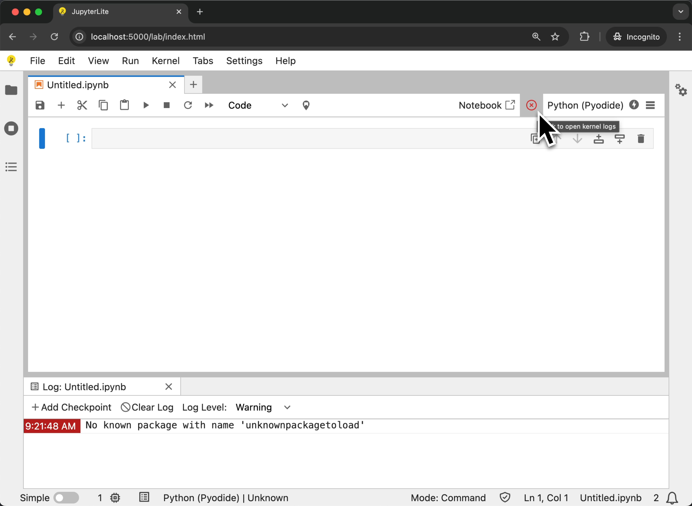

# CHANGELOG

## v0.7

JupyterLite 0.7.0 includes a number of new features (described below), bug fixes, and enhancements. This release brings workspace support, layout persistence, improved Markdown rendering capabilities, and updates to the latest JupyterLab and Jupyter Notebook releases.

### Workspace Support

Support for workspaces is now available in JupyterLite. Workspaces allow you to organize your notebooks and files into separate workspace environments, making it easier to switch between different projects or contexts.


The UI layout is also now automatically persisted across sessions. When you return to JupyterLite, your panel arrangements, open files, and workspace configuration will be restored exactly as you left them.

### Audio and Video Playback

JupyterLite now includes built-in audio and video viewers, allowing users to open audio and video files directly from within the UI.


### Basic Interrupt Functionality

The interrupt button now cancels the execution of cells that are scheduled to run after the currently executing cell. While this doesn't interrupt the currently running cell itself, it provides better control when executing multiple cells in sequence.


### Basic Notebook Export

JupyterLite now includes basic notebook export functionality through a custom export plugin. Users can export notebooks to different formats including `.ipynb` (notebook format) and script formats directly from the File menu.

Additionally, JupyterLite provides extension points for third-party extensions to register custom exporters. This enables the development of additional export formats, such as PDF, in future extensions.

```{warning}
There is currently no built-in support for PDF export, but this may be added in the future via a third-party extension.
```


### File Menu Download Option

A download entry has been added to the File menu, making it easier to download files from your JupyterLite environment.


### Enhanced Markdown Support

Markdown cells now support displaying base64-encoded images stored in the browser's local storage. This makes it easier to include images in your notebooks without requiring external hosting or network access.

### JupyterLab 4.5 and Notebook 7.5

JupyterLite 0.7.0 is built on top of JupyterLab 4.5.0 and Notebook 7.5.0, and brings many of the respective improvements and bug fixes. Check out the notes for these two releases to learn more:

- [JupyterLab 4.5](https://jupyterlab.readthedocs.io/en/latest/getting_started/changelog.html#v4-5)
- [Jupyter Notebook 7.5](https://jupyter-notebook.readthedocs.io/en/latest/changelog.html)

JupyterLab 4.5 notably includes significant [notebook performance improvements](https://jupyterlab.readthedocs.io/en/latest/getting_started/changelog.html#performance-and-windowing), such as the new optimized cell rendering with the new `contentVisibility` windowing mode.

### Pyodide Compatibility

JupyterLite 0.7.0 includes compatibility fixes for the latest Pyodide releases that use Emscripten 4. These fixes ensure stable kernel startup and operation with modern Python environments running in the browser.

```{note}
Some Pyodide packages have been removed from the Pyodide 0.28 release due to Python 3.13 support and compatibility changes. For more information about the affected packages, see the [Pyodide 0.28 release announcement](https://blog.pyodide.org/posts/0.28-release/#python-313-support-and-disabled-packages). Users should follow up on [pyodide/pyodide-recipes#99](https://github.com/pyodide/pyodide-recipes/issues/99) for updates on package availability.

As an alternative, users can consider using [jupyterlite-xeus](https://jupyterlite-xeus.readthedocs.io/en/stable/), which allows installing packages in a more granular manner.
```

### Python 3.9 support dropped

The minimum supported Python version for building JupyterLite sites has been increased to Python 3.10. Users on Python 3.9 will need to upgrade their Python installation to use the `jupyterlite` CLI and build tools.

<!-- <START NEW CHANGELOG ENTRY> -->

## 0.8.0a1

([Full Changelog](https://github.com/jupyterlite/jupyterlite/compare/@jupyterlite/application-extension@0.8.0-alpha.0...53536b1d20a03723698778e17a12f8a73ad2231f))

### Maintenance and upkeep improvements

- Bump lodash from 4.17.21 to 4.17.23 [#1849](https://github.com/jupyterlite/jupyterlite/pull/1849) ([@jtpio](https://github.com/jtpio))
- Bump tar from 6.1.11 to 6.2.1 [#1848](https://github.com/jupyterlite/jupyterlite/pull/1848) ([@jtpio](https://github.com/jtpio))
- Expand UI tests contrib docs [#1847](https://github.com/jupyterlite/jupyterlite/pull/1847) ([@jtpio](https://github.com/jtpio))
- Remove pin on `pytest-cov` [#1846](https://github.com/jupyterlite/jupyterlite/pull/1846) ([@jtpio](https://github.com/jtpio), [@bollwyvl](https://github.com/bollwyvl))
- Update to JupyterLab v4.6.0a2 and Notebook v7.6.0a2 [#1845](https://github.com/jupyterlite/jupyterlite/pull/1845) ([@jtpio](https://github.com/jtpio))
- Drop `lerna` [#1843](https://github.com/jupyterlite/jupyterlite/pull/1843) ([@jtpio](https://github.com/jtpio), [@bollwyvl](https://github.com/bollwyvl))
- Remove Rspack `compress: false` [#1842](https://github.com/jupyterlite/jupyterlite/pull/1842) ([@jtpio](https://github.com/jtpio))
- Update to JupyterLab v4.6.0a1 and Notebook v7.6.0a1 [#1841](https://github.com/jupyterlite/jupyterlite/pull/1841) ([@jtpio](https://github.com/jtpio))
- Fix update workflow [#1840](https://github.com/jupyterlite/jupyterlite/pull/1840) ([@jtpio](https://github.com/jtpio))
- Add script and workflow to update JupyterLab and Notebook [#1839](https://github.com/jupyterlite/jupyterlite/pull/1839) ([@jtpio](https://github.com/jtpio))
- Bump vega-selections from 5.6.0 to 5.6.3 in /ui-tests [#1838](https://github.com/jupyterlite/jupyterlite/pull/1838) ([@jtpio](https://github.com/jtpio))
- Simplify the dev setup [#1835](https://github.com/jupyterlite/jupyterlite/pull/1835) ([@jtpio](https://github.com/jtpio), [@bollwyvl](https://github.com/bollwyvl), [@ianthomas23](https://github.com/ianthomas23), [@trungleduc](https://github.com/trungleduc))
- Update conda dependencies [#1826](https://github.com/jupyterlite/jupyterlite/pull/1826) ([@jtpio](https://github.com/jtpio))

### Documentation improvements

- Fix a broken link to Pyodide documentation [#1829](https://github.com/jupyterlite/jupyterlite/pull/1829) ([@wata727](https://github.com/wata727), [@jtpio](https://github.com/jtpio))

### Contributors to this release

The following people contributed discussions, new ideas, code and documentation contributions, and review.
See [our definition of contributors](https://github-activity.readthedocs.io/en/latest/use/#how-does-this-tool-define-contributions-in-the-reports).

([GitHub contributors page for this release](https://github.com/jupyterlite/jupyterlite/graphs/contributors?from=2025-12-19&to=2026-01-26&type=c))

@bollwyvl ([activity](https://github.com/search?q=repo%3Ajupyterlite%2Fjupyterlite+involves%3Abollwyvl+updated%3A2025-12-19..2026-01-26&type=Issues)) | @ianthomas23 ([activity](https://github.com/search?q=repo%3Ajupyterlite%2Fjupyterlite+involves%3Aianthomas23+updated%3A2025-12-19..2026-01-26&type=Issues)) | @jtpio ([activity](https://github.com/search?q=repo%3Ajupyterlite%2Fjupyterlite+involves%3Ajtpio+updated%3A2025-12-19..2026-01-26&type=Issues)) | @trungleduc ([activity](https://github.com/search?q=repo%3Ajupyterlite%2Fjupyterlite+involves%3Atrungleduc+updated%3A2025-12-19..2026-01-26&type=Issues)) | @wata727 ([activity](https://github.com/search?q=repo%3Ajupyterlite%2Fjupyterlite+involves%3Awata727+updated%3A2025-12-19..2026-01-26&type=Issues))

<!-- <END NEW CHANGELOG ENTRY> -->

## 0.8.0a0

([Full Changelog](https://github.com/jupyterlite/jupyterlite/compare/@jupyterlite/application-extension@0.7.1...23d43e872530c1f5fbad7ea07a5065b549ae2745))

### Enhancements made

- use uri-reference format in configuration schema, use available format checkers during check [#1820](https://github.com/jupyterlite/jupyterlite/pull/1820) ([@bollwyvl](https://github.com/bollwyvl), [@jtpio](https://github.com/jtpio))

### Maintenance and upkeep improvements

- Delete .gitpod.yml [#1825](https://github.com/jupyterlite/jupyterlite/pull/1825) ([@jtpio](https://github.com/jtpio))
- Update to JupyterLab 4.6.0a0 and Notebook 7.6.0a0 [#1822](https://github.com/jupyterlite/jupyterlite/pull/1822) ([@jtpio](https://github.com/jtpio))
- Bump systeminformation from 5.23.14 to 5.27.14 in /ui-tests [#1821](https://github.com/jupyterlite/jupyterlite/pull/1821) ([@jtpio](https://github.com/jtpio))

### Contributors to this release

The following people contributed discussions, new ideas, code and documentation contributions, and review.
See [our definition of contributors](https://github-activity.readthedocs.io/en/latest/#how-does-this-tool-define-contributions-in-the-reports).

([GitHub contributors page for this release](https://github.com/jupyterlite/jupyterlite/graphs/contributors?from=2025-12-16&to=2025-12-19&type=c))

@bollwyvl ([activity](https://github.com/search?q=repo%3Ajupyterlite%2Fjupyterlite+involves%3Abollwyvl+updated%3A2025-12-16..2025-12-19&type=Issues)) | @jtpio ([activity](https://github.com/search?q=repo%3Ajupyterlite%2Fjupyterlite+involves%3Ajtpio+updated%3A2025-12-16..2025-12-19&type=Issues))

## 0.7.1

([Full Changelog](https://github.com/jupyterlite/jupyterlite/compare/@jupyterlite/application-extension@0.7.0...207809d2189db60111e6419f8b9c8ec58c6f3133))

### Bugs fixed

- Fix handling of `jupyter-lite.json` in sub-directories [#1817](https://github.com/jupyterlite/jupyterlite/pull/1817) ([@jtpio](https://github.com/jtpio), [@bollwyvl](https://github.com/bollwyvl), [@trungleduc](https://github.com/trungleduc))
- Fix handling of the default workspaces on first load [#1810](https://github.com/jupyterlite/jupyterlite/pull/1810) ([@jtpio](https://github.com/jtpio))
- Implement ContentProviderRegistry [#1808](https://github.com/jupyterlite/jupyterlite/pull/1808) ([@martinRenou](https://github.com/martinRenou), [@jtpio](https://github.com/jtpio))

### Maintenance and upkeep improvements

- Update to JupyterLab 4.5.1 and Notebook 7.5.1 [#1819](https://github.com/jupyterlite/jupyterlite/pull/1819) ([@jtpio](https://github.com/jtpio))
- Add plausible stats to docs [#1816](https://github.com/jupyterlite/jupyterlite/pull/1816) ([@jasongrout](https://github.com/jasongrout), [@jtpio](https://github.com/jtpio))
- Update docs to mention JupyterLite is part of Jupyter [#1815](https://github.com/jupyterlite/jupyterlite/pull/1815) ([@jasongrout](https://github.com/jasongrout), [@jtpio](https://github.com/jtpio))
- Package removal note for 0.8.0 (kernel, contents, server, settings) [#1805](https://github.com/jupyterlite/jupyterlite/pull/1805) ([@jtpio](https://github.com/jtpio))
- Bump actions/checkout from 5 to 6 in the actions group [#1802](https://github.com/jupyterlite/jupyterlite/pull/1802) ([@jtpio](https://github.com/jtpio))

### Documentation improvements

- Update kernels in the demo site [#1797](https://github.com/jupyterlite/jupyterlite/pull/1797) ([@jtpio](https://github.com/jtpio))

### Contributors to this release

The following people contributed discussions, new ideas, code and documentation contributions, and review.
See [our definition of contributors](https://github-activity.readthedocs.io/en/latest/#how-does-this-tool-define-contributions-in-the-reports).

([GitHub contributors page for this release](https://github.com/jupyterlite/jupyterlite/graphs/contributors?from=2025-11-26&to=2025-12-16&type=c))

@bollwyvl ([activity](https://github.com/search?q=repo%3Ajupyterlite%2Fjupyterlite+involves%3Abollwyvl+updated%3A2025-11-26..2025-12-16&type=Issues)) | @jasongrout ([activity](https://github.com/search?q=repo%3Ajupyterlite%2Fjupyterlite+involves%3Ajasongrout+updated%3A2025-11-26..2025-12-16&type=Issues)) | @jtpio ([activity](https://github.com/search?q=repo%3Ajupyterlite%2Fjupyterlite+involves%3Ajtpio+updated%3A2025-11-26..2025-12-16&type=Issues)) | @martinRenou ([activity](https://github.com/search?q=repo%3Ajupyterlite%2Fjupyterlite+involves%3AmartinRenou+updated%3A2025-11-26..2025-12-16&type=Issues)) | @trungleduc ([activity](https://github.com/search?q=repo%3Ajupyterlite%2Fjupyterlite+involves%3Atrungleduc+updated%3A2025-11-26..2025-12-16&type=Issues))

## 0.7.0

([Full Changelog](https://github.com/jupyterlite/jupyterlite/compare/@jupyterlite/application-extension@0.6.1...af4955da9f632729c750f88e6f2639470b17e33a))

### Enhancements made

- Expose `INbConvertExporters` to register custom exporters [#1780](https://github.com/jupyterlite/jupyterlite/pull/1780) ([@jtpio](https://github.com/jtpio))
- Add the download entry to the file menu [#1772](https://github.com/jupyterlite/jupyterlite/pull/1772) ([@jtpio](https://github.com/jtpio))
- Fix schema name to match the extension it relates to [#1764](https://github.com/jupyterlite/jupyterlite/pull/1764) ([@martinRenou](https://github.com/martinRenou))
- Update to JupyterLab `4.5.0b0` and Notebook `7.5.0b0` [#1744](https://github.com/jupyterlite/jupyterlite/pull/1744) ([@jtpio](https://github.com/jtpio))
- Update to JupyterLab 4.5.0a4 and Notebook 7.5.0a3 [#1738](https://github.com/jupyterlite/jupyterlite/pull/1738) ([@jtpio](https://github.com/jtpio))
- Update to JupyterLab 4.5.0a3 and Notebook 7.5.0a2 [#1710](https://github.com/jupyterlite/jupyterlite/pull/1710) ([@krassowski](https://github.com/krassowski))
- Show images from local storage in Markdown (`base64`-encoded) [#1707](https://github.com/jupyterlite/jupyterlite/pull/1707) ([@krassowski](https://github.com/krassowski))
- Update to JupyterLab 4.5.0a2 and Notebook 7.5.0a1 [#1701](https://github.com/jupyterlite/jupyterlite/pull/1701) ([@jtpio](https://github.com/jtpio))
- use bound instance methods for DriveFSEmscriptenNodeOps [#1688](https://github.com/jupyterlite/jupyterlite/pull/1688) ([@bollwyvl](https://github.com/bollwyvl))
- Add support for workspaces [#1684](https://github.com/jupyterlite/jupyterlite/pull/1684) ([@jtpio](https://github.com/jtpio))
- Introduce layout restoring support [#1670](https://github.com/jupyterlite/jupyterlite/pull/1670) ([@martinRenou](https://github.com/martinRenou))
- Provide a custom export plugin [#1625](https://github.com/jupyterlite/jupyterlite/pull/1625) ([@jtpio](https://github.com/jtpio))

### Bugs fixed

- Missing dependency from @jupyterlite/apputils on @jupyterlab/pluginmanager [#1785](https://github.com/jupyterlite/jupyterlite/pull/1785) ([@martinRenou](https://github.com/martinRenou))
- Support atime, ctime, mtime, requestId [#1781](https://github.com/jupyterlite/jupyterlite/pull/1781) ([@jtpio](https://github.com/jtpio))
- Correct use of EINVAL [#1742](https://github.com/jupyterlite/jupyterlite/pull/1742) ([@ianthomas23](https://github.com/ianthomas23))
- Fix links to local files in Markdown [#1740](https://github.com/jupyterlite/jupyterlite/pull/1740) ([@krassowski](https://github.com/krassowski))
- Throw EINVAL (28) in `DriveFSEmscriptenNodeOps.readlink` [#1723](https://github.com/jupyterlite/jupyterlite/pull/1723) ([@ianthomas23](https://github.com/ianthomas23))
- Fix: Drive issue when writing a previously created + deleted file [#1715](https://github.com/jupyterlite/jupyterlite/pull/1715) ([@martinRenou](https://github.com/martinRenou))
- Fix: Drive issue on rewritting JSON file [#1714](https://github.com/jupyterlite/jupyterlite/pull/1714) ([@martinRenou](https://github.com/martinRenou))
- Ignore `ctime` and `dontfollow` for now [#1705](https://github.com/jupyterlite/jupyterlite/pull/1705) ([@jtpio](https://github.com/jtpio))
- allow-bubbling-down [#1702](https://github.com/jupyterlite/jupyterlite/pull/1702) ([@DerThorsten](https://github.com/DerThorsten))
- Add basic interrupt functionality [#1683](https://github.com/jupyterlite/jupyterlite/pull/1683) ([@krassowski](https://github.com/krassowski))
- Implement `BrowserStorageDrive.getDownloadUrl()` [#1674](https://github.com/jupyterlite/jupyterlite/pull/1674) ([@jtpio](https://github.com/jtpio))

### Maintenance and upkeep improvements

- Update to `jupyterlite-pyodide-kernel==0.7.0rc1` [#1796](https://github.com/jupyterlite/jupyterlite/pull/1796) ([@jtpio](https://github.com/jtpio))
- Revert "Remove `SessionContext` workaround" [#1793](https://github.com/jupyterlite/jupyterlite/pull/1793) ([@jtpio](https://github.com/jtpio))
- Remove `SessionContext` workaround [#1788](https://github.com/jupyterlite/jupyterlite/pull/1788) ([@jtpio](https://github.com/jtpio))
- Linter: Enforce type imports when applicable [#1786](https://github.com/jupyterlite/jupyterlite/pull/1786) ([@martinRenou](https://github.com/martinRenou))
- Update to `jupyterlite-pyodide-kernel==0.7.0rc0` [#1784](https://github.com/jupyterlite/jupyterlite/pull/1784) ([@jtpio](https://github.com/jtpio))
- Update to JupyterLab 4.5 and Notebook 7.5 [#1783](https://github.com/jupyterlite/jupyterlite/pull/1783) ([@jtpio](https://github.com/jtpio))
- Create `@jupyterlite/services` package [#1777](https://github.com/jupyterlite/jupyterlite/pull/1777) ([@jtpio](https://github.com/jtpio))
- Update to JupyterLab 4.5.0rc1 and Notebook 7.5.0rc1 [#1776](https://github.com/jupyterlite/jupyterlite/pull/1776) ([@jtpio](https://github.com/jtpio))
- Add `.pixi` to default `ignore_contents` [#1775](https://github.com/jupyterlite/jupyterlite/pull/1775) ([@jtpio](https://github.com/jtpio))
- Update to JupyterLab `4.5.0rc0`, Notebook `7.5.0rc0`, minimum python to 3.10, test on python 3.14 [#1769](https://github.com/jupyterlite/jupyterlite/pull/1769) ([@bollwyvl](https://github.com/bollwyvl))
- Bump the actions group with 2 updates [#1767](https://github.com/jupyterlite/jupyterlite/pull/1767) ([@dependabot](https://github.com/dependabot))
- Update to `jupyterlite-pyodide-kernel==0.7.0b0` [#1763](https://github.com/jupyterlite/jupyterlite/pull/1763) ([@jtpio](https://github.com/jtpio))
- Update to JupyterLab 4.5.0b1 and Notebook 7.5.0b1 [#1760](https://github.com/jupyterlite/jupyterlite/pull/1760) ([@jtpio](https://github.com/jtpio))
- Use Node.js 24 / npm 11 to publish releases [#1759](https://github.com/jupyterlite/jupyterlite/pull/1759) ([@jtpio](https://github.com/jtpio))
- Bump the actions group with 2 updates [#1748](https://github.com/jupyterlite/jupyterlite/pull/1748) ([@dependabot](https://github.com/dependabot))
- Update to `jupyterlite-pyodide-kernel==0.7.0a5` [#1741](https://github.com/jupyterlite/jupyterlite/pull/1741) ([@jtpio](https://github.com/jtpio))
- Pin pytest-cov \<7 [#1730](https://github.com/jupyterlite/jupyterlite/pull/1730) ([@ianthomas23](https://github.com/ianthomas23))
- Fix dependency on `@jupyterlab/observables` [#1721](https://github.com/jupyterlite/jupyterlite/pull/1721) ([@jtpio](https://github.com/jtpio))
- Update to `jupyterlite-pyodide-kernel==0.7.0a2` [#1720](https://github.com/jupyterlite/jupyterlite/pull/1720) ([@jtpio](https://github.com/jtpio))
- Bump the actions group with 2 updates [#1717](https://github.com/jupyterlite/jupyterlite/pull/1717) ([@dependabot](https://github.com/dependabot))
- Update to `jupyterlite-pyodide-kernel==0.7.0a1` [#1694](https://github.com/jupyterlite/jupyterlite/pull/1694) ([@jtpio](https://github.com/jtpio))
- Increase timeouts and retries in tests [#1691](https://github.com/jupyterlite/jupyterlite/pull/1691) ([@jtpio](https://github.com/jtpio))
- Bump brace-expansion from 1.1.11 to 1.1.12 in /ui-tests [#1676](https://github.com/jupyterlite/jupyterlite/pull/1676) ([@dependabot](https://github.com/dependabot))
- Fix the failing `win-dev` CI check [#1675](https://github.com/jupyterlite/jupyterlite/pull/1675) ([@jtpio](https://github.com/jtpio))
- Update to JupyterLab 4.5.0a1 and Notebook 7.5.0a0 [#1667](https://github.com/jupyterlite/jupyterlite/pull/1667) ([@jtpio](https://github.com/jtpio))

### Documentation improvements

- Fix changelog headings [#1795](https://github.com/jupyterlite/jupyterlite/pull/1795) ([@jtpio](https://github.com/jtpio))
- Mention missing packages in Pyodide 0.28 [#1792](https://github.com/jupyterlite/jupyterlite/pull/1792) ([@jtpio](https://github.com/jtpio))
- Add version compatibility table to the README [#1789](https://github.com/jupyterlite/jupyterlite/pull/1789) ([@jtpio](https://github.com/jtpio))
- Add user-facing changelog for 0.7.0 [#1782](https://github.com/jupyterlite/jupyterlite/pull/1782) ([@jtpio](https://github.com/jtpio))
- Document usage of `pyodide-http` with xeus-python [#1773](https://github.com/jupyterlite/jupyterlite/pull/1773) ([@jtpio](https://github.com/jtpio))
- Update CONTRIBUTING.md to direct correct code of conduct page [#1770](https://github.com/jupyterlite/jupyterlite/pull/1770) ([@tan-i-ham](https://github.com/tan-i-ham))
- Improve Installing other kernels section from documentation [#1734](https://github.com/jupyterlite/jupyterlite/pull/1734) ([@rgaiacs](https://github.com/rgaiacs))
- Add xeus-r kernel to the documentation [#1725](https://github.com/jupyterlite/jupyterlite/pull/1725) ([@rgaiacs](https://github.com/rgaiacs))
- Fix workspaces docs [#1711](https://github.com/jupyterlite/jupyterlite/pull/1711) ([@jtpio](https://github.com/jtpio))
- docs: Update deployment instructions for Vercel and Netlify [#1672](https://github.com/jupyterlite/jupyterlite/pull/1672) ([@diegofcornejo](https://github.com/diegofcornejo))

### Contributors to this release

([GitHub contributors page for this release](https://github.com/jupyterlite/jupyterlite/graphs/contributors?from=2025-06-05&to=2025-11-26&type=c))

[@agriyakhetarpal](https://github.com/search?q=repo%3Ajupyterlite%2Fjupyterlite+involves%3Aagriyakhetarpal+updated%3A2025-06-05..2025-11-26&type=Issues) | [@bollwyvl](https://github.com/search?q=repo%3Ajupyterlite%2Fjupyterlite+involves%3Abollwyvl+updated%3A2025-06-05..2025-11-26&type=Issues) | [@brichet](https://github.com/search?q=repo%3Ajupyterlite%2Fjupyterlite+involves%3Abrichet+updated%3A2025-06-05..2025-11-26&type=Issues) | [@dependabot](https://github.com/search?q=repo%3Ajupyterlite%2Fjupyterlite+involves%3Adependabot+updated%3A2025-06-05..2025-11-26&type=Issues) | [@DerThorsten](https://github.com/search?q=repo%3Ajupyterlite%2Fjupyterlite+involves%3ADerThorsten+updated%3A2025-06-05..2025-11-26&type=Issues) | [@diegofcornejo](https://github.com/search?q=repo%3Ajupyterlite%2Fjupyterlite+involves%3Adiegofcornejo+updated%3A2025-06-05..2025-11-26&type=Issues) | [@github-actions](https://github.com/search?q=repo%3Ajupyterlite%2Fjupyterlite+involves%3Agithub-actions+updated%3A2025-06-05..2025-11-26&type=Issues) | [@ianthomas23](https://github.com/search?q=repo%3Ajupyterlite%2Fjupyterlite+involves%3Aianthomas23+updated%3A2025-06-05..2025-11-26&type=Issues) | [@jimwhite](https://github.com/search?q=repo%3Ajupyterlite%2Fjupyterlite+involves%3Ajimwhite+updated%3A2025-06-05..2025-11-26&type=Issues) | [@jtpio](https://github.com/search?q=repo%3Ajupyterlite%2Fjupyterlite+involves%3Ajtpio+updated%3A2025-06-05..2025-11-26&type=Issues) | [@krassowski](https://github.com/search?q=repo%3Ajupyterlite%2Fjupyterlite+involves%3Akrassowski+updated%3A2025-06-05..2025-11-26&type=Issues) | [@martinRenou](https://github.com/search?q=repo%3Ajupyterlite%2Fjupyterlite+involves%3AmartinRenou+updated%3A2025-06-05..2025-11-26&type=Issues) | [@rgaiacs](https://github.com/search?q=repo%3Ajupyterlite%2Fjupyterlite+involves%3Argaiacs+updated%3A2025-06-05..2025-11-26&type=Issues) | [@tan-i-ham](https://github.com/search?q=repo%3Ajupyterlite%2Fjupyterlite+involves%3Atan-i-ham+updated%3A2025-06-05..2025-11-26&type=Issues)

## 0.7.0rc2

([Full Changelog](https://github.com/jupyterlite/jupyterlite/compare/@jupyterlite/application-extension@0.7.0-rc.1...61d77d496d35c8b34dc5e690e2960c8ded05b094))

### Maintenance and upkeep improvements

- Revert "Remove `SessionContext` workaround" [#1793](https://github.com/jupyterlite/jupyterlite/pull/1793) ([@jtpio](https://github.com/jtpio))

### Documentation improvements

- Fix changelog headings [#1795](https://github.com/jupyterlite/jupyterlite/pull/1795) ([@jtpio](https://github.com/jtpio))
- Mention missing packages in Pyodide 0.28 [#1792](https://github.com/jupyterlite/jupyterlite/pull/1792) ([@jtpio](https://github.com/jtpio))
- Add version compatibility table to the README [#1789](https://github.com/jupyterlite/jupyterlite/pull/1789) ([@jtpio](https://github.com/jtpio))

### Contributors to this release

([GitHub contributors page for this release](https://github.com/jupyterlite/jupyterlite/graphs/contributors?from=2025-11-21&to=2025-11-25&type=c))

[@github-actions](https://github.com/search?q=repo%3Ajupyterlite%2Fjupyterlite+involves%3Agithub-actions+updated%3A2025-11-21..2025-11-25&type=Issues) | [@jtpio](https://github.com/search?q=repo%3Ajupyterlite%2Fjupyterlite+involves%3Ajtpio+updated%3A2025-11-21..2025-11-25&type=Issues)

## 0.7.0rc1

([Full Changelog](https://github.com/jupyterlite/jupyterlite/compare/@jupyterlite/application-extension@0.7.0-rc.0...3f6649c81be51132d33b80eb12d89334bc5ff38f))

### Bugs fixed

- Missing dependency from @jupyterlite/apputils on @jupyterlab/pluginmanager [#1785](https://github.com/jupyterlite/jupyterlite/pull/1785) ([@martinRenou](https://github.com/martinRenou))

### Maintenance and upkeep improvements

- Remove `SessionContext` workaround [#1788](https://github.com/jupyterlite/jupyterlite/pull/1788) ([@jtpio](https://github.com/jtpio))
- Linter: Enforce type imports when applicable [#1786](https://github.com/jupyterlite/jupyterlite/pull/1786) ([@martinRenou](https://github.com/martinRenou))
- Update to `jupyterlite-pyodide-kernel==0.7.0rc0` [#1784](https://github.com/jupyterlite/jupyterlite/pull/1784) ([@jtpio](https://github.com/jtpio))

### Documentation improvements

- Add user-facing changelog for 0.7.0 [#1782](https://github.com/jupyterlite/jupyterlite/pull/1782) ([@jtpio](https://github.com/jtpio))

### Contributors to this release

([GitHub contributors page for this release](https://github.com/jupyterlite/jupyterlite/graphs/contributors?from=2025-11-19&to=2025-11-21&type=c))

[@bollwyvl](https://github.com/search?q=repo%3Ajupyterlite%2Fjupyterlite+involves%3Abollwyvl+updated%3A2025-11-19..2025-11-21&type=Issues) | [@github-actions](https://github.com/search?q=repo%3Ajupyterlite%2Fjupyterlite+involves%3Agithub-actions+updated%3A2025-11-19..2025-11-21&type=Issues) | [@jtpio](https://github.com/search?q=repo%3Ajupyterlite%2Fjupyterlite+involves%3Ajtpio+updated%3A2025-11-19..2025-11-21&type=Issues) | [@martinRenou](https://github.com/search?q=repo%3Ajupyterlite%2Fjupyterlite+involves%3AmartinRenou+updated%3A2025-11-19..2025-11-21&type=Issues)

## 0.7.0rc0

([Full Changelog](https://github.com/jupyterlite/jupyterlite/compare/@jupyterlite/application-extension@0.7.0-beta.1...16c3808cffa05bac52d76a16dcad7b8b1637e074))

### Enhancements made

- Expose `INbConvertExporters` to register custom exporters [#1780](https://github.com/jupyterlite/jupyterlite/pull/1780) ([@jtpio](https://github.com/jtpio))
- Add the download entry to the file menu [#1772](https://github.com/jupyterlite/jupyterlite/pull/1772) ([@jtpio](https://github.com/jtpio))
- Provide a custom export plugin [#1625](https://github.com/jupyterlite/jupyterlite/pull/1625) ([@jtpio](https://github.com/jtpio))

### Bugs fixed

- Support atime, ctime, mtime, requestId [#1781](https://github.com/jupyterlite/jupyterlite/pull/1781) ([@jtpio](https://github.com/jtpio))

### Maintenance and upkeep improvements

- Update to JupyterLab 4.5 and Notebook 7.5 [#1783](https://github.com/jupyterlite/jupyterlite/pull/1783) ([@jtpio](https://github.com/jtpio))
- Create `@jupyterlite/services` package [#1777](https://github.com/jupyterlite/jupyterlite/pull/1777) ([@jtpio](https://github.com/jtpio))
- Update to JupyterLab 4.5.0rc1 and Notebook 7.5.0rc1 [#1776](https://github.com/jupyterlite/jupyterlite/pull/1776) ([@jtpio](https://github.com/jtpio))
- Add `.pixi` to default `ignore_contents` [#1775](https://github.com/jupyterlite/jupyterlite/pull/1775) ([@jtpio](https://github.com/jtpio))
- Bump the actions group with 2 updates [#1767](https://github.com/jupyterlite/jupyterlite/pull/1767) ([@dependabot](https://github.com/dependabot))

### Documentation improvements

- Document usage of `pyodide-http` with xeus-python [#1773](https://github.com/jupyterlite/jupyterlite/pull/1773) ([@jtpio](https://github.com/jtpio))
- Update CONTRIBUTING.md to direct correct code of conduct page [#1770](https://github.com/jupyterlite/jupyterlite/pull/1770) ([@tan-i-ham](https://github.com/tan-i-ham))

### Contributors to this release

([GitHub contributors page for this release](https://github.com/jupyterlite/jupyterlite/graphs/contributors?from=2025-11-04&to=2025-11-19&type=c))

[@bollwyvl](https://github.com/search?q=repo%3Ajupyterlite%2Fjupyterlite+involves%3Abollwyvl+updated%3A2025-11-04..2025-11-19&type=Issues) | [@dependabot](https://github.com/search?q=repo%3Ajupyterlite%2Fjupyterlite+involves%3Adependabot+updated%3A2025-11-04..2025-11-19&type=Issues) | [@github-actions](https://github.com/search?q=repo%3Ajupyterlite%2Fjupyterlite+involves%3Agithub-actions+updated%3A2025-11-04..2025-11-19&type=Issues) | [@jimwhite](https://github.com/search?q=repo%3Ajupyterlite%2Fjupyterlite+involves%3Ajimwhite+updated%3A2025-11-04..2025-11-19&type=Issues) | [@jtpio](https://github.com/search?q=repo%3Ajupyterlite%2Fjupyterlite+involves%3Ajtpio+updated%3A2025-11-04..2025-11-19&type=Issues) | [@krassowski](https://github.com/search?q=repo%3Ajupyterlite%2Fjupyterlite+involves%3Akrassowski+updated%3A2025-11-04..2025-11-19&type=Issues) | [@tan-i-ham](https://github.com/search?q=repo%3Ajupyterlite%2Fjupyterlite+involves%3Atan-i-ham+updated%3A2025-11-04..2025-11-19&type=Issues)

## 0.7.0b1

([Full Changelog](https://github.com/jupyterlite/jupyterlite/compare/@jupyterlite/application-extension@0.7.0-beta.0...765b66809542b82ff0d1f4674b771b2eafee45de))

### Enhancements made

- Fix schema name to match the extension it relates to [#1764](https://github.com/jupyterlite/jupyterlite/pull/1764) ([@martinRenou](https://github.com/martinRenou))

### Maintenance and upkeep improvements

- Update to JupyterLab `4.5.0rc0`, Notebook `7.5.0rc0`, minimum python to 3.10, test on python 3.14 [#1769](https://github.com/jupyterlite/jupyterlite/pull/1769) ([@bollwyvl](https://github.com/bollwyvl))
- Update to `jupyterlite-pyodide-kernel==0.7.0b0` [#1763](https://github.com/jupyterlite/jupyterlite/pull/1763) ([@jtpio](https://github.com/jtpio))

### Contributors to this release

([GitHub contributors page for this release](https://github.com/jupyterlite/jupyterlite/graphs/contributors?from=2025-10-23&to=2025-11-04&type=c))

[@bollwyvl](https://github.com/search?q=repo%3Ajupyterlite%2Fjupyterlite+involves%3Abollwyvl+updated%3A2025-10-23..2025-11-04&type=Issues) | [@github-actions](https://github.com/search?q=repo%3Ajupyterlite%2Fjupyterlite+involves%3Agithub-actions+updated%3A2025-10-23..2025-11-04&type=Issues) | [@jtpio](https://github.com/search?q=repo%3Ajupyterlite%2Fjupyterlite+involves%3Ajtpio+updated%3A2025-10-23..2025-11-04&type=Issues) | [@martinRenou](https://github.com/search?q=repo%3Ajupyterlite%2Fjupyterlite+involves%3AmartinRenou+updated%3A2025-10-23..2025-11-04&type=Issues)

## 0.7.0b0

([Full Changelog](https://github.com/jupyterlite/jupyterlite/compare/@jupyterlite/application-extension@0.7.0-alpha.7...c4f93686c0c3480a644b0c6f62ee598647a5cc14))

### Bugs fixed

- Fix links to local files in Markdown [#1740](https://github.com/jupyterlite/jupyterlite/pull/1740) ([@krassowski](https://github.com/krassowski))

### Maintenance and upkeep improvements

- Update to JupyterLab 4.5.0b1 and Notebook 7.5.0b1 [#1760](https://github.com/jupyterlite/jupyterlite/pull/1760) ([@jtpio](https://github.com/jtpio))
- Use Node.js 24 / npm 11 to publish releases [#1759](https://github.com/jupyterlite/jupyterlite/pull/1759) ([@jtpio](https://github.com/jtpio))
- Update to `jupyterlite-pyodide-kernel==0.7.0a5` [#1741](https://github.com/jupyterlite/jupyterlite/pull/1741) ([@jtpio](https://github.com/jtpio))

### Contributors to this release

([GitHub contributors page for this release](https://github.com/jupyterlite/jupyterlite/graphs/contributors?from=2025-10-10&to=2025-10-23&type=c))

[@github-actions](https://github.com/search?q=repo%3Ajupyterlite%2Fjupyterlite+involves%3Agithub-actions+updated%3A2025-10-10..2025-10-23&type=Issues) | [@jtpio](https://github.com/search?q=repo%3Ajupyterlite%2Fjupyterlite+involves%3Ajtpio+updated%3A2025-10-10..2025-10-23&type=Issues) | [@krassowski](https://github.com/search?q=repo%3Ajupyterlite%2Fjupyterlite+involves%3Akrassowski+updated%3A2025-10-10..2025-10-23&type=Issues)

## 0.7.0a7

([Full Changelog](https://github.com/jupyterlite/jupyterlite/compare/@jupyterlite/application-extension@0.7.0-alpha.6...b513095376f9c39d2826d4f2ae4cb66757ed9e61))

### Enhancements made

- Update to JupyterLab `4.5.0b0` and Notebook `7.5.0b0` [#1744](https://github.com/jupyterlite/jupyterlite/pull/1744) ([@jtpio](https://github.com/jtpio))

### Bugs fixed

- Correct use of EINVAL [#1742](https://github.com/jupyterlite/jupyterlite/pull/1742) ([@ianthomas23](https://github.com/ianthomas23))

### Maintenance and upkeep improvements

- Bump the actions group with 2 updates [#1748](https://github.com/jupyterlite/jupyterlite/pull/1748) ([@dependabot](https://github.com/dependabot))

### Contributors to this release

([GitHub contributors page for this release](https://github.com/jupyterlite/jupyterlite/graphs/contributors?from=2025-09-24&to=2025-10-10&type=c))

[@dependabot](https://github.com/search?q=repo%3Ajupyterlite%2Fjupyterlite+involves%3Adependabot+updated%3A2025-09-24..2025-10-10&type=Issues) | [@github-actions](https://github.com/search?q=repo%3Ajupyterlite%2Fjupyterlite+involves%3Agithub-actions+updated%3A2025-09-24..2025-10-10&type=Issues) | [@ianthomas23](https://github.com/search?q=repo%3Ajupyterlite%2Fjupyterlite+involves%3Aianthomas23+updated%3A2025-09-24..2025-10-10&type=Issues) | [@jtpio](https://github.com/search?q=repo%3Ajupyterlite%2Fjupyterlite+involves%3Ajtpio+updated%3A2025-09-24..2025-10-10&type=Issues) | [@krassowski](https://github.com/search?q=repo%3Ajupyterlite%2Fjupyterlite+involves%3Akrassowski+updated%3A2025-09-24..2025-10-10&type=Issues)

## 0.7.0a6

([Full Changelog](https://github.com/jupyterlite/jupyterlite/compare/@jupyterlite/application-extension@0.7.0-alpha.5...9c584016ed90c33151664ea7cd85d8090924e237))

### Enhancements made

- Update to JupyterLab 4.5.0a4 and Notebook 7.5.0a3 [#1738](https://github.com/jupyterlite/jupyterlite/pull/1738) ([@jtpio](https://github.com/jtpio))

### Bugs fixed

- Throw EINVAL (28) in `DriveFSEmscriptenNodeOps.readlink` [#1723](https://github.com/jupyterlite/jupyterlite/pull/1723) ([@ianthomas23](https://github.com/ianthomas23))

### Maintenance and upkeep improvements

- Pin pytest-cov \<7 [#1730](https://github.com/jupyterlite/jupyterlite/pull/1730) ([@ianthomas23](https://github.com/ianthomas23))
- Fix dependency on `@jupyterlab/observables` [#1721](https://github.com/jupyterlite/jupyterlite/pull/1721) ([@jtpio](https://github.com/jtpio))
- Update to `jupyterlite-pyodide-kernel==0.7.0a2` [#1720](https://github.com/jupyterlite/jupyterlite/pull/1720) ([@jtpio](https://github.com/jtpio))

### Documentation improvements

- Improve Installing other kernels section from documentation [#1734](https://github.com/jupyterlite/jupyterlite/pull/1734) ([@rgaiacs](https://github.com/rgaiacs))
- Add xeus-r kernel to the documentation [#1725](https://github.com/jupyterlite/jupyterlite/pull/1725) ([@rgaiacs](https://github.com/rgaiacs))

### Contributors to this release

([GitHub contributors page for this release](https://github.com/jupyterlite/jupyterlite/graphs/contributors?from=2025-09-08&to=2025-09-24&type=c))

[@bollwyvl](https://github.com/search?q=repo%3Ajupyterlite%2Fjupyterlite+involves%3Abollwyvl+updated%3A2025-09-08..2025-09-24&type=Issues) | [@github-actions](https://github.com/search?q=repo%3Ajupyterlite%2Fjupyterlite+involves%3Agithub-actions+updated%3A2025-09-08..2025-09-24&type=Issues) | [@ianthomas23](https://github.com/search?q=repo%3Ajupyterlite%2Fjupyterlite+involves%3Aianthomas23+updated%3A2025-09-08..2025-09-24&type=Issues) | [@jtpio](https://github.com/search?q=repo%3Ajupyterlite%2Fjupyterlite+involves%3Ajtpio+updated%3A2025-09-08..2025-09-24&type=Issues) | [@rgaiacs](https://github.com/search?q=repo%3Ajupyterlite%2Fjupyterlite+involves%3Argaiacs+updated%3A2025-09-08..2025-09-24&type=Issues)

## 0.7.0a5

([Full Changelog](https://github.com/jupyterlite/jupyterlite/compare/@jupyterlite/application-extension@0.7.0-alpha.4...ccf925887b247db7ea02190f1660beb3394694f6))

### Bugs fixed

- Fix: Drive issue when writing a previously created + deleted file [#1715](https://github.com/jupyterlite/jupyterlite/pull/1715) ([@martinRenou](https://github.com/martinRenou))
- Fix: Drive issue on rewritting JSON file [#1714](https://github.com/jupyterlite/jupyterlite/pull/1714) ([@martinRenou](https://github.com/martinRenou))

### Maintenance and upkeep improvements

- Bump the actions group with 2 updates [#1717](https://github.com/jupyterlite/jupyterlite/pull/1717) ([@dependabot](https://github.com/dependabot))

### Contributors to this release

([GitHub contributors page for this release](https://github.com/jupyterlite/jupyterlite/graphs/contributors?from=2025-08-19&to=2025-09-08&type=c))

[@dependabot](https://github.com/search?q=repo%3Ajupyterlite%2Fjupyterlite+involves%3Adependabot+updated%3A2025-08-19..2025-09-08&type=Issues) | [@github-actions](https://github.com/search?q=repo%3Ajupyterlite%2Fjupyterlite+involves%3Agithub-actions+updated%3A2025-08-19..2025-09-08&type=Issues) | [@jtpio](https://github.com/search?q=repo%3Ajupyterlite%2Fjupyterlite+involves%3Ajtpio+updated%3A2025-08-19..2025-09-08&type=Issues) | [@martinRenou](https://github.com/search?q=repo%3Ajupyterlite%2Fjupyterlite+involves%3AmartinRenou+updated%3A2025-08-19..2025-09-08&type=Issues)

## 0.7.0a4

([Full Changelog](https://github.com/jupyterlite/jupyterlite/compare/@jupyterlite/application-extension@0.7.0-alpha.3...59fad82cb2e5cb7a2454bc37b1e939e0b0b02348))

### Enhancements made

- Update to JupyterLab 4.5.0a3 and Notebook 7.5.0a2 [#1710](https://github.com/jupyterlite/jupyterlite/pull/1710) ([@krassowski](https://github.com/krassowski))
- Show images from local storage in Markdown (`base64`-encoded) [#1707](https://github.com/jupyterlite/jupyterlite/pull/1707) ([@krassowski](https://github.com/krassowski))

### Maintenance and upkeep improvements

- Update to `jupyterlite-pyodide-kernel==0.7.0a1` [#1694](https://github.com/jupyterlite/jupyterlite/pull/1694) ([@jtpio](https://github.com/jtpio))

### Documentation improvements

- Fix workspaces docs [#1711](https://github.com/jupyterlite/jupyterlite/pull/1711) ([@jtpio](https://github.com/jtpio))

### Contributors to this release

([GitHub contributors page for this release](https://github.com/jupyterlite/jupyterlite/graphs/contributors?from=2025-08-13&to=2025-08-19&type=c))

[@bollwyvl](https://github.com/search?q=repo%3Ajupyterlite%2Fjupyterlite+involves%3Abollwyvl+updated%3A2025-08-13..2025-08-19&type=Issues) | [@github-actions](https://github.com/search?q=repo%3Ajupyterlite%2Fjupyterlite+involves%3Agithub-actions+updated%3A2025-08-13..2025-08-19&type=Issues) | [@jtpio](https://github.com/search?q=repo%3Ajupyterlite%2Fjupyterlite+involves%3Ajtpio+updated%3A2025-08-13..2025-08-19&type=Issues) | [@krassowski](https://github.com/search?q=repo%3Ajupyterlite%2Fjupyterlite+involves%3Akrassowski+updated%3A2025-08-13..2025-08-19&type=Issues)

## 0.7.0a3

([Full Changelog](https://github.com/jupyterlite/jupyterlite/compare/@jupyterlite/application-extension@0.7.0-alpha.2...416184863c3a98cc6eb54c52ec29d50795702648))

### Enhancements made

- Add support for workspaces [#1684](https://github.com/jupyterlite/jupyterlite/pull/1684) ([@jtpio](https://github.com/jtpio))

### Bugs fixed

- Ignore `ctime` and `dontfollow` for now [#1705](https://github.com/jupyterlite/jupyterlite/pull/1705) ([@jtpio](https://github.com/jtpio))
- allow-bubbling-down [#1702](https://github.com/jupyterlite/jupyterlite/pull/1702) ([@DerThorsten](https://github.com/DerThorsten))

### Contributors to this release

([GitHub contributors page for this release](https://github.com/jupyterlite/jupyterlite/graphs/contributors?from=2025-08-11&to=2025-08-13&type=c))

[@brichet](https://github.com/search?q=repo%3Ajupyterlite%2Fjupyterlite+involves%3Abrichet+updated%3A2025-08-11..2025-08-13&type=Issues) | [@DerThorsten](https://github.com/search?q=repo%3Ajupyterlite%2Fjupyterlite+involves%3ADerThorsten+updated%3A2025-08-11..2025-08-13&type=Issues) | [@github-actions](https://github.com/search?q=repo%3Ajupyterlite%2Fjupyterlite+involves%3Agithub-actions+updated%3A2025-08-11..2025-08-13&type=Issues) | [@jtpio](https://github.com/search?q=repo%3Ajupyterlite%2Fjupyterlite+involves%3Ajtpio+updated%3A2025-08-11..2025-08-13&type=Issues) | [@krassowski](https://github.com/search?q=repo%3Ajupyterlite%2Fjupyterlite+involves%3Akrassowski+updated%3A2025-08-11..2025-08-13&type=Issues)

## 0.7.0a2

([Full Changelog](https://github.com/jupyterlite/jupyterlite/compare/@jupyterlite/application-extension@0.7.0-alpha.1...d19ffb9bbf63c3a9229bdf81d45063426ec17951))

### Enhancements made

- Update to JupyterLab 4.5.0a2 and Notebook 7.5.0a1 [#1701](https://github.com/jupyterlite/jupyterlite/pull/1701) ([@jtpio](https://github.com/jtpio))

### Contributors to this release

([GitHub contributors page for this release](https://github.com/jupyterlite/jupyterlite/graphs/contributors?from=2025-08-05&to=2025-08-11&type=c))

[@github-actions](https://github.com/search?q=repo%3Ajupyterlite%2Fjupyterlite+involves%3Agithub-actions+updated%3A2025-08-05..2025-08-11&type=Issues) | [@jtpio](https://github.com/search?q=repo%3Ajupyterlite%2Fjupyterlite+involves%3Ajtpio+updated%3A2025-08-05..2025-08-11&type=Issues)

## 0.7.0a1

([Full Changelog](https://github.com/jupyterlite/jupyterlite/compare/@jupyterlite/application-extension@0.7.0-alpha.0...dc4d24713b20ad5c7f16aa928f4dfeed06ecf8cf))

### Enhancements made

- use bound instance methods for DriveFSEmscriptenNodeOps [#1688](https://github.com/jupyterlite/jupyterlite/pull/1688) ([@bollwyvl](https://github.com/bollwyvl))
- Introduce layout restoring support [#1670](https://github.com/jupyterlite/jupyterlite/pull/1670) ([@martinRenou](https://github.com/martinRenou))

### Bugs fixed

- Add basic interrupt functionality [#1683](https://github.com/jupyterlite/jupyterlite/pull/1683) ([@krassowski](https://github.com/krassowski))

### Maintenance and upkeep improvements

- Increase timeouts and retries in tests [#1691](https://github.com/jupyterlite/jupyterlite/pull/1691) ([@jtpio](https://github.com/jtpio))

### Contributors to this release

([GitHub contributors page for this release](https://github.com/jupyterlite/jupyterlite/graphs/contributors?from=2025-07-03&to=2025-08-05&type=c))

[@bollwyvl](https://github.com/search?q=repo%3Ajupyterlite%2Fjupyterlite+involves%3Abollwyvl+updated%3A2025-07-03..2025-08-05&type=Issues) | [@github-actions](https://github.com/search?q=repo%3Ajupyterlite%2Fjupyterlite+involves%3Agithub-actions+updated%3A2025-07-03..2025-08-05&type=Issues) | [@jtpio](https://github.com/search?q=repo%3Ajupyterlite%2Fjupyterlite+involves%3Ajtpio+updated%3A2025-07-03..2025-08-05&type=Issues) | [@krassowski](https://github.com/search?q=repo%3Ajupyterlite%2Fjupyterlite+involves%3Akrassowski+updated%3A2025-07-03..2025-08-05&type=Issues) | [@martinRenou](https://github.com/search?q=repo%3Ajupyterlite%2Fjupyterlite+involves%3AmartinRenou+updated%3A2025-07-03..2025-08-05&type=Issues)

## 0.7.0a0

([Full Changelog](https://github.com/jupyterlite/jupyterlite/compare/@jupyterlite/application-extension@0.6.1...498c9e4500196d49507455a6b87711d53d7a1c71))

### Bugs fixed

- Implement `BrowserStorageDrive.getDownloadUrl()` [#1674](https://github.com/jupyterlite/jupyterlite/pull/1674) ([@jtpio](https://github.com/jtpio))

### Maintenance and upkeep improvements

- Bump brace-expansion from 1.1.11 to 1.1.12 in /ui-tests [#1676](https://github.com/jupyterlite/jupyterlite/pull/1676) ([@dependabot](https://github.com/dependabot))
- Fix the failing `win-dev` CI check [#1675](https://github.com/jupyterlite/jupyterlite/pull/1675) ([@jtpio](https://github.com/jtpio))
- Update to JupyterLab 4.5.0a1 and Notebook 7.5.0a0 [#1667](https://github.com/jupyterlite/jupyterlite/pull/1667) ([@jtpio](https://github.com/jtpio))

### Documentation improvements

- docs: Update deployment instructions for Vercel and Netlify [#1672](https://github.com/jupyterlite/jupyterlite/pull/1672) ([@diegofcornejo](https://github.com/diegofcornejo))

### Contributors to this release

([GitHub contributors page for this release](https://github.com/jupyterlite/jupyterlite/graphs/contributors?from=2025-06-05&to=2025-07-03&type=c))

[@dependabot](https://github.com/search?q=repo%3Ajupyterlite%2Fjupyterlite+involves%3Adependabot+updated%3A2025-06-05..2025-07-03&type=Issues) | [@diegofcornejo](https://github.com/search?q=repo%3Ajupyterlite%2Fjupyterlite+involves%3Adiegofcornejo+updated%3A2025-06-05..2025-07-03&type=Issues) | [@github-actions](https://github.com/search?q=repo%3Ajupyterlite%2Fjupyterlite+involves%3Agithub-actions+updated%3A2025-06-05..2025-07-03&type=Issues) | [@jtpio](https://github.com/search?q=repo%3Ajupyterlite%2Fjupyterlite+involves%3Ajtpio+updated%3A2025-06-05..2025-07-03&type=Issues)

## 0.6.1

([Full Changelog](https://github.com/jupyterlite/jupyterlite/compare/@jupyterlite/application-extension@0.6.0...754a459bf1fe7cfc4892cd9758790f8670febca0))

### Bugs fixed

- Stop execution when an error occurs on "Restart Kernel and Run All Cells" [#1671](https://github.com/jupyterlite/jupyterlite/pull/1671) ([@jtpio](https://github.com/jtpio))

### Maintenance and upkeep improvements

- Bump to `jupyterlite-pyodide-kernel==0.6.0` [#1666](https://github.com/jupyterlite/jupyterlite/pull/1666) ([@jtpio](https://github.com/jtpio))

### Documentation improvements

- Document how to test package compatibility [#1669](https://github.com/jupyterlite/jupyterlite/pull/1669) ([@jtpio](https://github.com/jtpio))
- remove top copyright years [#1668](https://github.com/jupyterlite/jupyterlite/pull/1668) ([@bollwyvl](https://github.com/bollwyvl))
- docs: include REPL guide on the howto page [#1665](https://github.com/jupyterlite/jupyterlite/pull/1665) ([@jtpio](https://github.com/jtpio))

### Contributors to this release

([GitHub contributors page for this release](https://github.com/jupyterlite/jupyterlite/graphs/contributors?from=2025-06-02&to=2025-06-05&type=c))

[@bollwyvl](https://github.com/search?q=repo%3Ajupyterlite%2Fjupyterlite+involves%3Abollwyvl+updated%3A2025-06-02..2025-06-05&type=Issues) | [@github-actions](https://github.com/search?q=repo%3Ajupyterlite%2Fjupyterlite+involves%3Agithub-actions+updated%3A2025-06-02..2025-06-05&type=Issues) | [@jtpio](https://github.com/search?q=repo%3Ajupyterlite%2Fjupyterlite+involves%3Ajtpio+updated%3A2025-06-02..2025-06-05&type=Issues)

## v0.6

JupyterLite 0.6.0 includes a number of new features (described below), bug fixes, and enhancements. This release brings significant improvements to the user experience and new customization options for JupyterLite deployments.

### Interactive Input Support

Support for kernel `stdin` requests is now available, enabling interactive input functions like Python's `input()` in notebooks. This fixes a long standing limitation of JupyterLite when executing the following code:

```python
name = input("What is your name? ")
print(f"Hello {name}!")
```


Since `input()` is used quite extensively in introductory Python courses, we hope this new feature will help make teaching with JupyterLite easier!

### New REPL Options

The REPL now exposes new options as URL parameters:

- `promptCellPosition` - place the prompt cell to the top, left, right or bottom
- `clearCodeContentOnExecute` - when disabled, the code submitted for execution remains in the code editor, allowing for further edits.
- `hideCodeInput` - when enabled, only the execution output is shown in the console.
- `clearCellsOnExecute` - when enabled, only the last cell is displayed.
- `showBanner` - when disabled, hide the banner for the kernel

Toggling all the new options transforms the console into an interactive editor resembling an ephemeral notebook with a single cell.


In addition to these URL parameters, the toolbar includes new items to:

- Execute code
- Restart the kernel
- Clear the cells
- Switch the kernel

Check out the [REPL documentation](./quickstart/embed-repl.md) for more details on how to use these parameters.

### Kernel Indicator and Logs

A new notebook toolbar item has been added to show the kernel status with three different states:

- Loading: the kernel is starting or performing some actions
- Success: the kernel is ready to execute code
- Failure: an error occurred while starting the kernel or during execution, and likely requires a restart

This new toolbar item gives users better visibility into the kernel's status and allows them to view the kernel logs (if the kernel reports them) by clicking on the toolbar item to open the log console.



### Clear Browser Data

By default JupyterLite stores user created notebooks and settings in the browser.

In previous versions, users had to manually clear the data using the browser developer tools. With JupyterLite 0.6.0 it is now possible to clear the browser data from the UI by clicking on the `Help > Clear Browser Data` menu item. The confirmation dialog will show options to clear settings and contents.


### Loading indicator

A new indicator has been added to let users know JupyterLite is currently loading, which is useful for deployments that take some time to load, especially on slow connections.

By default, the loading indicator is only visible in the JupyterLab application (not for Jupyter Notebook or REPL). If you would like to enable or disable the indicator for some or all applications, check out the [guide in the documentation](./howto/configure/loading_indicator.md).


### Settings import and export

Settings can now be exported to an `overrides.json` file from the Settings Editor, which can be used to pre-configure defaults in deployments or to restore settings.

This allows users to interact with a JupyterLite deployment, make a couple of changes to the settings, and export them to an `overrides.json` that can be included in a JupyterLite deployment.


### Plugin Manager

Open the command palette and search for `Advanced Plugin Manager` to open the plugin manager. With the plugin manager, users can:

- View active plugins in the running JupyterLite environment
- Understand dependency relationships between plugins
- Gain better visibility into the configuration of their environment


### Improved Multi-site Contents Management

The default in-browser storage is now scoped using the `baseUrl` of the deployment. This allows hosting multiple sites under the same domain, and keeps user created files isolated from each other, for example:

- `https://username.github.io/jupyterlite-foo`
- `https://username.github.io/jupyterlite-bar`

In practice this fixes the issue where users would create new files in one site, and they would show up in another site hosted under the same domain.

### Multi-Tab File System Access

Using JupyterLite in multiple browser tabs should now result in less issues, in particular when interacting with the file system.

### Extension system

In previous versions, JupyterLite was creating a separate application to register "server" extensions. Examples of such extensions are the different managers (sessions, kernels, settings, contents) but also the actual kernels (Pyodide, Xeus Python). This was not ideal because it introduced a separate namespace for these extensions, and extension authors had to configure their extension to be either a regular JupyterLab extension or a JupyterLite "server" extension.

Starting with JupyterLite 0.6.0, all extensions are now registered at the same level as regular JupyterLab extensions, making use of the new `ServiceManagerPlugin` type of extension introduced in JupyterLab 4.4.

### JupyterLab 4.4 and Notebook 7.4

JupyterLite 0.6.0 is built on top of JupyterLab 4.4 and Notebook 7.4, and brings many of the respective improvements and bug fixes. Check out the release notes for these two releases to learn more:

- [https://github.com/jupyterlab/jupyterlab/releases/tag/v4.4.0](https://github.com/jupyterlab/jupyterlab/releases/tag/v4.4.0)
- [https://github.com/jupyter/notebook/releases/tag/v7.4.0](https://github.com/jupyter/notebook/releases/tag/v7.4.0)

([Full Changelog](https://github.com/jupyterlite/jupyterlite/compare/@jupyterlite/application-extension@0.5.0...9b3bd5bce12b15466c2e518d7b23aae40b8f42c7))

### Enhancements made

- Rename service-worker broadcast channel to something more general [#1654](https://github.com/jupyterlite/jupyterlite/pull/1654) ([@martinRenou](https://github.com/martinRenou))
- Toolbar item to show the kernel logs [#1642](https://github.com/jupyterlite/jupyterlite/pull/1642) ([@jtpio](https://github.com/jtpio))
- Support kernel `stdin` request via ServiceWorker and SharedArrayBuffer [#1640](https://github.com/jupyterlite/jupyterlite/pull/1640) ([@ianthomas23](https://github.com/ianthomas23))
- Add a plugin to clear browser data (settings and files) [#1638](https://github.com/jupyterlite/jupyterlite/pull/1638) ([@jtpio](https://github.com/jtpio))
- Add a loading indicator [#1636](https://github.com/jupyterlite/jupyterlite/pull/1636) ([@jtpio](https://github.com/jtpio))
- Update to JupyterLab `4.4.0rc1` and Notebook `7.4.0rc0` [#1613](https://github.com/jupyterlite/jupyterlite/pull/1613) ([@jtpio](https://github.com/jtpio))
- Fix handling of contents when multiple lite sites are shared under the same host [#1612](https://github.com/jupyterlite/jupyterlite/pull/1612) ([@jtpio](https://github.com/jtpio))
- Update to JupyterLab 4.4.0b2 and Notebook 7.4.0b2 [#1597](https://github.com/jupyterlite/jupyterlite/pull/1597) ([@jtpio](https://github.com/jtpio))
- Add the plugin manager [#1593](https://github.com/jupyterlite/jupyterlite/pull/1593) ([@jtpio](https://github.com/jtpio))
- Update to JupyterLab `4.4.0b0` and Notebook `7.4.0b0` [#1578](https://github.com/jupyterlite/jupyterlite/pull/1578) ([@jtpio](https://github.com/jtpio))
- Update to Notebook 7.4.0a3 [#1574](https://github.com/jupyterlite/jupyterlite/pull/1574) ([@jtpio](https://github.com/jtpio))
- Expose more REPL options via query string parameters [#1573](https://github.com/jupyterlite/jupyterlite/pull/1573) ([@jtpio](https://github.com/jtpio))
- Update to JupyterLab `4.4.0a3` and Notebook `7.4.0a2` [#1570](https://github.com/jupyterlite/jupyterlite/pull/1570) ([@jtpio](https://github.com/jtpio))

### Bugs fixed

- Fix concurrent file system access from multiple tabs [#1627](https://github.com/jupyterlite/jupyterlite/pull/1627) ([@jtpio](https://github.com/jtpio))
- `BroadcastChannel` with identifier to properly send responses from the Service Worker [#1621](https://github.com/jupyterlite/jupyterlite/pull/1621) ([@jtpio](https://github.com/jtpio))
- Use a `MessageChannel` instead of `BroadcastChannel` to communicate with the Service Worker [#1608](https://github.com/jupyterlite/jupyterlite/pull/1608) ([@jtpio](https://github.com/jtpio))
- Handle Drive.get exceptions for missing content [#1606](https://github.com/jupyterlite/jupyterlite/pull/1606) ([@juntyr](https://github.com/juntyr))
- Refresh specs when new JupyterLite kernels are added [#1602](https://github.com/jupyterlite/jupyterlite/pull/1602) ([@jtpio](https://github.com/jtpio))
- Fix handling of the showBanner REPL parameter [#1600](https://github.com/jupyterlite/jupyterlite/pull/1600) ([@jtpio](https://github.com/jtpio))
- Trigger signal for spec refresh [#1596](https://github.com/jupyterlite/jupyterlite/pull/1596) ([@martinRenou](https://github.com/martinRenou))
- Emscripten DriveFS: Use ErronoError instead of genericErrors in the lookup function [#1568](https://github.com/jupyterlite/jupyterlite/pull/1568) ([@anutosh491](https://github.com/anutosh491))

### Maintenance and upkeep improvements

- Update to `jupyterlite-pyodide-kernel==0.6.0rc0` [#1661](https://github.com/jupyterlite/jupyterlite/pull/1661) ([@jtpio](https://github.com/jtpio))
- Remove `registerPluginModule` methods from `SingleWidgetApp` [#1659](https://github.com/jupyterlite/jupyterlite/pull/1659) ([@jtpio](https://github.com/jtpio))
- Update to JupyterLab 4.4.3 and Notebook 7.4.3 [#1658](https://github.com/jupyterlite/jupyterlite/pull/1658) ([@jtpio](https://github.com/jtpio))
- Bump to `jupyterlite-pyodide-kernel==0.6.0b1` [#1650](https://github.com/jupyterlite/jupyterlite/pull/1650) ([@jtpio](https://github.com/jtpio))
- Remove triple slash references [#1645](https://github.com/jupyterlite/jupyterlite/pull/1645) ([@martinRenou](https://github.com/martinRenou))
- Update to JupyterLab 4.4.2 and Notebook 7.4.2 [#1643](https://github.com/jupyterlite/jupyterlite/pull/1643) ([@jtpio](https://github.com/jtpio))
- Bump actions/create-github-app-token from 1 to 2 in the actions group [#1639](https://github.com/jupyterlite/jupyterlite/pull/1639) ([@dependabot](https://github.com/dependabot))
- Fix a couple of `TODO` items [#1634](https://github.com/jupyterlite/jupyterlite/pull/1634) ([@jtpio](https://github.com/jtpio))
- Add `preserve="true"` to `<reference>` [#1633](https://github.com/jupyterlite/jupyterlite/pull/1633) ([@jtpio](https://github.com/jtpio))
- Add `apputils` and `apputils-extension` packages [#1632](https://github.com/jupyterlite/jupyterlite/pull/1632) ([@jtpio](https://github.com/jtpio))
- Update to JupyterLab 4.4.1 and Notebook 7.4.1 [#1631](https://github.com/jupyterlite/jupyterlite/pull/1631) ([@jtpio](https://github.com/jtpio))
- Use consistent filenames for UI test [#1630](https://github.com/jupyterlite/jupyterlite/pull/1630) ([@jtpio](https://github.com/jtpio))
- Stabilize UI tests [#1628](https://github.com/jupyterlite/jupyterlite/pull/1628) ([@jtpio](https://github.com/jtpio))
- Update to `jupyterlite-pyodide-kernel==0.6.0a5` [#1624](https://github.com/jupyterlite/jupyterlite/pull/1624) ([@jtpio](https://github.com/jtpio))
- Fix typo in notebook requirement [#1623](https://github.com/jupyterlite/jupyterlite/pull/1623) ([@jtpio](https://github.com/jtpio))
- Remove top-level `resolutions` [#1620](https://github.com/jupyterlite/jupyterlite/pull/1620) ([@jtpio](https://github.com/jtpio))
- Update to JupyterLab 4.4 and Jupyter Notebook 7.4 [#1619](https://github.com/jupyterlite/jupyterlite/pull/1619) ([@jtpio](https://github.com/jtpio))
- Bump vega from 5.31.0 to 5.33.0 in /ui-tests [#1614](https://github.com/jupyterlite/jupyterlite/pull/1614) ([@dependabot](https://github.com/dependabot))
- Update to JupyterLab 4.4.0rc0 and Notebook 7.4.0b3 [#1603](https://github.com/jupyterlite/jupyterlite/pull/1603) ([@jtpio](https://github.com/jtpio))
- Remove custom `IServerSettings` plugin [#1598](https://github.com/jupyterlite/jupyterlite/pull/1598) ([@jtpio](https://github.com/jtpio))
- Register server plugins as `ServiceManagerPlugin`, drop `JupyterLiteServer` [#1590](https://github.com/jupyterlite/jupyterlite/pull/1590) ([@jtpio](https://github.com/jtpio))
- Bump vega from 5.25.0 to 5.31.0 in /ui-tests [#1585](https://github.com/jupyterlite/jupyterlite/pull/1585) ([@dependabot](https://github.com/dependabot))
- Pin on `sphinx<8.2` to the fix docs build [#1580](https://github.com/jupyterlite/jupyterlite/pull/1580) ([@jtpio](https://github.com/jtpio))
- Update to JupyterLab 4.4 and Notebook 7.4 [#1561](https://github.com/jupyterlite/jupyterlite/pull/1561) ([@jtpio](https://github.com/jtpio))
- Troubleshoot UI tests [#1560](https://github.com/jupyterlite/jupyterlite/pull/1560) ([@jtpio](https://github.com/jtpio))
- Bump `jupyterlite-pyodide-kernel` [#1559](https://github.com/jupyterlite/jupyterlite/pull/1559) ([@jtpio](https://github.com/jtpio))
- Improve error message for when jupyter-server is not installed [#1401](https://github.com/jupyterlite/jupyterlite/pull/1401) ([@martinRenou](https://github.com/martinRenou))

### Documentation improvements

- Fix user facing changelog [#1655](https://github.com/jupyterlite/jupyterlite/pull/1655) ([@jtpio](https://github.com/jtpio))
- Improve kernel logs docs [#1649](https://github.com/jupyterlite/jupyterlite/pull/1649) ([@jtpio](https://github.com/jtpio))
- Update docs for interacting with JupyterLite in an IFrame [#1648](https://github.com/jupyterlite/jupyterlite/pull/1648) ([@jtpio](https://github.com/jtpio))
- User facing changelog for 0.6.0 [#1647](https://github.com/jupyterlite/jupyterlite/pull/1647) ([@jtpio](https://github.com/jtpio))
- Add `doit dev` command to CONTRIBUTING docs [#1611](https://github.com/jupyterlite/jupyterlite/pull/1611) ([@martinRenou](https://github.com/martinRenou))
- Add Single Executable Cell use case to the docs [#1604](https://github.com/jupyterlite/jupyterlite/pull/1604) ([@jtpio](https://github.com/jtpio))
- Fix memoryStorageDriver in jupyterlite.schema.v0.json [#1591](https://github.com/jupyterlite/jupyterlite/pull/1591) ([@2xB](https://github.com/2xB))
- DOC: kernels.md: wording [#1589](https://github.com/jupyterlite/jupyterlite/pull/1589) ([@westurner](https://github.com/westurner))
- [DOC] Update Python version in vercel/netlify docs [#1577](https://github.com/jupyterlite/jupyterlite/pull/1577) ([@yogabonito](https://github.com/yogabonito))
- Fix typo in CLI addons doc [#1558](https://github.com/jupyterlite/jupyterlite/pull/1558) ([@lesteve](https://github.com/lesteve))
- Fix typo [#1555](https://github.com/jupyterlite/jupyterlite/pull/1555) ([@davidbrochart](https://github.com/davidbrochart))

### API and Breaking Changes

- Remove `registerPluginModule` methods from `SingleWidgetApp` [#1659](https://github.com/jupyterlite/jupyterlite/pull/1659) ([@jtpio](https://github.com/jtpio))
- Rename service-worker broadcast channel to something more general [#1654](https://github.com/jupyterlite/jupyterlite/pull/1654) ([@martinRenou](https://github.com/martinRenou))
- Register server plugins as `ServiceManagerPlugin`, drop `JupyterLiteServer` [#1590](https://github.com/jupyterlite/jupyterlite/pull/1590) ([@jtpio](https://github.com/jtpio))

### Contributors to this release

([GitHub contributors page for this release](https://github.com/jupyterlite/jupyterlite/graphs/contributors?from=2025-01-09&to=2025-06-02&type=c))

[@2xB](https://github.com/search?q=repo%3Ajupyterlite%2Fjupyterlite+involves%3A2xB+updated%3A2025-01-09..2025-06-02&type=Issues) | [@anutosh491](https://github.com/search?q=repo%3Ajupyterlite%2Fjupyterlite+involves%3Aanutosh491+updated%3A2025-01-09..2025-06-02&type=Issues) | [@bollwyvl](https://github.com/search?q=repo%3Ajupyterlite%2Fjupyterlite+involves%3Abollwyvl+updated%3A2025-01-09..2025-06-02&type=Issues) | [@davidbrochart](https://github.com/search?q=repo%3Ajupyterlite%2Fjupyterlite+involves%3Adavidbrochart+updated%3A2025-01-09..2025-06-02&type=Issues) | [@dependabot](https://github.com/search?q=repo%3Ajupyterlite%2Fjupyterlite+involves%3Adependabot+updated%3A2025-01-09..2025-06-02&type=Issues) | [@github-actions](https://github.com/search?q=repo%3Ajupyterlite%2Fjupyterlite+involves%3Agithub-actions+updated%3A2025-01-09..2025-06-02&type=Issues) | [@ianthomas23](https://github.com/search?q=repo%3Ajupyterlite%2Fjupyterlite+involves%3Aianthomas23+updated%3A2025-01-09..2025-06-02&type=Issues) | [@jtpio](https://github.com/search?q=repo%3Ajupyterlite%2Fjupyterlite+involves%3Ajtpio+updated%3A2025-01-09..2025-06-02&type=Issues) | [@juntyr](https://github.com/search?q=repo%3Ajupyterlite%2Fjupyterlite+involves%3Ajuntyr+updated%3A2025-01-09..2025-06-02&type=Issues) | [@lesteve](https://github.com/search?q=repo%3Ajupyterlite%2Fjupyterlite+involves%3Alesteve+updated%3A2025-01-09..2025-06-02&type=Issues) | [@martinRenou](https://github.com/search?q=repo%3Ajupyterlite%2Fjupyterlite+involves%3AmartinRenou+updated%3A2025-01-09..2025-06-02&type=Issues) | [@RMattB1](https://github.com/search?q=repo%3Ajupyterlite%2Fjupyterlite+involves%3ARMattB1+updated%3A2025-01-09..2025-06-02&type=Issues) | [@trungleduc](https://github.com/search?q=repo%3Ajupyterlite%2Fjupyterlite+involves%3Atrungleduc+updated%3A2025-01-09..2025-06-02&type=Issues) | [@westurner](https://github.com/search?q=repo%3Ajupyterlite%2Fjupyterlite+involves%3Awesturner+updated%3A2025-01-09..2025-06-02&type=Issues) | [@yogabonito](https://github.com/search?q=repo%3Ajupyterlite%2Fjupyterlite+involves%3Ayogabonito+updated%3A2025-01-09..2025-06-02&type=Issues)

## 0.6.0rc0

([Full Changelog](https://github.com/jupyterlite/jupyterlite/compare/@jupyterlite/application-extension@0.6.0-beta.1...755819207491eebfcd4831800a3fa4adafc879d5))

### Maintenance and upkeep improvements

- Remove `registerPluginModule` methods from `SingleWidgetApp` [#1659](https://github.com/jupyterlite/jupyterlite/pull/1659) ([@jtpio](https://github.com/jtpio))
- Update to JupyterLab 4.4.3 and Notebook 7.4.3 [#1658](https://github.com/jupyterlite/jupyterlite/pull/1658) ([@jtpio](https://github.com/jtpio))

### API and Breaking Changes

- Remove `registerPluginModule` methods from `SingleWidgetApp` [#1659](https://github.com/jupyterlite/jupyterlite/pull/1659) ([@jtpio](https://github.com/jtpio))

### Contributors to this release

([GitHub contributors page for this release](https://github.com/jupyterlite/jupyterlite/graphs/contributors?from=2025-05-21&to=2025-05-27&type=c))

[@github-actions](https://github.com/search?q=repo%3Ajupyterlite%2Fjupyterlite+involves%3Agithub-actions+updated%3A2025-05-21..2025-05-27&type=Issues) | [@jtpio](https://github.com/search?q=repo%3Ajupyterlite%2Fjupyterlite+involves%3Ajtpio+updated%3A2025-05-21..2025-05-27&type=Issues)

## 0.6.0b1

([Full Changelog](https://github.com/jupyterlite/jupyterlite/compare/@jupyterlite/application-extension@0.6.0-beta.0...77daefdd20eb8b83d1aa6a11bb5e495b130e401e))

### Enhancements made

- Rename service-worker broadcast channel to something more general [#1654](https://github.com/jupyterlite/jupyterlite/pull/1654) ([@martinRenou](https://github.com/martinRenou))

### Maintenance and upkeep improvements

- Bump to `jupyterlite-pyodide-kernel==0.6.0b1` [#1650](https://github.com/jupyterlite/jupyterlite/pull/1650) ([@jtpio](https://github.com/jtpio))

### Documentation improvements

- Fix user facing changelog [#1655](https://github.com/jupyterlite/jupyterlite/pull/1655) ([@jtpio](https://github.com/jtpio))
- Improve kernel logs docs [#1649](https://github.com/jupyterlite/jupyterlite/pull/1649) ([@jtpio](https://github.com/jtpio))
- Update docs for interacting with JupyterLite in an IFrame [#1648](https://github.com/jupyterlite/jupyterlite/pull/1648) ([@jtpio](https://github.com/jtpio))
- User facing changelog for 0.6.0 [#1647](https://github.com/jupyterlite/jupyterlite/pull/1647) ([@jtpio](https://github.com/jtpio))

### API and Breaking Changes

- Rename service-worker broadcast channel to something more general [#1654](https://github.com/jupyterlite/jupyterlite/pull/1654) ([@martinRenou](https://github.com/martinRenou))

### Contributors to this release

([GitHub contributors page for this release](https://github.com/jupyterlite/jupyterlite/graphs/contributors?from=2025-05-12&to=2025-05-21&type=c))

[@github-actions](https://github.com/search?q=repo%3Ajupyterlite%2Fjupyterlite+involves%3Agithub-actions+updated%3A2025-05-12..2025-05-21&type=Issues) | [@jtpio](https://github.com/search?q=repo%3Ajupyterlite%2Fjupyterlite+involves%3Ajtpio+updated%3A2025-05-12..2025-05-21&type=Issues) | [@martinRenou](https://github.com/search?q=repo%3Ajupyterlite%2Fjupyterlite+involves%3AmartinRenou+updated%3A2025-05-12..2025-05-21&type=Issues)

## 0.6.0b0

([Full Changelog](https://github.com/jupyterlite/jupyterlite/compare/@jupyterlite/application-extension@0.6.0-alpha.10...c3782d0188f43b78fa06f43878afd288eae0bc4f))

### Enhancements made

- Toolbar item to show the kernel logs [#1642](https://github.com/jupyterlite/jupyterlite/pull/1642) ([@jtpio](https://github.com/jtpio))

### Maintenance and upkeep improvements

- Remove triple slash references [#1645](https://github.com/jupyterlite/jupyterlite/pull/1645) ([@martinRenou](https://github.com/martinRenou))

### Contributors to this release

([GitHub contributors page for this release](https://github.com/jupyterlite/jupyterlite/graphs/contributors?from=2025-05-08&to=2025-05-12&type=c))

[@github-actions](https://github.com/search?q=repo%3Ajupyterlite%2Fjupyterlite+involves%3Agithub-actions+updated%3A2025-05-08..2025-05-12&type=Issues) | [@jtpio](https://github.com/search?q=repo%3Ajupyterlite%2Fjupyterlite+involves%3Ajtpio+updated%3A2025-05-08..2025-05-12&type=Issues) | [@juntyr](https://github.com/search?q=repo%3Ajupyterlite%2Fjupyterlite+involves%3Ajuntyr+updated%3A2025-05-08..2025-05-12&type=Issues) | [@martinRenou](https://github.com/search?q=repo%3Ajupyterlite%2Fjupyterlite+involves%3AmartinRenou+updated%3A2025-05-08..2025-05-12&type=Issues)

## 0.6.0a10

([Full Changelog](https://github.com/jupyterlite/jupyterlite/compare/@jupyterlite/application-extension@0.6.0-alpha.9...2008f3bb75c412ade6548ff3e4ededc7fa5bfaf0))

### Enhancements made

- Support kernel `stdin` request via ServiceWorker and SharedArrayBuffer [#1640](https://github.com/jupyterlite/jupyterlite/pull/1640) ([@ianthomas23](https://github.com/ianthomas23))
- Add a plugin to clear browser data (settings and files) [#1638](https://github.com/jupyterlite/jupyterlite/pull/1638) ([@jtpio](https://github.com/jtpio))
- Add a loading indicator [#1636](https://github.com/jupyterlite/jupyterlite/pull/1636) ([@jtpio](https://github.com/jtpio))

### Maintenance and upkeep improvements

- Update to JupyterLab 4.4.2 and Notebook 7.4.2 [#1643](https://github.com/jupyterlite/jupyterlite/pull/1643) ([@jtpio](https://github.com/jtpio))
- Bump actions/create-github-app-token from 1 to 2 in the actions group [#1639](https://github.com/jupyterlite/jupyterlite/pull/1639) ([@dependabot](https://github.com/dependabot))
- Fix a couple of `TODO` items [#1634](https://github.com/jupyterlite/jupyterlite/pull/1634) ([@jtpio](https://github.com/jtpio))
- Add `preserve="true"` to `<reference>` [#1633](https://github.com/jupyterlite/jupyterlite/pull/1633) ([@jtpio](https://github.com/jtpio))
- Add `apputils` and `apputils-extension` packages [#1632](https://github.com/jupyterlite/jupyterlite/pull/1632) ([@jtpio](https://github.com/jtpio))
- Update to JupyterLab 4.4.1 and Notebook 7.4.1 [#1631](https://github.com/jupyterlite/jupyterlite/pull/1631) ([@jtpio](https://github.com/jtpio))
- Use consistent filenames for UI test [#1630](https://github.com/jupyterlite/jupyterlite/pull/1630) ([@jtpio](https://github.com/jtpio))
- Stabilize UI tests [#1628](https://github.com/jupyterlite/jupyterlite/pull/1628) ([@jtpio](https://github.com/jtpio))

### Contributors to this release

([GitHub contributors page for this release](https://github.com/jupyterlite/jupyterlite/graphs/contributors?from=2025-04-18&to=2025-05-08&type=c))

[@dependabot](https://github.com/search?q=repo%3Ajupyterlite%2Fjupyterlite+involves%3Adependabot+updated%3A2025-04-18..2025-05-08&type=Issues) | [@github-actions](https://github.com/search?q=repo%3Ajupyterlite%2Fjupyterlite+involves%3Agithub-actions+updated%3A2025-04-18..2025-05-08&type=Issues) | [@ianthomas23](https://github.com/search?q=repo%3Ajupyterlite%2Fjupyterlite+involves%3Aianthomas23+updated%3A2025-04-18..2025-05-08&type=Issues) | [@jtpio](https://github.com/search?q=repo%3Ajupyterlite%2Fjupyterlite+involves%3Ajtpio+updated%3A2025-04-18..2025-05-08&type=Issues)

## 0.6.0a9

([Full Changelog](https://github.com/jupyterlite/jupyterlite/compare/@jupyterlite/application-extension@0.6.0-alpha.8...efc9efe3b09c3a57bd019c3dd04be0dfc9e5a8f2))

### Enhancements made

- Fix handling of contents when multiple lite sites are shared under the same host [#1612](https://github.com/jupyterlite/jupyterlite/pull/1612) ([@jtpio](https://github.com/jtpio))

### Bugs fixed

- Fix concurrent file system access from multiple tabs [#1627](https://github.com/jupyterlite/jupyterlite/pull/1627) ([@jtpio](https://github.com/jtpio))

### Maintenance and upkeep improvements

- Update to `jupyterlite-pyodide-kernel==0.6.0a5` [#1624](https://github.com/jupyterlite/jupyterlite/pull/1624) ([@jtpio](https://github.com/jtpio))
- Remove top-level `resolutions` [#1620](https://github.com/jupyterlite/jupyterlite/pull/1620) ([@jtpio](https://github.com/jtpio))
- Improve error message for when jupyter-server is not installed [#1401](https://github.com/jupyterlite/jupyterlite/pull/1401) ([@martinRenou](https://github.com/martinRenou))

### Contributors to this release

([GitHub contributors page for this release](https://github.com/jupyterlite/jupyterlite/graphs/contributors?from=2025-04-15&to=2025-04-18&type=c))

[@bollwyvl](https://github.com/search?q=repo%3Ajupyterlite%2Fjupyterlite+involves%3Abollwyvl+updated%3A2025-04-15..2025-04-18&type=Issues) | [@github-actions](https://github.com/search?q=repo%3Ajupyterlite%2Fjupyterlite+involves%3Agithub-actions+updated%3A2025-04-15..2025-04-18&type=Issues) | [@jtpio](https://github.com/search?q=repo%3Ajupyterlite%2Fjupyterlite+involves%3Ajtpio+updated%3A2025-04-15..2025-04-18&type=Issues) | [@martinRenou](https://github.com/search?q=repo%3Ajupyterlite%2Fjupyterlite+involves%3AmartinRenou+updated%3A2025-04-15..2025-04-18&type=Issues)

## 0.6.0a8

([Full Changelog](https://github.com/jupyterlite/jupyterlite/compare/@jupyterlite/application-extension@0.6.0-alpha.7...722f097588e47c442b355c8e4ba65f91a975adf9))

### Enhancements made

- Update to JupyterLab `4.4.0rc1` and Notebook `7.4.0rc0` [#1613](https://github.com/jupyterlite/jupyterlite/pull/1613) ([@jtpio](https://github.com/jtpio))

### Bugs fixed

- `BroadcastChannel` with identifier to properly send responses from the Service Worker [#1621](https://github.com/jupyterlite/jupyterlite/pull/1621) ([@jtpio](https://github.com/jtpio))

### Maintenance and upkeep improvements

- Fix typo in notebook requirement [#1623](https://github.com/jupyterlite/jupyterlite/pull/1623) ([@jtpio](https://github.com/jtpio))
- Update to JupyterLab 4.4 and Jupyter Notebook 7.4 [#1619](https://github.com/jupyterlite/jupyterlite/pull/1619) ([@jtpio](https://github.com/jtpio))
- Bump vega from 5.31.0 to 5.33.0 in /ui-tests [#1614](https://github.com/jupyterlite/jupyterlite/pull/1614) ([@dependabot](https://github.com/dependabot))

### Documentation improvements

- Add `doit dev` command to CONTRIBUTING docs [#1611](https://github.com/jupyterlite/jupyterlite/pull/1611) ([@martinRenou](https://github.com/martinRenou))

### Contributors to this release

([GitHub contributors page for this release](https://github.com/jupyterlite/jupyterlite/graphs/contributors?from=2025-03-31&to=2025-04-15&type=c))

[@dependabot](https://github.com/search?q=repo%3Ajupyterlite%2Fjupyterlite+involves%3Adependabot+updated%3A2025-03-31..2025-04-15&type=Issues) | [@github-actions](https://github.com/search?q=repo%3Ajupyterlite%2Fjupyterlite+involves%3Agithub-actions+updated%3A2025-03-31..2025-04-15&type=Issues) | [@jtpio](https://github.com/search?q=repo%3Ajupyterlite%2Fjupyterlite+involves%3Ajtpio+updated%3A2025-03-31..2025-04-15&type=Issues) | [@martinRenou](https://github.com/search?q=repo%3Ajupyterlite%2Fjupyterlite+involves%3AmartinRenou+updated%3A2025-03-31..2025-04-15&type=Issues) | [@trungleduc](https://github.com/search?q=repo%3Ajupyterlite%2Fjupyterlite+involves%3Atrungleduc+updated%3A2025-03-31..2025-04-15&type=Issues)

## 0.6.0a7

([Full Changelog](https://github.com/jupyterlite/jupyterlite/compare/@jupyterlite/application-extension@0.6.0-alpha.6...d87faf75238e7fa8c1bffdb08b04009485941c7e))

### Bugs fixed

- Use a `MessageChannel` instead of `BroadcastChannel` to communicate with the Service Worker [#1608](https://github.com/jupyterlite/jupyterlite/pull/1608) ([@jtpio](https://github.com/jtpio))

### Contributors to this release

([GitHub contributors page for this release](https://github.com/jupyterlite/jupyterlite/graphs/contributors?from=2025-03-27&to=2025-03-31&type=c))

[@jtpio](https://github.com/search?q=repo%3Ajupyterlite%2Fjupyterlite+involves%3Ajtpio+updated%3A2025-03-27..2025-03-31&type=Issues)

## 0.6.0a6

([Full Changelog](https://github.com/jupyterlite/jupyterlite/compare/@jupyterlite/application-extension@0.6.0-alpha.5...d5bc48fa1f1af1567adaeda3054ef1bd04456cc4))

### Bugs fixed

- Handle Drive.get exceptions for missing content [#1606](https://github.com/jupyterlite/jupyterlite/pull/1606) ([@juntyr](https://github.com/juntyr))
- Refresh specs when new JupyterLite kernels are added [#1602](https://github.com/jupyterlite/jupyterlite/pull/1602) ([@jtpio](https://github.com/jtpio))
- Fix handling of the showBanner REPL parameter [#1600](https://github.com/jupyterlite/jupyterlite/pull/1600) ([@jtpio](https://github.com/jtpio))

### Maintenance and upkeep improvements

- Update to JupyterLab 4.4.0rc0 and Notebook 7.4.0b3 [#1603](https://github.com/jupyterlite/jupyterlite/pull/1603) ([@jtpio](https://github.com/jtpio))

### Documentation improvements

- Add Single Executable Cell use case to the docs [#1604](https://github.com/jupyterlite/jupyterlite/pull/1604) ([@jtpio](https://github.com/jtpio))

### Contributors to this release

([GitHub contributors page for this release](https://github.com/jupyterlite/jupyterlite/graphs/contributors?from=2025-03-21&to=2025-03-27&type=c))

[@github-actions](https://github.com/search?q=repo%3Ajupyterlite%2Fjupyterlite+involves%3Agithub-actions+updated%3A2025-03-21..2025-03-27&type=Issues) | [@jtpio](https://github.com/search?q=repo%3Ajupyterlite%2Fjupyterlite+involves%3Ajtpio+updated%3A2025-03-21..2025-03-27&type=Issues) | [@juntyr](https://github.com/search?q=repo%3Ajupyterlite%2Fjupyterlite+involves%3Ajuntyr+updated%3A2025-03-21..2025-03-27&type=Issues)

## 0.6.0a5

([Full Changelog](https://github.com/jupyterlite/jupyterlite/compare/@jupyterlite/application-extension@0.6.0-alpha.4...1d8f110558f355e4e0e778caee0e54dbede05210))

### Enhancements made

- Update to JupyterLab 4.4.0b2 and Notebook 7.4.0b2 [#1597](https://github.com/jupyterlite/jupyterlite/pull/1597) ([@jtpio](https://github.com/jtpio))

### Maintenance and upkeep improvements

- Remove custom `IServerSettings` plugin [#1598](https://github.com/jupyterlite/jupyterlite/pull/1598) ([@jtpio](https://github.com/jtpio))

### Contributors to this release

([GitHub contributors page for this release](https://github.com/jupyterlite/jupyterlite/graphs/contributors?from=2025-03-19&to=2025-03-21&type=c))

[@github-actions](https://github.com/search?q=repo%3Ajupyterlite%2Fjupyterlite+involves%3Agithub-actions+updated%3A2025-03-19..2025-03-21&type=Issues) | [@jtpio](https://github.com/search?q=repo%3Ajupyterlite%2Fjupyterlite+involves%3Ajtpio+updated%3A2025-03-19..2025-03-21&type=Issues)

## 0.6.0a4

([Full Changelog](https://github.com/jupyterlite/jupyterlite/compare/@jupyterlite/application-extension@0.6.0-alpha.3...e2de427f5394b0f3007c576a360e21c4d5d399e1))

### Bugs fixed

- Trigger signal for spec refresh [#1596](https://github.com/jupyterlite/jupyterlite/pull/1596) ([@martinRenou](https://github.com/martinRenou))

### Contributors to this release

([GitHub contributors page for this release](https://github.com/jupyterlite/jupyterlite/graphs/contributors?from=2025-03-18&to=2025-03-19&type=c))

[@martinRenou](https://github.com/search?q=repo%3Ajupyterlite%2Fjupyterlite+involves%3AmartinRenou+updated%3A2025-03-18..2025-03-19&type=Issues)

## 0.6.0a3

([Full Changelog](https://github.com/jupyterlite/jupyterlite/compare/@jupyterlite/application-extension@0.6.0-alpha.2...489ccaa75f35ba15a5ebf955346729c9651e25fb))

### Enhancements made

- Add the plugin manager [#1593](https://github.com/jupyterlite/jupyterlite/pull/1593) ([@jtpio](https://github.com/jtpio))

### Maintenance and upkeep improvements

- Register server plugins as `ServiceManagerPlugin`, drop `JupyterLiteServer` [#1590](https://github.com/jupyterlite/jupyterlite/pull/1590) ([@jtpio](https://github.com/jtpio))
- Bump vega from 5.25.0 to 5.31.0 in /ui-tests [#1585](https://github.com/jupyterlite/jupyterlite/pull/1585) ([@dependabot](https://github.com/dependabot))

### Documentation improvements

- Fix memoryStorageDriver in jupyterlite.schema.v0.json [#1591](https://github.com/jupyterlite/jupyterlite/pull/1591) ([@2xB](https://github.com/2xB))
- DOC: kernels.md: wording [#1589](https://github.com/jupyterlite/jupyterlite/pull/1589) ([@westurner](https://github.com/westurner))

### API and Breaking Changes

- Register server plugins as `ServiceManagerPlugin`, drop `JupyterLiteServer` [#1590](https://github.com/jupyterlite/jupyterlite/pull/1590) ([@jtpio](https://github.com/jtpio))

### Contributors to this release

([GitHub contributors page for this release](https://github.com/jupyterlite/jupyterlite/graphs/contributors?from=2025-02-21&to=2025-03-18&type=c))

[@2xB](https://github.com/search?q=repo%3Ajupyterlite%2Fjupyterlite+involves%3A2xB+updated%3A2025-02-21..2025-03-18&type=Issues) | [@dependabot](https://github.com/search?q=repo%3Ajupyterlite%2Fjupyterlite+involves%3Adependabot+updated%3A2025-02-21..2025-03-18&type=Issues) | [@github-actions](https://github.com/search?q=repo%3Ajupyterlite%2Fjupyterlite+involves%3Agithub-actions+updated%3A2025-02-21..2025-03-18&type=Issues) | [@jtpio](https://github.com/search?q=repo%3Ajupyterlite%2Fjupyterlite+involves%3Ajtpio+updated%3A2025-02-21..2025-03-18&type=Issues) | [@westurner](https://github.com/search?q=repo%3Ajupyterlite%2Fjupyterlite+involves%3Awesturner+updated%3A2025-02-21..2025-03-18&type=Issues)

## 0.6.0a2

([Full Changelog](https://github.com/jupyterlite/jupyterlite/compare/@jupyterlite/application-extension@0.6.0-alpha.1...d4816b2f894d67ab5ff0b2ecf5207dc84d2ec7bc))

### Enhancements made

- Update to JupyterLab `4.4.0b0` and Notebook `7.4.0b0` [#1578](https://github.com/jupyterlite/jupyterlite/pull/1578) ([@jtpio](https://github.com/jtpio))
- Update to Notebook 7.4.0a3 [#1574](https://github.com/jupyterlite/jupyterlite/pull/1574) ([@jtpio](https://github.com/jtpio))
- Expose more REPL options via query string parameters [#1573](https://github.com/jupyterlite/jupyterlite/pull/1573) ([@jtpio](https://github.com/jtpio))

### Maintenance and upkeep improvements

- Pin on `sphinx<8.2` to the fix docs build [#1580](https://github.com/jupyterlite/jupyterlite/pull/1580) ([@jtpio](https://github.com/jtpio))

### Documentation improvements

- [DOC] Update Python version in vercel/netlify docs [#1577](https://github.com/jupyterlite/jupyterlite/pull/1577) ([@yogabonito](https://github.com/yogabonito))

### Contributors to this release

([GitHub contributors page for this release](https://github.com/jupyterlite/jupyterlite/graphs/contributors?from=2025-02-04&to=2025-02-21&type=c))

[@github-actions](https://github.com/search?q=repo%3Ajupyterlite%2Fjupyterlite+involves%3Agithub-actions+updated%3A2025-02-04..2025-02-21&type=Issues) | [@jtpio](https://github.com/search?q=repo%3Ajupyterlite%2Fjupyterlite+involves%3Ajtpio+updated%3A2025-02-04..2025-02-21&type=Issues) | [@yogabonito](https://github.com/search?q=repo%3Ajupyterlite%2Fjupyterlite+involves%3Ayogabonito+updated%3A2025-02-04..2025-02-21&type=Issues)

## 0.6.0a1

([Full Changelog](https://github.com/jupyterlite/jupyterlite/compare/@jupyterlite/application-extension@0.6.0-alpha.0...a299d3188e3b5eaae965a7ff9d4efdf8412b4c08))

### Enhancements made

- Update to JupyterLab `4.4.0a3` and Notebook `7.4.0a2` [#1570](https://github.com/jupyterlite/jupyterlite/pull/1570) ([@jtpio](https://github.com/jtpio))

### Bugs fixed

- Emscripten DriveFS: Use ErronoError instead of genericErrors in the lookup function [#1568](https://github.com/jupyterlite/jupyterlite/pull/1568) ([@anutosh491](https://github.com/anutosh491))

### Contributors to this release

([GitHub contributors page for this release](https://github.com/jupyterlite/jupyterlite/graphs/contributors?from=2025-01-17&to=2025-02-04&type=c))

[@anutosh491](https://github.com/search?q=repo%3Ajupyterlite%2Fjupyterlite+involves%3Aanutosh491+updated%3A2025-01-17..2025-02-04&type=Issues) | [@github-actions](https://github.com/search?q=repo%3Ajupyterlite%2Fjupyterlite+involves%3Agithub-actions+updated%3A2025-01-17..2025-02-04&type=Issues) | [@jtpio](https://github.com/search?q=repo%3Ajupyterlite%2Fjupyterlite+involves%3Ajtpio+updated%3A2025-01-17..2025-02-04&type=Issues) | [@martinRenou](https://github.com/search?q=repo%3Ajupyterlite%2Fjupyterlite+involves%3AmartinRenou+updated%3A2025-01-17..2025-02-04&type=Issues)

## 0.6.0a0

([Full Changelog](https://github.com/jupyterlite/jupyterlite/compare/@jupyterlite/application-extension@0.5.0...9320a83f78b207d08916fbabb03aed769e4b99b3))

### Maintenance and upkeep improvements

- Update to JupyterLab 4.4 and Notebook 7.4 [#1561](https://github.com/jupyterlite/jupyterlite/pull/1561) ([@jtpio](https://github.com/jtpio))
- Troubleshoot UI tests [#1560](https://github.com/jupyterlite/jupyterlite/pull/1560) ([@jtpio](https://github.com/jtpio))
- Bump `jupyterlite-pyodide-kernel` [#1559](https://github.com/jupyterlite/jupyterlite/pull/1559) ([@jtpio](https://github.com/jtpio))

### Documentation improvements

- Fix typo in CLI addons doc [#1558](https://github.com/jupyterlite/jupyterlite/pull/1558) ([@lesteve](https://github.com/lesteve))
- Fix typo [#1555](https://github.com/jupyterlite/jupyterlite/pull/1555) ([@davidbrochart](https://github.com/davidbrochart))

### Contributors to this release

([GitHub contributors page for this release](https://github.com/jupyterlite/jupyterlite/graphs/contributors?from=2025-01-09&to=2025-01-17&type=c))

[@davidbrochart](https://github.com/search?q=repo%3Ajupyterlite%2Fjupyterlite+involves%3Adavidbrochart+updated%3A2025-01-09..2025-01-17&type=Issues) | [@github-actions](https://github.com/search?q=repo%3Ajupyterlite%2Fjupyterlite+involves%3Agithub-actions+updated%3A2025-01-09..2025-01-17&type=Issues) | [@jtpio](https://github.com/search?q=repo%3Ajupyterlite%2Fjupyterlite+involves%3Ajtpio+updated%3A2025-01-09..2025-01-17&type=Issues) | [@lesteve](https://github.com/search?q=repo%3Ajupyterlite%2Fjupyterlite+involves%3Alesteve+updated%3A2025-01-09..2025-01-17&type=Issues)

## 0.5.0

([Full Changelog](https://github.com/jupyterlite/jupyterlite/compare/@jupyterlite/application-extension@0.4.5...36e6367592e9498e40936ed50a7bb0d11d235a63))

### Enhancements made

- Increase nbformat_minor to 5 in contents package [#1550](https://github.com/jupyterlite/jupyterlite/pull/1550) ([@martenrichter](https://github.com/martenrichter))
- Allow not executing code with the repl [#1547](https://github.com/jupyterlite/jupyterlite/pull/1547) ([@jtpio](https://github.com/jtpio))
- Update to JupyterLab 4.3 and Notebook 7.3 [#1514](https://github.com/jupyterlite/jupyterlite/pull/1514) ([@jtpio](https://github.com/jtpio))

### Bugs fixed

- Fix handling of sessions and kernels restarts [#1538](https://github.com/jupyterlite/jupyterlite/pull/1538) ([@jtpio](https://github.com/jtpio))

### Maintenance and upkeep improvements

- Bump `jupyterlite-pyodide-kernel` [#1546](https://github.com/jupyterlite/jupyterlite/pull/1546) ([@jtpio](https://github.com/jtpio))
- Update to JupyterLab 4.3.4 and Notebook 7.3.2 [#1545](https://github.com/jupyterlite/jupyterlite/pull/1545) ([@jtpio](https://github.com/jtpio))
- Bump systeminformation from 5.21.8 to 5.23.14 in /ui-tests [#1544](https://github.com/jupyterlite/jupyterlite/pull/1544) ([@dependabot](https://github.com/dependabot))
- Add Zulip badge to the README [#1539](https://github.com/jupyterlite/jupyterlite/pull/1539) ([@jtpio](https://github.com/jtpio))
- Drop Python 3.8 [#1537](https://github.com/jupyterlite/jupyterlite/pull/1537) ([@jtpio](https://github.com/jtpio))
- Bump nanoid from 3.3.6 to 3.3.8 in /ui-tests [#1535](https://github.com/jupyterlite/jupyterlite/pull/1535) ([@dependabot](https://github.com/dependabot))
- Bump mamba-org/setup-micromamba from 1 to 2 in the actions group [#1515](https://github.com/jupyterlite/jupyterlite/pull/1515) ([@dependabot](https://github.com/dependabot))
- Bump `sphinx` in the docs environment [#1493](https://github.com/jupyterlite/jupyterlite/pull/1493) ([@jtpio](https://github.com/jtpio))
- Add noscript tag [#1476](https://github.com/jupyterlite/jupyterlite/pull/1476) ([@jtpio](https://github.com/jtpio))
- Update to Python 3.12 for the dev environment and CI [#1462](https://github.com/jupyterlite/jupyterlite/pull/1462) ([@EwoutH](https://github.com/EwoutH))

### Documentation improvements

- Fix outdated RTC docs, clean up handling of the `collaborative` flag [#1536](https://github.com/jupyterlite/jupyterlite/pull/1536) ([@jtpio](https://github.com/jtpio))

### Contributors to this release

([GitHub contributors page for this release](https://github.com/jupyterlite/jupyterlite/graphs/contributors?from=2024-12-06&to=2025-01-09&type=c))

[@bollwyvl](https://github.com/search?q=repo%3Ajupyterlite%2Fjupyterlite+involves%3Abollwyvl+updated%3A2024-12-06..2025-01-09&type=Issues) | [@dependabot](https://github.com/search?q=repo%3Ajupyterlite%2Fjupyterlite+involves%3Adependabot+updated%3A2024-12-06..2025-01-09&type=Issues) | [@EwoutH](https://github.com/search?q=repo%3Ajupyterlite%2Fjupyterlite+involves%3AEwoutH+updated%3A2024-12-06..2025-01-09&type=Issues) | [@github-actions](https://github.com/search?q=repo%3Ajupyterlite%2Fjupyterlite+involves%3Agithub-actions+updated%3A2024-12-06..2025-01-09&type=Issues) | [@jtpio](https://github.com/search?q=repo%3Ajupyterlite%2Fjupyterlite+involves%3Ajtpio+updated%3A2024-12-06..2025-01-09&type=Issues) | [@lesteve](https://github.com/search?q=repo%3Ajupyterlite%2Fjupyterlite+involves%3Alesteve+updated%3A2024-12-06..2025-01-09&type=Issues) | [@martenrichter](https://github.com/search?q=repo%3Ajupyterlite%2Fjupyterlite+involves%3Amartenrichter+updated%3A2024-12-06..2025-01-09&type=Issues)

## 0.5.0rc0

([Full Changelog](https://github.com/jupyterlite/jupyterlite/compare/@jupyterlite/application-extension@0.5.0-beta.0...36e6367592e9498e40936ed50a7bb0d11d235a63))

### Enhancements made

- Increase nbformat_minor to 5 in contents package [#1550](https://github.com/jupyterlite/jupyterlite/pull/1550) ([@martenrichter](https://github.com/martenrichter))

### Contributors to this release

([GitHub contributors page for this release](https://github.com/jupyterlite/jupyterlite/graphs/contributors?from=2025-01-01&to=2025-01-06&type=c))

[@jtpio](https://github.com/search?q=repo%3Ajupyterlite%2Fjupyterlite+involves%3Ajtpio+updated%3A2025-01-01..2025-01-06&type=Issues) | [@martenrichter](https://github.com/search?q=repo%3Ajupyterlite%2Fjupyterlite+involves%3Amartenrichter+updated%3A2025-01-01..2025-01-06&type=Issues)

## 0.5.0b0

([Full Changelog](https://github.com/jupyterlite/jupyterlite/compare/@jupyterlite/application-extension@0.5.0-alpha.2...3262a8f074bf6ae21c04de7d0004af570df8c45e))

### Enhancements made

- Allow not executing code with the repl [#1547](https://github.com/jupyterlite/jupyterlite/pull/1547) ([@jtpio](https://github.com/jtpio))

### Maintenance and upkeep improvements

- Bump `jupyterlite-pyodide-kernel` [#1546](https://github.com/jupyterlite/jupyterlite/pull/1546) ([@jtpio](https://github.com/jtpio))
- Add Zulip badge to the README [#1539](https://github.com/jupyterlite/jupyterlite/pull/1539) ([@jtpio](https://github.com/jtpio))

### Contributors to this release

([GitHub contributors page for this release](https://github.com/jupyterlite/jupyterlite/graphs/contributors?from=2024-12-21&to=2025-01-01&type=c))

[@github-actions](https://github.com/search?q=repo%3Ajupyterlite%2Fjupyterlite+involves%3Agithub-actions+updated%3A2024-12-21..2025-01-01&type=Issues) | [@jtpio](https://github.com/search?q=repo%3Ajupyterlite%2Fjupyterlite+involves%3Ajtpio+updated%3A2024-12-21..2025-01-01&type=Issues)

## 0.5.0a2

([Full Changelog](https://github.com/jupyterlite/jupyterlite/compare/@jupyterlite/application-extension@0.5.0-alpha.1...c916274a07551bc9570f66c0047c5ef899c4256f))

### Maintenance and upkeep improvements

- Update to JupyterLab 4.3.4 and Notebook 7.3.2 [#1545](https://github.com/jupyterlite/jupyterlite/pull/1545) ([@jtpio](https://github.com/jtpio))
- Bump systeminformation from 5.21.8 to 5.23.14 in /ui-tests [#1544](https://github.com/jupyterlite/jupyterlite/pull/1544) ([@dependabot](https://github.com/dependabot))
- Bump mamba-org/setup-micromamba from 1 to 2 in the actions group [#1515](https://github.com/jupyterlite/jupyterlite/pull/1515) ([@dependabot](https://github.com/dependabot))
- Add noscript tag [#1476](https://github.com/jupyterlite/jupyterlite/pull/1476) ([@jtpio](https://github.com/jtpio))

### Contributors to this release

([GitHub contributors page for this release](https://github.com/jupyterlite/jupyterlite/graphs/contributors?from=2024-12-20&to=2024-12-21&type=c))

[@dependabot](https://github.com/search?q=repo%3Ajupyterlite%2Fjupyterlite+involves%3Adependabot+updated%3A2024-12-20..2024-12-21&type=Issues) | [@github-actions](https://github.com/search?q=repo%3Ajupyterlite%2Fjupyterlite+involves%3Agithub-actions+updated%3A2024-12-20..2024-12-21&type=Issues) | [@jtpio](https://github.com/search?q=repo%3Ajupyterlite%2Fjupyterlite+involves%3Ajtpio+updated%3A2024-12-20..2024-12-21&type=Issues)

## 0.5.0a1

([Full Changelog](https://github.com/jupyterlite/jupyterlite/compare/@jupyterlite/application-extension@0.5.0-alpha.0...efd9e089ab4ffd062e6b67b3c859bf3d95a370bc))

### Bugs fixed

- Fix handling of sessions and kernels restarts [#1538](https://github.com/jupyterlite/jupyterlite/pull/1538) ([@jtpio](https://github.com/jtpio))

### Maintenance and upkeep improvements

- Drop Python 3.8 [#1537](https://github.com/jupyterlite/jupyterlite/pull/1537) ([@jtpio](https://github.com/jtpio))
- Bump nanoid from 3.3.6 to 3.3.8 in /ui-tests [#1535](https://github.com/jupyterlite/jupyterlite/pull/1535) ([@dependabot](https://github.com/dependabot))
- Bump `sphinx` in the docs environment [#1493](https://github.com/jupyterlite/jupyterlite/pull/1493) ([@jtpio](https://github.com/jtpio))
- Update to Python 3.12 for the dev environment and CI [#1462](https://github.com/jupyterlite/jupyterlite/pull/1462) ([@EwoutH](https://github.com/EwoutH))

### Documentation improvements

- Fix outdated RTC docs, clean up handling of the `collaborative` flag [#1536](https://github.com/jupyterlite/jupyterlite/pull/1536) ([@jtpio](https://github.com/jtpio))

### Contributors to this release

([GitHub contributors page for this release](https://github.com/jupyterlite/jupyterlite/graphs/contributors?from=2024-12-16&to=2024-12-20&type=c))

[@dependabot](https://github.com/search?q=repo%3Ajupyterlite%2Fjupyterlite+involves%3Adependabot+updated%3A2024-12-16..2024-12-20&type=Issues) | [@EwoutH](https://github.com/search?q=repo%3Ajupyterlite%2Fjupyterlite+involves%3AEwoutH+updated%3A2024-12-16..2024-12-20&type=Issues) | [@github-actions](https://github.com/search?q=repo%3Ajupyterlite%2Fjupyterlite+involves%3Agithub-actions+updated%3A2024-12-16..2024-12-20&type=Issues) | [@jtpio](https://github.com/search?q=repo%3Ajupyterlite%2Fjupyterlite+involves%3Ajtpio+updated%3A2024-12-16..2024-12-20&type=Issues) | [@lesteve](https://github.com/search?q=repo%3Ajupyterlite%2Fjupyterlite+involves%3Alesteve+updated%3A2024-12-16..2024-12-20&type=Issues)

## 0.5.0a0

([Full Changelog](https://github.com/jupyterlite/jupyterlite/compare/@jupyterlite/application-extension@0.4.5...c01599ff0cc2fb64e22d87ec29199183ce5cf888))

### Enhancements made

- Update to JupyterLab 4.3 and Notebook 7.3 [#1514](https://github.com/jupyterlite/jupyterlite/pull/1514) ([@jtpio](https://github.com/jtpio))

### Contributors to this release

([GitHub contributors page for this release](https://github.com/jupyterlite/jupyterlite/graphs/contributors?from=2024-12-06&to=2024-12-16&type=c))

[@bollwyvl](https://github.com/search?q=repo%3Ajupyterlite%2Fjupyterlite+involves%3Abollwyvl+updated%3A2024-12-06..2024-12-16&type=Issues) | [@github-actions](https://github.com/search?q=repo%3Ajupyterlite%2Fjupyterlite+involves%3Agithub-actions+updated%3A2024-12-06..2024-12-16&type=Issues) | [@jtpio](https://github.com/search?q=repo%3Ajupyterlite%2Fjupyterlite+involves%3Ajtpio+updated%3A2024-12-06..2024-12-16&type=Issues)

## 0.4.5

([Full Changelog](https://github.com/jupyterlite/jupyterlite/compare/@jupyterlite/application-extension@0.4.4...1f784cbf7f2392a9258d20b2b8fcaf6269c8b8d6))

### Bugs fixed

- Fix file size handling for the contents drive [#1530](https://github.com/jupyterlite/jupyterlite/pull/1530) ([@juntyr](https://github.com/juntyr))
- Fix contents copy stripping part of path [#1524](https://github.com/jupyterlite/jupyterlite/pull/1524) ([@juntyr](https://github.com/juntyr))

### Maintenance and upkeep improvements

- Test on Python 3.9 - 3.13 on CI [#1531](https://github.com/jupyterlite/jupyterlite/pull/1531) ([@jtpio](https://github.com/jtpio))
- Bump cross-spawn from 7.0.3 to 7.0.6 in /ui-tests [#1528](https://github.com/jupyterlite/jupyterlite/pull/1528) ([@dependabot](https://github.com/dependabot))
- Bump markdown-to-jsx from 7.3.2 to 7.5.0 in /ui-tests [#1522](https://github.com/jupyterlite/jupyterlite/pull/1522) ([@dependabot](https://github.com/dependabot))

### Contributors to this release

([GitHub contributors page for this release](https://github.com/jupyterlite/jupyterlite/graphs/contributors?from=2024-11-08&to=2024-12-06&type=c))

[@dependabot](https://github.com/search?q=repo%3Ajupyterlite%2Fjupyterlite+involves%3Adependabot+updated%3A2024-11-08..2024-12-06&type=Issues) | [@github-actions](https://github.com/search?q=repo%3Ajupyterlite%2Fjupyterlite+involves%3Agithub-actions+updated%3A2024-11-08..2024-12-06&type=Issues) | [@jtpio](https://github.com/search?q=repo%3Ajupyterlite%2Fjupyterlite+involves%3Ajtpio+updated%3A2024-11-08..2024-12-06&type=Issues) | [@juntyr](https://github.com/search?q=repo%3Ajupyterlite%2Fjupyterlite+involves%3Ajuntyr+updated%3A2024-11-08..2024-12-06&type=Issues)

## 0.4.4

([Full Changelog](https://github.com/jupyterlite/jupyterlite/compare/@jupyterlite/application-extension@0.4.3...e59c81b6492654b009dcb2e749a6de86830adc83))

### Enhancements made

- Update download logic so that it relies on mimetype instead of solely content.type [#1521](https://github.com/jupyterlite/jupyterlite/pull/1521) ([@martinRenou](https://github.com/martinRenou))

### Bugs fixed

- Align kernel URL for server with client kernel URL [#1509](https://github.com/jupyterlite/jupyterlite/pull/1509) ([@fcollonval](https://github.com/fcollonval))

### Contributors to this release

([GitHub contributors page for this release](https://github.com/jupyterlite/jupyterlite/graphs/contributors?from=2024-10-15&to=2024-11-08&type=c))

[@fcollonval](https://github.com/search?q=repo%3Ajupyterlite%2Fjupyterlite+involves%3Afcollonval+updated%3A2024-10-15..2024-11-08&type=Issues) | [@github-actions](https://github.com/search?q=repo%3Ajupyterlite%2Fjupyterlite+involves%3Agithub-actions+updated%3A2024-10-15..2024-11-08&type=Issues) | [@jtpio](https://github.com/search?q=repo%3Ajupyterlite%2Fjupyterlite+involves%3Ajtpio+updated%3A2024-10-15..2024-11-08&type=Issues) | [@martinRenou](https://github.com/search?q=repo%3Ajupyterlite%2Fjupyterlite+involves%3AmartinRenou+updated%3A2024-10-15..2024-11-08&type=Issues)

## 0.4.3

([Full Changelog](https://github.com/jupyterlite/jupyterlite/compare/@jupyterlite/application-extension@0.4.2...6e316cc6f4fdd5ece61afb619a7822f730fb4d83))

### Bugs fixed

- handle binary file chunks [#1497](https://github.com/jupyterlite/jupyterlite/pull/1497) ([@katotetsuro](https://github.com/katotetsuro))
- Service worker unregistering should be completed before registering new service worker [#1495](https://github.com/jupyterlite/jupyterlite/pull/1495) ([@andeplane](https://github.com/andeplane))
- Update `LocalEventManager` to emit an `Event.Emission` that mimics the back-end [#1494](https://github.com/jupyterlite/jupyterlite/pull/1494) ([@afshin](https://github.com/afshin))

### Documentation improvements

- Fix deployment issue by removing reliance on .bashrc for Vercel and Netlify environments [#1491](https://github.com/jupyterlite/jupyterlite/pull/1491) ([@diegofcornejo](https://github.com/diegofcornejo))

### Contributors to this release

([GitHub contributors page for this release](https://github.com/jupyterlite/jupyterlite/graphs/contributors?from=2024-10-04&to=2024-10-15&type=c))

[@afshin](https://github.com/search?q=repo%3Ajupyterlite%2Fjupyterlite+involves%3Aafshin+updated%3A2024-10-04..2024-10-15&type=Issues) | [@andeplane](https://github.com/search?q=repo%3Ajupyterlite%2Fjupyterlite+involves%3Aandeplane+updated%3A2024-10-04..2024-10-15&type=Issues) | [@diegofcornejo](https://github.com/search?q=repo%3Ajupyterlite%2Fjupyterlite+involves%3Adiegofcornejo+updated%3A2024-10-04..2024-10-15&type=Issues) | [@github-actions](https://github.com/search?q=repo%3Ajupyterlite%2Fjupyterlite+involves%3Agithub-actions+updated%3A2024-10-04..2024-10-15&type=Issues) | [@katotetsuro](https://github.com/search?q=repo%3Ajupyterlite%2Fjupyterlite+involves%3Akatotetsuro+updated%3A2024-10-04..2024-10-15&type=Issues)

## 0.4.2

([Full Changelog](https://github.com/jupyterlite/jupyterlite/compare/@jupyterlite/application-extension@0.4.1...80c64a52cb3e0990a032075efb6bc8d0fcdb0a80))

### Enhancements made

- Add a partially functional local event manager [#1481](https://github.com/jupyterlite/jupyterlite/pull/1481) ([@afshin](https://github.com/afshin))

### Bugs fixed

- Ping service worker every 20s [#1489](https://github.com/jupyterlite/jupyterlite/pull/1489) ([@trungleduc](https://github.com/trungleduc))

### Maintenance and upkeep improvements

- Use custom `artifact_name` and `report_name` in `playwright-update.yml` [#1478](https://github.com/jupyterlite/jupyterlite/pull/1478) ([@jtpio](https://github.com/jtpio))
- Troubleshoot UI tests [#1477](https://github.com/jupyterlite/jupyterlite/pull/1477) ([@jtpio](https://github.com/jtpio))
- Bump `jupyterlite-pyodide-kernel` [#1448](https://github.com/jupyterlite/jupyterlite/pull/1448) ([@jtpio](https://github.com/jtpio))

### Documentation improvements

- remove jupyterlab-github [#1474](https://github.com/jupyterlite/jupyterlite/pull/1474) ([@bollwyvl](https://github.com/bollwyvl))

### Contributors to this release

([GitHub contributors page for this release](https://github.com/jupyterlite/jupyterlite/graphs/contributors?from=2024-09-02&to=2024-10-04&type=c))

[@afshin](https://github.com/search?q=repo%3Ajupyterlite%2Fjupyterlite+involves%3Aafshin+updated%3A2024-09-02..2024-10-04&type=Issues) | [@bollwyvl](https://github.com/search?q=repo%3Ajupyterlite%2Fjupyterlite+involves%3Abollwyvl+updated%3A2024-09-02..2024-10-04&type=Issues) | [@github-actions](https://github.com/search?q=repo%3Ajupyterlite%2Fjupyterlite+involves%3Agithub-actions+updated%3A2024-09-02..2024-10-04&type=Issues) | [@jtpio](https://github.com/search?q=repo%3Ajupyterlite%2Fjupyterlite+involves%3Ajtpio+updated%3A2024-09-02..2024-10-04&type=Issues) | [@trungleduc](https://github.com/search?q=repo%3Ajupyterlite%2Fjupyterlite+involves%3Atrungleduc+updated%3A2024-09-02..2024-10-04&type=Issues)

## 0.4.1

([Full Changelog](https://github.com/jupyterlite/jupyterlite/compare/@jupyterlite/application-extension@0.4.0...f4700e077b0ef9ee354edcb871132f1013c7a19d))

### Maintenance and upkeep improvements

- Update to JupyterLab 4.2.5 and Notebook 7.2.2 [#1473](https://github.com/jupyterlite/jupyterlite/pull/1473) ([@jtpio](https://github.com/jtpio))
- Fix tbump rule [#1446](https://github.com/jupyterlite/jupyterlite/pull/1446) ([@jtpio](https://github.com/jtpio))

### Documentation improvements

- Update Vercel Setup Instructions for Node.js v20 [#1450](https://github.com/jupyterlite/jupyterlite/pull/1450) ([@michaelweinold](https://github.com/michaelweinold))
- docs: update config file example with correct output dir parameter name [#1443](https://github.com/jupyterlite/jupyterlite/pull/1443) ([@zonca](https://github.com/zonca))

### Contributors to this release

([GitHub contributors page for this release](https://github.com/jupyterlite/jupyterlite/graphs/contributors?from=2024-07-25&to=2024-09-02&type=c))

[@github-actions](https://github.com/search?q=repo%3Ajupyterlite%2Fjupyterlite+involves%3Agithub-actions+updated%3A2024-07-25..2024-09-02&type=Issues) | [@jtpio](https://github.com/search?q=repo%3Ajupyterlite%2Fjupyterlite+involves%3Ajtpio+updated%3A2024-07-25..2024-09-02&type=Issues) | [@michaelweinold](https://github.com/search?q=repo%3Ajupyterlite%2Fjupyterlite+involves%3Amichaelweinold+updated%3A2024-07-25..2024-09-02&type=Issues) | [@zonca](https://github.com/search?q=repo%3Ajupyterlite%2Fjupyterlite+involves%3Azonca+updated%3A2024-07-25..2024-09-02&type=Issues)

## 0.4.0

([Full Changelog](https://github.com/jupyterlite/jupyterlite/compare/@jupyterlite/application-extension@0.3.0...cdbb58bc93704da7b662d07a39df8779178a9385))

### Enhancements made

- Update to JupyterLab 4.2.4 [#1439](https://github.com/jupyterlite/jupyterlite/pull/1439) ([@jtpio](https://github.com/jtpio))
- Update to JupyterLab 4.2.3 [#1425](https://github.com/jupyterlite/jupyterlite/pull/1425) ([@jtpio](https://github.com/jtpio))
- Reduce final package size, start updating demo [#1423](https://github.com/jupyterlite/jupyterlite/pull/1423) ([@bollwyvl](https://github.com/bollwyvl))
- Update to JupyterLab 4.2.2 [#1420](https://github.com/jupyterlite/jupyterlite/pull/1420) ([@jtpio](https://github.com/jtpio))
- Update to Jupyterlab 4.2.1 [#1400](https://github.com/jupyterlite/jupyterlite/pull/1400) ([@jtpio](https://github.com/jtpio))
- Add `@jupyterlab/terminal-extension` [#1397](https://github.com/jupyterlite/jupyterlite/pull/1397) ([@jtpio](https://github.com/jtpio))
- DriveFS: Handle receiving a stream instead of a node [#1395](https://github.com/jupyterlite/jupyterlite/pull/1395) ([@martinRenou](https://github.com/martinRenou))
- Allow providing your own ContentsAPI implementation for the emscripten DriveFS [#1383](https://github.com/jupyterlite/jupyterlite/pull/1383) ([@martinRenou](https://github.com/martinRenou))
- Update to JupyterLab 4.2 and Notebook 7.2 [#1376](https://github.com/jupyterlite/jupyterlite/pull/1376) ([@jtpio](https://github.com/jtpio))

### Bugs fixed

- Fix some drive methods return types [#1418](https://github.com/jupyterlite/jupyterlite/pull/1418) ([@martinRenou](https://github.com/martinRenou))

### Maintenance and upkeep improvements

- Updated integration tests workflow [#1434](https://github.com/jupyterlite/jupyterlite/pull/1434) ([@krassowski](https://github.com/krassowski))
- Remove pin on `importlib_metadata` [#1426](https://github.com/jupyterlite/jupyterlite/pull/1426) ([@jtpio](https://github.com/jtpio))
- Add `packageManager` to `package.json` [#1419](https://github.com/jupyterlite/jupyterlite/pull/1419) ([@jtpio](https://github.com/jtpio))
- Bump ws from 8.13.0 to 8.17.1 in /ui-tests [#1417](https://github.com/jupyterlite/jupyterlite/pull/1417) ([@dependabot](https://github.com/dependabot))
- Bump `ejs` [#1392](https://github.com/jupyterlite/jupyterlite/pull/1392) ([@jtpio](https://github.com/jtpio))
- Fix playwright update workflow [#1391](https://github.com/jupyterlite/jupyterlite/pull/1391) ([@jtpio](https://github.com/jtpio))
- Update UI-tests snapshots [#1390](https://github.com/jupyterlite/jupyterlite/pull/1390) ([@martinRenou](https://github.com/martinRenou))
- Bump some dependencies [#1389](https://github.com/jupyterlite/jupyterlite/pull/1389) ([@jtpio](https://github.com/jtpio))
- Bump tar from 6.1.15 to 6.2.1 in /ui-tests [#1367](https://github.com/jupyterlite/jupyterlite/pull/1367) ([@dependabot](https://github.com/dependabot))
- Update releaser workflows [#1356](https://github.com/jupyterlite/jupyterlite/pull/1356) ([@jtpio](https://github.com/jtpio))

### Documentation improvements

- Mention file access via `SharedArrayBuffer` in the migration guide [#1442](https://github.com/jupyterlite/jupyterlite/pull/1442) ([@jtpio](https://github.com/jtpio))
- Mention `jupyterlite-pyodide-kernel` supports the `SharedArrayBuffer` in the documentation [#1428](https://github.com/jupyterlite/jupyterlite/pull/1428) ([@jtpio](https://github.com/jtpio))
- Add docs about the use of `SharedArrayBuffer` [#1405](https://github.com/jupyterlite/jupyterlite/pull/1405) ([@jtpio](https://github.com/jtpio))
- Add note about `currentChanged` to the migration guide [#1394](https://github.com/jupyterlite/jupyterlite/pull/1394) ([@jtpio](https://github.com/jtpio))
- Typo in RTD link in index page [#1380](https://github.com/jupyterlite/jupyterlite/pull/1380) ([@afshin](https://github.com/afshin))
- \[DOCS\]: Suggest to wait for kernel starting to prevent to prevent "Fi… [#1372](https://github.com/jupyterlite/jupyterlite/pull/1372) ([@Carreau](https://github.com/Carreau))

### API and Breaking Changes

- DriveFS: Handle receiving a stream instead of a node [#1395](https://github.com/jupyterlite/jupyterlite/pull/1395) ([@martinRenou](https://github.com/martinRenou))

### Contributors to this release

([GitHub contributors page for this release](https://github.com/jupyterlite/jupyterlite/graphs/contributors?from=2024-03-26&to=2024-07-25&type=c))

[@afshin](https://github.com/search?q=repo%3Ajupyterlite%2Fjupyterlite+involves%3Aafshin+updated%3A2024-03-26..2024-07-25&type=Issues) | [@bollwyvl](https://github.com/search?q=repo%3Ajupyterlite%2Fjupyterlite+involves%3Abollwyvl+updated%3A2024-03-26..2024-07-25&type=Issues) | [@Carreau](https://github.com/search?q=repo%3Ajupyterlite%2Fjupyterlite+involves%3ACarreau+updated%3A2024-03-26..2024-07-25&type=Issues) | [@dependabot](https://github.com/search?q=repo%3Ajupyterlite%2Fjupyterlite+involves%3Adependabot+updated%3A2024-03-26..2024-07-25&type=Issues) | [@github-actions](https://github.com/search?q=repo%3Ajupyterlite%2Fjupyterlite+involves%3Agithub-actions+updated%3A2024-03-26..2024-07-25&type=Issues) | [@jtpio](https://github.com/search?q=repo%3Ajupyterlite%2Fjupyterlite+involves%3Ajtpio+updated%3A2024-03-26..2024-07-25&type=Issues) | [@juntyr](https://github.com/search?q=repo%3Ajupyterlite%2Fjupyterlite+involves%3Ajuntyr+updated%3A2024-03-26..2024-07-25&type=Issues) | [@krassowski](https://github.com/search?q=repo%3Ajupyterlite%2Fjupyterlite+involves%3Akrassowski+updated%3A2024-03-26..2024-07-25&type=Issues) | [@martinRenou](https://github.com/search?q=repo%3Ajupyterlite%2Fjupyterlite+involves%3AmartinRenou+updated%3A2024-03-26..2024-07-25&type=Issues)

## 0.4.0rc0

([Full Changelog](https://github.com/jupyterlite/jupyterlite/compare/@jupyterlite/application-extension@0.4.0-beta.1...02880b14c1a5f0b3d9a71438de15b8408506538a))

### Enhancements made

- Update to JupyterLab 4.2.3 [#1425](https://github.com/jupyterlite/jupyterlite/pull/1425) ([@jtpio](https://github.com/jtpio))
- Reduce final package size, start updating demo [#1423](https://github.com/jupyterlite/jupyterlite/pull/1423) ([@bollwyvl](https://github.com/bollwyvl))

### Maintenance and upkeep improvements

- Updated integration tests workflow [#1434](https://github.com/jupyterlite/jupyterlite/pull/1434) ([@krassowski](https://github.com/krassowski))

### Documentation improvements

- Mention `jupyterlite-pyodide-kernel` supports the `SharedArrayBuffer` in the documentation [#1428](https://github.com/jupyterlite/jupyterlite/pull/1428) ([@jtpio](https://github.com/jtpio))

### Contributors to this release

([GitHub contributors page for this release](https://github.com/jupyterlite/jupyterlite/graphs/contributors?from=2024-06-25&to=2024-07-18&type=c))

[@bollwyvl](https://github.com/search?q=repo%3Ajupyterlite%2Fjupyterlite+involves%3Abollwyvl+updated%3A2024-06-25..2024-07-18&type=Issues) | [@github-actions](https://github.com/search?q=repo%3Ajupyterlite%2Fjupyterlite+involves%3Agithub-actions+updated%3A2024-06-25..2024-07-18&type=Issues) | [@jtpio](https://github.com/search?q=repo%3Ajupyterlite%2Fjupyterlite+involves%3Ajtpio+updated%3A2024-06-25..2024-07-18&type=Issues) | [@krassowski](https://github.com/search?q=repo%3Ajupyterlite%2Fjupyterlite+involves%3Akrassowski+updated%3A2024-06-25..2024-07-18&type=Issues)

## 0.4.0b1

([Full Changelog](https://github.com/jupyterlite/jupyterlite/compare/@jupyterlite/application-extension@0.4.0-beta.0...c571888f49c9d9c78d8ed557da93a292c18c940a))

### Enhancements made

- Update to JupyterLab 4.2.2 [#1420](https://github.com/jupyterlite/jupyterlite/pull/1420) ([@jtpio](https://github.com/jtpio))

### Bugs fixed

- Fix some drive methods return types [#1418](https://github.com/jupyterlite/jupyterlite/pull/1418) ([@martinRenou](https://github.com/martinRenou))

### Maintenance and upkeep improvements

- Add `packageManager` to `package.json` [#1419](https://github.com/jupyterlite/jupyterlite/pull/1419) ([@jtpio](https://github.com/jtpio))
- Bump ws from 8.13.0 to 8.17.1 in /ui-tests [#1417](https://github.com/jupyterlite/jupyterlite/pull/1417) ([@dependabot](https://github.com/dependabot))

### Contributors to this release

([GitHub contributors page for this release](https://github.com/jupyterlite/jupyterlite/graphs/contributors?from=2024-06-12&to=2024-06-25&type=c))

[@dependabot](https://github.com/search?q=repo%3Ajupyterlite%2Fjupyterlite+involves%3Adependabot+updated%3A2024-06-12..2024-06-25&type=Issues) | [@github-actions](https://github.com/search?q=repo%3Ajupyterlite%2Fjupyterlite+involves%3Agithub-actions+updated%3A2024-06-12..2024-06-25&type=Issues) | [@jtpio](https://github.com/search?q=repo%3Ajupyterlite%2Fjupyterlite+involves%3Ajtpio+updated%3A2024-06-12..2024-06-25&type=Issues) | [@martinRenou](https://github.com/search?q=repo%3Ajupyterlite%2Fjupyterlite+involves%3AmartinRenou+updated%3A2024-06-12..2024-06-25&type=Issues)

## 0.4.0b0

([Full Changelog](https://github.com/jupyterlite/jupyterlite/compare/@jupyterlite/application-extension@0.4.0-alpha.3...dc2e0a8da28770684afa497770d8b80586b1f366))

### Documentation improvements

- Add docs about the use of `SharedArrayBuffer` [#1405](https://github.com/jupyterlite/jupyterlite/pull/1405) ([@jtpio](https://github.com/jtpio))

### Contributors to this release

([GitHub contributors page for this release](https://github.com/jupyterlite/jupyterlite/graphs/contributors?from=2024-06-03&to=2024-06-12&type=c))

[@jtpio](https://github.com/search?q=repo%3Ajupyterlite%2Fjupyterlite+involves%3Ajtpio+updated%3A2024-06-03..2024-06-12&type=Issues)

## 0.4.0a3

([Full Changelog](https://github.com/jupyterlite/jupyterlite/compare/@jupyterlite/application-extension@0.4.0-alpha.2...ea956070bd735af2ce8c180a87bb639a4acc2d4c))

### Enhancements made

- Allow providing your own ContentsAPI implementation for the emscripten DriveFS [#1383](https://github.com/jupyterlite/jupyterlite/pull/1383) ([@martinRenou](https://github.com/martinRenou))

### Contributors to this release

([GitHub contributors page for this release](https://github.com/jupyterlite/jupyterlite/graphs/contributors?from=2024-05-31&to=2024-06-03&type=c))

[@github-actions](https://github.com/search?q=repo%3Ajupyterlite%2Fjupyterlite+involves%3Agithub-actions+updated%3A2024-05-31..2024-06-03&type=Issues) | [@martinRenou](https://github.com/search?q=repo%3Ajupyterlite%2Fjupyterlite+involves%3AmartinRenou+updated%3A2024-05-31..2024-06-03&type=Issues)

## 0.4.0a2

([Full Changelog](https://github.com/jupyterlite/jupyterlite/compare/@jupyterlite/application-extension@0.4.0-alpha.1...727767eb31d0765784a606fc5c6cf18d844bb17d))

### Enhancements made

- Update to Jupyterlab 4.2.1 [#1400](https://github.com/jupyterlite/jupyterlite/pull/1400) ([@jtpio](https://github.com/jtpio))
- DriveFS: Handle receiving a stream instead of a node [#1395](https://github.com/jupyterlite/jupyterlite/pull/1395) ([@martinRenou](https://github.com/martinRenou))

### API and Breaking Changes

- DriveFS: Handle receiving a stream instead of a node [#1395](https://github.com/jupyterlite/jupyterlite/pull/1395) ([@martinRenou](https://github.com/martinRenou))

### Contributors to this release

([GitHub contributors page for this release](https://github.com/jupyterlite/jupyterlite/graphs/contributors?from=2024-05-28&to=2024-05-31&type=c))

[@github-actions](https://github.com/search?q=repo%3Ajupyterlite%2Fjupyterlite+involves%3Agithub-actions+updated%3A2024-05-28..2024-05-31&type=Issues) | [@jtpio](https://github.com/search?q=repo%3Ajupyterlite%2Fjupyterlite+involves%3Ajtpio+updated%3A2024-05-28..2024-05-31&type=Issues) | [@martinRenou](https://github.com/search?q=repo%3Ajupyterlite%2Fjupyterlite+involves%3AmartinRenou+updated%3A2024-05-28..2024-05-31&type=Issues)

## 0.4.0a1

([Full Changelog](https://github.com/jupyterlite/jupyterlite/compare/@jupyterlite/application-extension@0.4.0-alpha.0...46f36170d9ddeb071953b53bb6c54b4c51fc0870))

### Enhancements made

- Add `@jupyterlab/terminal-extension` [#1397](https://github.com/jupyterlite/jupyterlite/pull/1397) ([@jtpio](https://github.com/jtpio))

### Maintenance and upkeep improvements

- Bump `ejs` [#1392](https://github.com/jupyterlite/jupyterlite/pull/1392) ([@jtpio](https://github.com/jtpio))
- Fix playwright update workflow [#1391](https://github.com/jupyterlite/jupyterlite/pull/1391) ([@jtpio](https://github.com/jtpio))
- Update UI-tests snapshots [#1390](https://github.com/jupyterlite/jupyterlite/pull/1390) ([@martinRenou](https://github.com/martinRenou))
- Bump some dependencies [#1389](https://github.com/jupyterlite/jupyterlite/pull/1389) ([@jtpio](https://github.com/jtpio))

### Documentation improvements

- Add note about `currentChanged` to the migration guide [#1394](https://github.com/jupyterlite/jupyterlite/pull/1394) ([@jtpio](https://github.com/jtpio))

### Contributors to this release

([GitHub contributors page for this release](https://github.com/jupyterlite/jupyterlite/graphs/contributors?from=2024-05-21&to=2024-05-28&type=c))

[@github-actions](https://github.com/search?q=repo%3Ajupyterlite%2Fjupyterlite+involves%3Agithub-actions+updated%3A2024-05-21..2024-05-28&type=Issues) | [@jtpio](https://github.com/search?q=repo%3Ajupyterlite%2Fjupyterlite+involves%3Ajtpio+updated%3A2024-05-21..2024-05-28&type=Issues) | [@martinRenou](https://github.com/search?q=repo%3Ajupyterlite%2Fjupyterlite+involves%3AmartinRenou+updated%3A2024-05-21..2024-05-28&type=Issues)

## 0.4.0a0

([Full Changelog](https://github.com/jupyterlite/jupyterlite/compare/@jupyterlite/application-extension@0.3.0...6e488569ce124005e474986172123a0b7bf9e427))

### Enhancements made

- Update to JupyterLab 4.2 and Notebook 7.2 [#1376](https://github.com/jupyterlite/jupyterlite/pull/1376) ([@jtpio](https://github.com/jtpio))

### Maintenance and upkeep improvements

- Bump tar from 6.1.15 to 6.2.1 in /ui-tests [#1367](https://github.com/jupyterlite/jupyterlite/pull/1367) ([@dependabot](https://github.com/dependabot))
- Update releaser workflows [#1356](https://github.com/jupyterlite/jupyterlite/pull/1356) ([@jtpio](https://github.com/jtpio))

### Documentation improvements

- Typo in RTD link in index page [#1380](https://github.com/jupyterlite/jupyterlite/pull/1380) ([@afshin](https://github.com/afshin))
- \[DOCS\]: Suggest to wait for kernel starting to prevent to prevent "Fi… [#1372](https://github.com/jupyterlite/jupyterlite/pull/1372) ([@Carreau](https://github.com/Carreau))

### Contributors to this release

([GitHub contributors page for this release](https://github.com/jupyterlite/jupyterlite/graphs/contributors?from=2024-03-26&to=2024-05-21&type=c))

[@afshin](https://github.com/search?q=repo%3Ajupyterlite%2Fjupyterlite+involves%3Aafshin+updated%3A2024-03-26..2024-05-21&type=Issues) | [@Carreau](https://github.com/search?q=repo%3Ajupyterlite%2Fjupyterlite+involves%3ACarreau+updated%3A2024-03-26..2024-05-21&type=Issues) | [@dependabot](https://github.com/search?q=repo%3Ajupyterlite%2Fjupyterlite+involves%3Adependabot+updated%3A2024-03-26..2024-05-21&type=Issues) | [@github-actions](https://github.com/search?q=repo%3Ajupyterlite%2Fjupyterlite+involves%3Agithub-actions+updated%3A2024-03-26..2024-05-21&type=Issues) | [@jtpio](https://github.com/search?q=repo%3Ajupyterlite%2Fjupyterlite+involves%3Ajtpio+updated%3A2024-03-26..2024-05-21&type=Issues)

## 0.3.0

([Full Changelog](https://github.com/jupyterlite/jupyterlite/compare/@jupyterlite/application-extension@0.2.3...8efa36629954af7e21b043fdf805552f646077af))

### Enhancements made

- Enable the notifications plugin in Notebook 7 [#1325](https://github.com/jupyterlite/jupyterlite/pull/1325) ([@jtpio](https://github.com/jtpio))
- Update to JupyterLab 4.1 and Notebook 7.1 [#1263](https://github.com/jupyterlite/jupyterlite/pull/1263) ([@jtpio](https://github.com/jtpio))

### Bugs fixed

- Unregistering old service workers when there is a new version  [#1336](https://github.com/jupyterlite/jupyterlite/pull/1336) ([@andeplane](https://github.com/andeplane))
- Add an option to enable the service worker cache [#1316](https://github.com/jupyterlite/jupyterlite/pull/1316) ([@jtpio](https://github.com/jtpio))

### Maintenance and upkeep improvements

- Update to Python 3.11 for the dev environment [#1355](https://github.com/jupyterlite/jupyterlite/pull/1355) ([@jtpio](https://github.com/jtpio))
- Update to JupyterLab 4.1.5 and Notebook 7.1.2 [#1349](https://github.com/jupyterlite/jupyterlite/pull/1349) ([@jtpio](https://github.com/jtpio))
- Bump to `jupyterlab-tour==4.0.1` [#1330](https://github.com/jupyterlite/jupyterlite/pull/1330) ([@jtpio](https://github.com/jtpio))
- Mock `/api/config` endpoint [#1329](https://github.com/jupyterlite/jupyterlite/pull/1329) ([@jtpio](https://github.com/jtpio))
- Update to the JupyterLab 4.1.2 and Notebook 7.1.1 packages [#1327](https://github.com/jupyterlite/jupyterlite/pull/1327) ([@jtpio](https://github.com/jtpio))
- Bump ip from 2.0.0 to 2.0.1 in /ui-tests [#1322](https://github.com/jupyterlite/jupyterlite/pull/1322) ([@dependabot](https://github.com/dependabot))
- Bump UI tests dependencies [#1314](https://github.com/jupyterlite/jupyterlite/pull/1314) ([@jtpio](https://github.com/jtpio))
- Remove `jupyterlite-javascript-kernel` [#1313](https://github.com/jupyterlite/jupyterlite/pull/1313) ([@jtpio](https://github.com/jtpio))
- Pin `pytest<8` for pypy [#1309](https://github.com/jupyterlite/jupyterlite/pull/1309) ([@jtpio](https://github.com/jtpio))
- Pin to `jupyterlab<4.1.0` [#1306](https://github.com/jupyterlite/jupyterlite/pull/1306) ([@jtpio](https://github.com/jtpio))
- Bump the actions group with 1 update [#1303](https://github.com/jupyterlite/jupyterlite/pull/1303) ([@dependabot](https://github.com/dependabot))
- Bump notebook from 7.0.6 to 7.0.7 in /ui-tests [#1296](https://github.com/jupyterlite/jupyterlite/pull/1296) ([@dependabot](https://github.com/dependabot))

### Documentation improvements

- Add troubleshooting page to the documentation [#1352](https://github.com/jupyterlite/jupyterlite/pull/1352) ([@jtpio](https://github.com/jtpio))
- Update offline guide to mention xeus python [#1326](https://github.com/jupyterlite/jupyterlite/pull/1326) ([@jtpio](https://github.com/jtpio))
- Update xeus python documentation [#1310](https://github.com/jupyterlite/jupyterlite/pull/1310) ([@jtpio](https://github.com/jtpio))
- Fix a few typos in documentation [#1305](https://github.com/jupyterlite/jupyterlite/pull/1305) ([@ianthomas23](https://github.com/ianthomas23))
- Initiate documentation on the kernel contents [#1293](https://github.com/jupyterlite/jupyterlite/pull/1293) ([@fcollonval](https://github.com/fcollonval))
- Re-add `jupyterlab-tour` [#1258](https://github.com/jupyterlite/jupyterlite/pull/1258) ([@jtpio](https://github.com/jtpio))
- Add seaborn example [#940](https://github.com/jupyterlite/jupyterlite/pull/940) ([@jtpio](https://github.com/jtpio))

### Contributors to this release

([GitHub contributors page for this release](https://github.com/jupyterlite/jupyterlite/graphs/contributors?from=2024-01-22&to=2024-03-26&type=c))

[@andeplane](https://github.com/search?q=repo%3Ajupyterlite%2Fjupyterlite+involves%3Aandeplane+updated%3A2024-01-22..2024-03-26&type=Issues) | [@bollwyvl](https://github.com/search?q=repo%3Ajupyterlite%2Fjupyterlite+involves%3Abollwyvl+updated%3A2024-01-22..2024-03-26&type=Issues) | [@dependabot](https://github.com/search?q=repo%3Ajupyterlite%2Fjupyterlite+involves%3Adependabot+updated%3A2024-01-22..2024-03-26&type=Issues) | [@fcollonval](https://github.com/search?q=repo%3Ajupyterlite%2Fjupyterlite+involves%3Afcollonval+updated%3A2024-01-22..2024-03-26&type=Issues) | [@github-actions](https://github.com/search?q=repo%3Ajupyterlite%2Fjupyterlite+involves%3Agithub-actions+updated%3A2024-01-22..2024-03-26&type=Issues) | [@ianthomas23](https://github.com/search?q=repo%3Ajupyterlite%2Fjupyterlite+involves%3Aianthomas23+updated%3A2024-01-22..2024-03-26&type=Issues) | [@jtpio](https://github.com/search?q=repo%3Ajupyterlite%2Fjupyterlite+involves%3Ajtpio+updated%3A2024-01-22..2024-03-26&type=Issues) | [@martinRenou](https://github.com/search?q=repo%3Ajupyterlite%2Fjupyterlite+involves%3AmartinRenou+updated%3A2024-01-22..2024-03-26&type=Issues)

## 0.3.0rc1

([Full Changelog](https://github.com/jupyterlite/jupyterlite/compare/v0.3.0rc0...05478dcf4957fb254fd9d0b44b068921f1bd14f6))

### Bugs fixed

- Add an option to enable the service worker cache [#1316](https://github.com/jupyterlite/jupyterlite/pull/1316) ([@jtpio](https://github.com/jtpio))

### Maintenance and upkeep improvements

- Update to JupyterLab 4.1.5 and Notebook 7.1.2 [#1349](https://github.com/jupyterlite/jupyterlite/pull/1349) ([@jtpio](https://github.com/jtpio))

### Contributors to this release

([GitHub contributors page for this release](https://github.com/jupyterlite/jupyterlite/graphs/contributors?from=2024-03-14&to=2024-03-18&type=c))

[@github-actions](https://github.com/search?q=repo%3Ajupyterlite%2Fjupyterlite+involves%3Agithub-actions+updated%3A2024-03-14..2024-03-18&type=Issues) | [@jtpio](https://github.com/search?q=repo%3Ajupyterlite%2Fjupyterlite+involves%3Ajtpio+updated%3A2024-03-14..2024-03-18&type=Issues)

## 0.3.0rc0

([Full Changelog](https://github.com/jupyterlite/jupyterlite/compare/v0.3.0b0...2499e8f49c6e39854b72bc0a56cae24e7986202b))

### Bugs fixed

- Unregistering old service workers when there is a new version  [#1336](https://github.com/jupyterlite/jupyterlite/pull/1336) ([@andeplane](https://github.com/andeplane))

### Maintenance and upkeep improvements

- Bump to `jupyterlab-tour==4.0.1` [#1330](https://github.com/jupyterlite/jupyterlite/pull/1330) ([@jtpio](https://github.com/jtpio))

### Contributors to this release

([GitHub contributors page for this release](https://github.com/jupyterlite/jupyterlite/graphs/contributors?from=2024-02-29&to=2024-03-14&type=c))

[@andeplane](https://github.com/search?q=repo%3Ajupyterlite%2Fjupyterlite+involves%3Aandeplane+updated%3A2024-02-29..2024-03-14&type=Issues) | [@github-actions](https://github.com/search?q=repo%3Ajupyterlite%2Fjupyterlite+involves%3Agithub-actions+updated%3A2024-02-29..2024-03-14&type=Issues) | [@jtpio](https://github.com/search?q=repo%3Ajupyterlite%2Fjupyterlite+involves%3Ajtpio+updated%3A2024-02-29..2024-03-14&type=Issues)

## 0.3.0b0

([Full Changelog](https://github.com/jupyterlite/jupyterlite/compare/v0.3.0a1...a254cfcad5826c8390286cd04fb2f0db84799644))

### Maintenance and upkeep improvements

- Mock `/api/config` endpoint [#1329](https://github.com/jupyterlite/jupyterlite/pull/1329) ([@jtpio](https://github.com/jtpio))

### Documentation improvements

- Re-add `jupyterlab-tour` [#1258](https://github.com/jupyterlite/jupyterlite/pull/1258) ([@jtpio](https://github.com/jtpio))
- Add seaborn example [#940](https://github.com/jupyterlite/jupyterlite/pull/940) ([@jtpio](https://github.com/jtpio))

### Contributors to this release

([GitHub contributors page for this release](https://github.com/jupyterlite/jupyterlite/graphs/contributors?from=2024-02-26&to=2024-02-29&type=c))

[@bollwyvl](https://github.com/search?q=repo%3Ajupyterlite%2Fjupyterlite+involves%3Abollwyvl+updated%3A2024-02-26..2024-02-29&type=Issues) | [@github-actions](https://github.com/search?q=repo%3Ajupyterlite%2Fjupyterlite+involves%3Agithub-actions+updated%3A2024-02-26..2024-02-29&type=Issues) | [@jtpio](https://github.com/search?q=repo%3Ajupyterlite%2Fjupyterlite+involves%3Ajtpio+updated%3A2024-02-26..2024-02-29&type=Issues)

## 0.3.0a1

([Full Changelog](https://github.com/jupyterlite/jupyterlite/compare/v0.3.0a0...669ed1e15f4a2842302208f079437dc58437fa3f))

### Enhancements made

- Enable the notifications plugin in Notebook 7 [#1325](https://github.com/jupyterlite/jupyterlite/pull/1325) ([@jtpio](https://github.com/jtpio))

### Maintenance and upkeep improvements

- Update to the JupyterLab 4.1.2 and Notebook 7.1.1 packages [#1327](https://github.com/jupyterlite/jupyterlite/pull/1327) ([@jtpio](https://github.com/jtpio))
- Bump ip from 2.0.0 to 2.0.1 in /ui-tests [#1322](https://github.com/jupyterlite/jupyterlite/pull/1322) ([@dependabot](https://github.com/dependabot))
- Bump UI tests dependencies [#1314](https://github.com/jupyterlite/jupyterlite/pull/1314) ([@jtpio](https://github.com/jtpio))

### Documentation improvements

- Update offline guide to mention xeus python [#1326](https://github.com/jupyterlite/jupyterlite/pull/1326) ([@jtpio](https://github.com/jtpio))

### Contributors to this release

([GitHub contributors page for this release](https://github.com/jupyterlite/jupyterlite/graphs/contributors?from=2024-02-16&to=2024-02-26&type=c))

[@bollwyvl](https://github.com/search?q=repo%3Ajupyterlite%2Fjupyterlite+involves%3Abollwyvl+updated%3A2024-02-16..2024-02-26&type=Issues) | [@dependabot](https://github.com/search?q=repo%3Ajupyterlite%2Fjupyterlite+involves%3Adependabot+updated%3A2024-02-16..2024-02-26&type=Issues) | [@github-actions](https://github.com/search?q=repo%3Ajupyterlite%2Fjupyterlite+involves%3Agithub-actions+updated%3A2024-02-16..2024-02-26&type=Issues) | [@jtpio](https://github.com/search?q=repo%3Ajupyterlite%2Fjupyterlite+involves%3Ajtpio+updated%3A2024-02-16..2024-02-26&type=Issues)

## 0.3.0a0

([Full Changelog](https://github.com/jupyterlite/jupyterlite/compare/@jupyterlite/application-extension@0.2.3...eb8b62a234aa342841d6609ffd07bdf864ac7420))

### Enhancements made

- Update to JupyterLab 4.1 and Notebook 7.1 [#1263](https://github.com/jupyterlite/jupyterlite/pull/1263) ([@jtpio](https://github.com/jtpio))

### Maintenance and upkeep improvements

- Remove `jupyterlite-javascript-kernel` [#1313](https://github.com/jupyterlite/jupyterlite/pull/1313) ([@jtpio](https://github.com/jtpio))
- Pin `pytest<8` for pypy [#1309](https://github.com/jupyterlite/jupyterlite/pull/1309) ([@jtpio](https://github.com/jtpio))
- Pin to `jupyterlab<4.1.0` [#1306](https://github.com/jupyterlite/jupyterlite/pull/1306) ([@jtpio](https://github.com/jtpio))
- Bump the actions group with 1 update [#1303](https://github.com/jupyterlite/jupyterlite/pull/1303) ([@dependabot](https://github.com/dependabot))
- Bump notebook from 7.0.6 to 7.0.7 in /ui-tests [#1296](https://github.com/jupyterlite/jupyterlite/pull/1296) ([@dependabot](https://github.com/dependabot))

### Documentation improvements

- Update xeus python documentation [#1310](https://github.com/jupyterlite/jupyterlite/pull/1310) ([@jtpio](https://github.com/jtpio))
- Fix a few typos in documentation [#1305](https://github.com/jupyterlite/jupyterlite/pull/1305) ([@ianthomas23](https://github.com/ianthomas23))
- Initiate documentation on the kernel contents [#1293](https://github.com/jupyterlite/jupyterlite/pull/1293) ([@fcollonval](https://github.com/fcollonval))

### Contributors to this release

([GitHub contributors page for this release](https://github.com/jupyterlite/jupyterlite/graphs/contributors?from=2024-01-22&to=2024-02-16&type=c))

[@bollwyvl](https://github.com/search?q=repo%3Ajupyterlite%2Fjupyterlite+involves%3Abollwyvl+updated%3A2024-01-22..2024-02-16&type=Issues) | [@dependabot](https://github.com/search?q=repo%3Ajupyterlite%2Fjupyterlite+involves%3Adependabot+updated%3A2024-01-22..2024-02-16&type=Issues) | [@fcollonval](https://github.com/search?q=repo%3Ajupyterlite%2Fjupyterlite+involves%3Afcollonval+updated%3A2024-01-22..2024-02-16&type=Issues) | [@github-actions](https://github.com/search?q=repo%3Ajupyterlite%2Fjupyterlite+involves%3Agithub-actions+updated%3A2024-01-22..2024-02-16&type=Issues) | [@ianthomas23](https://github.com/search?q=repo%3Ajupyterlite%2Fjupyterlite+involves%3Aianthomas23+updated%3A2024-01-22..2024-02-16&type=Issues) | [@jtpio](https://github.com/search?q=repo%3Ajupyterlite%2Fjupyterlite+involves%3Ajtpio+updated%3A2024-01-22..2024-02-16&type=Issues)

## 0.2.3

([Full Changelog](https://github.com/jupyterlite/jupyterlite/compare/@jupyterlite/application-extension@0.2.2...4fa05578099c74dcd2fef43d8ebe2a2d1ab6a069))

### Maintenance and upkeep improvements

- Update to JupyterLab 4.0.11 and Notebook 7.0.7 [#1297](https://github.com/jupyterlite/jupyterlite/pull/1297) ([@jtpio](https://github.com/jtpio))
- Include src in published library for sourcemap resolution [#1291](https://github.com/jupyterlite/jupyterlite/pull/1291) ([@fcollonval](https://github.com/fcollonval))
- Bump the actions group with 2 updates [#1282](https://github.com/jupyterlite/jupyterlite/pull/1282) ([@dependabot](https://github.com/dependabot))
- Group dependabot updates [#1281](https://github.com/jupyterlite/jupyterlite/pull/1281) ([@jtpio](https://github.com/jtpio))

### Documentation improvements

- Update the IFrame guide to reference the JupyterLab extension template [#1290](https://github.com/jupyterlite/jupyterlite/pull/1290) ([@jtpio](https://github.com/jtpio))
- Update Vercel documentation [#1289](https://github.com/jupyterlite/jupyterlite/pull/1289) ([@jeremy-feng](https://github.com/jeremy-feng))
- Fix typo in docs for adding custom file type [#1287](https://github.com/jupyterlite/jupyterlite/pull/1287) ([@tgourdel](https://github.com/tgourdel))
- Add contributors to the README [#1225](https://github.com/jupyterlite/jupyterlite/pull/1225) ([@Rjchauhan18](https://github.com/Rjchauhan18))

### Contributors to this release

([GitHub contributors page for this release](https://github.com/jupyterlite/jupyterlite/graphs/contributors?from=2024-01-03&to=2024-01-22&type=c))

[@dependabot](https://github.com/search?q=repo%3Ajupyterlite%2Fjupyterlite+involves%3Adependabot+updated%3A2024-01-03..2024-01-22&type=Issues) | [@fcollonval](https://github.com/search?q=repo%3Ajupyterlite%2Fjupyterlite+involves%3Afcollonval+updated%3A2024-01-03..2024-01-22&type=Issues) | [@github-actions](https://github.com/search?q=repo%3Ajupyterlite%2Fjupyterlite+involves%3Agithub-actions+updated%3A2024-01-03..2024-01-22&type=Issues) | [@jeremy-feng](https://github.com/search?q=repo%3Ajupyterlite%2Fjupyterlite+involves%3Ajeremy-feng+updated%3A2024-01-03..2024-01-22&type=Issues) | [@jtpio](https://github.com/search?q=repo%3Ajupyterlite%2Fjupyterlite+involves%3Ajtpio+updated%3A2024-01-03..2024-01-22&type=Issues) | [@Rjchauhan18](https://github.com/search?q=repo%3Ajupyterlite%2Fjupyterlite+involves%3ARjchauhan18+updated%3A2024-01-03..2024-01-22&type=Issues) | [@tgourdel](https://github.com/search?q=repo%3Ajupyterlite%2Fjupyterlite+involves%3Atgourdel+updated%3A2024-01-03..2024-01-22&type=Issues)

## 0.2.2

([Full Changelog](https://github.com/jupyterlite/jupyterlite/compare/@jupyterlite/application-extension@0.2.1...19b0a411eb442a92688517284fd71799897ae7b8))

### Bugs fixed

- Handle missing `all_federated.json` [#1269](https://github.com/jupyterlite/jupyterlite/pull/1269) ([@jtpio](https://github.com/jtpio))
- Re-add `@jupyterlab/celltags-extension`, bump to `@jupyterlab` 4.0.9 packages [#1267](https://github.com/jupyterlite/jupyterlite/pull/1267) ([@jtpio](https://github.com/jtpio))
- javascript-kernel: use string repr of eval result [#1264](https://github.com/jupyterlite/jupyterlite/pull/1264) ([@tomjakubowski](https://github.com/tomjakubowski))

### Maintenance and upkeep improvements

- Bump actions/setup-python from 4 to 5 [#1278](https://github.com/jupyterlite/jupyterlite/pull/1278) ([@dependabot](https://github.com/dependabot))
- Update to `jupyterlite-pyodide-kernel==0.2.0` [#1271](https://github.com/jupyterlite/jupyterlite/pull/1271) ([@jtpio](https://github.com/jtpio))
- Adopt ruff format [#1266](https://github.com/jupyterlite/jupyterlite/pull/1266) ([@jtpio](https://github.com/jtpio))
- Update publish workflow for trusted publishers [#1261](https://github.com/jupyterlite/jupyterlite/pull/1261) ([@jtpio](https://github.com/jtpio))
- Bump actions/github-script from 6 to 7 [#1260](https://github.com/jupyterlite/jupyterlite/pull/1260) ([@dependabot](https://github.com/dependabot))

### Documentation improvements

- DOCS: unpin myst-nb [#1270](https://github.com/jupyterlite/jupyterlite/pull/1270) ([@agoose77](https://github.com/agoose77))

### Contributors to this release

([GitHub contributors page for this release](https://github.com/jupyterlite/jupyterlite/graphs/contributors?from=2023-11-30&to=2024-01-03&type=c))

[@agoose77](https://github.com/search?q=repo%3Ajupyterlite%2Fjupyterlite+involves%3Aagoose77+updated%3A2023-11-30..2024-01-03&type=Issues) | [@bollwyvl](https://github.com/search?q=repo%3Ajupyterlite%2Fjupyterlite+involves%3Abollwyvl+updated%3A2023-11-30..2024-01-03&type=Issues) | [@dependabot](https://github.com/search?q=repo%3Ajupyterlite%2Fjupyterlite+involves%3Adependabot+updated%3A2023-11-30..2024-01-03&type=Issues) | [@github-actions](https://github.com/search?q=repo%3Ajupyterlite%2Fjupyterlite+involves%3Agithub-actions+updated%3A2023-11-30..2024-01-03&type=Issues) | [@jtpio](https://github.com/search?q=repo%3Ajupyterlite%2Fjupyterlite+involves%3Ajtpio+updated%3A2023-11-30..2024-01-03&type=Issues) | [@tomjakubowski](https://github.com/search?q=repo%3Ajupyterlite%2Fjupyterlite+involves%3Atomjakubowski+updated%3A2023-11-30..2024-01-03&type=Issues)

## 0.2.1

([Full Changelog](https://github.com/jupyterlite/jupyterlite/compare/@jupyterlite/application-extension@0.2.0...68ad05a86e812d068091b559a0c3f15bc5aa9326))

### Bugs fixed

- Fixed so hard refresh loads service worker properly [#1251](https://github.com/jupyterlite/jupyterlite/pull/1251) ([@andeplane](https://github.com/andeplane))
- Add markdownviewer-extension to edit app [#1249](https://github.com/jupyterlite/jupyterlite/pull/1249) ([@bollwyvl](https://github.com/bollwyvl))

### Maintenance and upkeep improvements

- Troubleshoot docs build on CI [#1256](https://github.com/jupyterlite/jupyterlite/pull/1256) ([@jtpio](https://github.com/jtpio))
- fix typo in the libarchive help message [#1240](https://github.com/jupyterlite/jupyterlite/pull/1240) ([@Tialo](https://github.com/Tialo))
- Fix extra console.log, avoid future console.log noise [#1235](https://github.com/jupyterlite/jupyterlite/pull/1235) ([@bollwyvl](https://github.com/bollwyvl))
- update jupyterlab trove classifiers [#1232](https://github.com/jupyterlite/jupyterlite/pull/1232) ([@bollwyvl](https://github.com/bollwyvl))

### Documentation improvements

- Update link to Notebook 7 in the README [#1234](https://github.com/jupyterlite/jupyterlite/pull/1234) ([@jtpio](https://github.com/jtpio))

### Contributors to this release

([GitHub contributors page for this release](https://github.com/jupyterlite/jupyterlite/graphs/contributors?from=2023-10-26&to=2023-11-30&type=c))

[@andeplane](https://github.com/search?q=repo%3Ajupyterlite%2Fjupyterlite+involves%3Aandeplane+updated%3A2023-10-26..2023-11-30&type=Issues) | [@bollwyvl](https://github.com/search?q=repo%3Ajupyterlite%2Fjupyterlite+involves%3Abollwyvl+updated%3A2023-10-26..2023-11-30&type=Issues) | [@github-actions](https://github.com/search?q=repo%3Ajupyterlite%2Fjupyterlite+involves%3Agithub-actions+updated%3A2023-10-26..2023-11-30&type=Issues) | [@jtpio](https://github.com/search?q=repo%3Ajupyterlite%2Fjupyterlite+involves%3Ajtpio+updated%3A2023-10-26..2023-11-30&type=Issues) | [@Tialo](https://github.com/search?q=repo%3Ajupyterlite%2Fjupyterlite+involves%3ATialo+updated%3A2023-10-26..2023-11-30&type=Issues)

## 0.2.0

([Full Changelog](https://github.com/jupyterlite/jupyterlite/compare/@jupyterlite/app-lab@0.1.2...fabb7a35553b997cfe8f897d5c3a012f95c4439a))

## ✨ Highlights ✨

JupyterLite 0.2.0 is released 🎉

The main highlights in JupyterLite 0.2.0 is the update to JupyterLab 4. This brings compatibility with extensions that have been updated to JupyterLab 4 the past couple of months.

The RetroLab interface has now been removed in favor of Notebook 7 (which is the successor of RetroLab).

Check out the migration guide to learn more on how to update your deployments: https://jupyterlite.readthedocs.io/en/latest/migration.html

Below is the full changelog since the last stable release.

### Enhancements made

- Update to JupyterLab 4.0.7 and Notebook 7.0.5 [#1205](https://github.com/jupyterlite/jupyterlite/pull/1205) ([@jtpio](https://github.com/jtpio))
- Fix document viewers in Notebook [#1202](https://github.com/jupyterlite/jupyterlite/pull/1202) ([@jtpio](https://github.com/jtpio))
- Fix opening files with a different factory [#1199](https://github.com/jupyterlite/jupyterlite/pull/1199) ([@jtpio](https://github.com/jtpio))
- Allow config worker url in ServiceWorkerManager [#1159](https://github.com/jupyterlite/jupyterlite/pull/1159) ([@trungleduc](https://github.com/trungleduc))
- Update to JupyterLab 4.0.6 and Notebook 7.0.4 [#1154](https://github.com/jupyterlite/jupyterlite/pull/1154) ([@jtpio](https://github.com/jtpio))
- Update to JupyterLab 4 and Notebook 7 [#1019](https://github.com/jupyterlite/jupyterlite/pull/1019) ([@jtpio](https://github.com/jtpio))

### Bugs fixed

- Fix handling of files in custom drives [#1227](https://github.com/jupyterlite/jupyterlite/pull/1227) ([@jtpio](https://github.com/jtpio))
- Load all settings from federated extensions at startup [#1220](https://github.com/jupyterlite/jupyterlite/pull/1220) ([@jtpio](https://github.com/jtpio))
- Update to Notebook 7.0.6, copy Jupyter Server favicons [#1214](https://github.com/jupyterlite/jupyterlite/pull/1214) ([@jtpio](https://github.com/jtpio))
- Fix handling of `default` locale [#1209](https://github.com/jupyterlite/jupyterlite/pull/1209) ([@jtpio](https://github.com/jtpio))
- Fix CLI help for aliases [#1207](https://github.com/jupyterlite/jupyterlite/pull/1207) ([@bollwyvl](https://github.com/bollwyvl))
- Fix handling of kernels and sessions [#1186](https://github.com/jupyterlite/jupyterlite/pull/1186) ([@jtpio](https://github.com/jtpio))
- Add missing singleton packages, fix extra newlines, fix duplicated content [#1176](https://github.com/jupyterlite/jupyterlite/pull/1176) ([@jtpio](https://github.com/jtpio))
- JupyterLab 4 / Notebook 7 update fixes [#1170](https://github.com/jupyterlite/jupyterlite/pull/1170) ([@jtpio](https://github.com/jtpio))

### Maintenance and upkeep improvements

- Add `tsconfig.eslint.json` with a list of `include` [#1212](https://github.com/jupyterlite/jupyterlite/pull/1212) ([@jtpio](https://github.com/jtpio))
- Add UI test for MathJax [#1198](https://github.com/jupyterlite/jupyterlite/pull/1198) ([@jtpio](https://github.com/jtpio))
- Cleanup Mathjax [#1193](https://github.com/jupyterlite/jupyterlite/pull/1193) ([@jtpio](https://github.com/jtpio))
- Bump postcss from 8.4.27 to 8.4.31 in /ui-tests [#1191](https://github.com/jupyterlite/jupyterlite/pull/1191) ([@dependabot](https://github.com/dependabot))
- Add more UI tests [#1189](https://github.com/jupyterlite/jupyterlite/pull/1189) ([@jtpio](https://github.com/jtpio))
- Switch from `hub` to `gh` in the Playwright snapshots update workflow [#1187](https://github.com/jupyterlite/jupyterlite/pull/1187) ([@jtpio](https://github.com/jtpio))
- Clean up log messages, flaky tests on Windows [#1183](https://github.com/jupyterlite/jupyterlite/pull/1183) ([@bollwyvl](https://github.com/bollwyvl))
- Adopt `ruff`, clean up linting [#1161](https://github.com/jupyterlite/jupyterlite/pull/1161) ([@jtpio](https://github.com/jtpio))
- Bump systeminformation from 5.18.11 to 5.21.8 in /ui-tests [#1160](https://github.com/jupyterlite/jupyterlite/pull/1160) ([@dependabot](https://github.com/dependabot))
- Remove dependency on `jupyterlite-pyodide-kernel` [#1147](https://github.com/jupyterlite/jupyterlite/pull/1147) ([@jtpio](https://github.com/jtpio))
- Add bot reaction to the snapshot update comment [#1146](https://github.com/jupyterlite/jupyterlite/pull/1146) ([@jtpio](https://github.com/jtpio))
- Move prettier config to `package.json`, drop `trailingComma` [#1143](https://github.com/jupyterlite/jupyterlite/pull/1143) ([@jtpio](https://github.com/jtpio))
- Bump actions/checkout from 3 to 4 [#1137](https://github.com/jupyterlite/jupyterlite/pull/1137) ([@dependabot](https://github.com/dependabot))
- Add a lower bound on `jupyterlite-core` [#1010](https://github.com/jupyterlite/jupyterlite/pull/1010) ([@jtpio](https://github.com/jtpio))

### Documentation improvements

- Set `navigation_with_keys` to `False` explicitely [#1230](https://github.com/jupyterlite/jupyterlite/pull/1230) ([@jtpio](https://github.com/jtpio))
- Mention `jupyterlab_server` in the translation documentation [#1223](https://github.com/jupyterlite/jupyterlite/pull/1223) ([@jtpio](https://github.com/jtpio))
- Document `extra_labextensions_path` [#1221](https://github.com/jupyterlite/jupyterlite/pull/1221) ([@jtpio](https://github.com/jtpio))
- Fix contents example in `jupyter_lite_config.json` [#1200](https://github.com/jupyterlite/jupyterlite/pull/1200) ([@jtpio](https://github.com/jtpio))
- Add note about extension authoring in 0.2.0 [#1188](https://github.com/jupyterlite/jupyterlite/pull/1188) ([@jtpio](https://github.com/jtpio))
- Bump `ipyleaflet` [#1184](https://github.com/jupyterlite/jupyterlite/pull/1184) ([@jtpio](https://github.com/jtpio))
- Bump `ipyvue` and `ipyvuetify` [#1182](https://github.com/jupyterlite/jupyterlite/pull/1182) ([@jtpio](https://github.com/jtpio))
- Fix deprecation warning in the Altair example [#1181](https://github.com/jupyterlite/jupyterlite/pull/1181) ([@jtpio](https://github.com/jtpio))
- Add Jupyter Notebook 7 to the migration guide [#1177](https://github.com/jupyterlite/jupyterlite/pull/1177) ([@jtpio](https://github.com/jtpio))
- Add version switcher to the docs [#1167](https://github.com/jupyterlite/jupyterlite/pull/1167) ([@jtpio](https://github.com/jtpio))
- Fix docs for the new pydata sphinx theme [#1165](https://github.com/jupyterlite/jupyterlite/pull/1165) ([@jtpio](https://github.com/jtpio))
- Point to `retro` for the stable docs [#1164](https://github.com/jupyterlite/jupyterlite/pull/1164) ([@jtpio](https://github.com/jtpio))
- Update to `jupyterlite-pyodide-kernel==0.2.0a1` on ReadTheDocs [#1162](https://github.com/jupyterlite/jupyterlite/pull/1162) ([@jtpio](https://github.com/jtpio))
- Mention the Playwright trace in the contributing guide [#1145](https://github.com/jupyterlite/jupyterlite/pull/1145) ([@jtpio](https://github.com/jtpio))
- Add a section to the migration guide for `0.2.0` [#1144](https://github.com/jupyterlite/jupyterlite/pull/1144) ([@jtpio](https://github.com/jtpio))
- Update to jupyterlite-pyodide-kernel==0.1.1 on RTD [#1130](https://github.com/jupyterlite/jupyterlite/pull/1130) ([@andeplane](https://github.com/andeplane))

### API and Breaking Changes

- Cleanup Mathjax [#1193](https://github.com/jupyterlite/jupyterlite/pull/1193) ([@jtpio](https://github.com/jtpio))
- Remove dependency on `jupyterlite-pyodide-kernel` [#1147](https://github.com/jupyterlite/jupyterlite/pull/1147) ([@jtpio](https://github.com/jtpio))

### Contributors to this release

([GitHub contributors page for this release](https://github.com/jupyterlite/jupyterlite/graphs/contributors?from=2023-08-21&to=2023-10-26&type=c))

[@andeplane](https://github.com/search?q=repo%3Ajupyterlite%2Fjupyterlite+involves%3Aandeplane+updated%3A2023-08-21..2023-10-26&type=Issues) | [@bollwyvl](https://github.com/search?q=repo%3Ajupyterlite%2Fjupyterlite+involves%3Abollwyvl+updated%3A2023-08-21..2023-10-26&type=Issues) | [@dependabot](https://github.com/search?q=repo%3Ajupyterlite%2Fjupyterlite+involves%3Adependabot+updated%3A2023-08-21..2023-10-26&type=Issues) | [@github-actions](https://github.com/search?q=repo%3Ajupyterlite%2Fjupyterlite+involves%3Agithub-actions+updated%3A2023-08-21..2023-10-26&type=Issues) | [@jtpio](https://github.com/search?q=repo%3Ajupyterlite%2Fjupyterlite+involves%3Ajtpio+updated%3A2023-08-21..2023-10-26&type=Issues) | [@martinRenou](https://github.com/search?q=repo%3Ajupyterlite%2Fjupyterlite+involves%3AmartinRenou+updated%3A2023-08-21..2023-10-26&type=Issues) | [@trungleduc](https://github.com/search?q=repo%3Ajupyterlite%2Fjupyterlite+involves%3Atrungleduc+updated%3A2023-08-21..2023-10-26&type=Issues)

## 0.2.0rc1

([Full Changelog](https://github.com/jupyterlite/jupyterlite/compare/v0.2.0rc0...38c6fb14b6411338f6ca1d06fcc20c037d5f2bed))

### Bugs fixed

- Load all settings from federated extensions at startup [#1220](https://github.com/jupyterlite/jupyterlite/pull/1220) ([@jtpio](https://github.com/jtpio))
- Update to Notebook 7.0.6, copy Jupyter Server favicons [#1214](https://github.com/jupyterlite/jupyterlite/pull/1214) ([@jtpio](https://github.com/jtpio))
- Fix handling of `default` locale [#1209](https://github.com/jupyterlite/jupyterlite/pull/1209) ([@jtpio](https://github.com/jtpio))
- Fix CLI help for aliases [#1207](https://github.com/jupyterlite/jupyterlite/pull/1207) ([@bollwyvl](https://github.com/bollwyvl))

### Maintenance and upkeep improvements

- Add `tsconfig.eslint.json` with a list of `include` [#1212](https://github.com/jupyterlite/jupyterlite/pull/1212) ([@jtpio](https://github.com/jtpio))

### Contributors to this release

([GitHub contributors page for this release](https://github.com/jupyterlite/jupyterlite/graphs/contributors?from=2023-10-12&to=2023-10-20&type=c))

[@bollwyvl](https://github.com/search?q=repo%3Ajupyterlite%2Fjupyterlite+involves%3Abollwyvl+updated%3A2023-10-12..2023-10-20&type=Issues) | [@github-actions](https://github.com/search?q=repo%3Ajupyterlite%2Fjupyterlite+involves%3Agithub-actions+updated%3A2023-10-12..2023-10-20&type=Issues) | [@jtpio](https://github.com/search?q=repo%3Ajupyterlite%2Fjupyterlite+involves%3Ajtpio+updated%3A2023-10-12..2023-10-20&type=Issues)

## 0.2.0rc0

([Full Changelog](https://github.com/jupyterlite/jupyterlite/compare/v0.2.0b1...ccbeffeeed7117fc904f7c21d169323093e98f3a))

### Enhancements made

- Update to JupyterLab 4.0.7 and Notebook 7.0.5 [#1205](https://github.com/jupyterlite/jupyterlite/pull/1205) ([@jtpio](https://github.com/jtpio))
- Fix document viewers in Notebook [#1202](https://github.com/jupyterlite/jupyterlite/pull/1202) ([@jtpio](https://github.com/jtpio))
- Fix opening files with a different factory [#1199](https://github.com/jupyterlite/jupyterlite/pull/1199) ([@jtpio](https://github.com/jtpio))

### Maintenance and upkeep improvements

- Add UI test for MathJax [#1198](https://github.com/jupyterlite/jupyterlite/pull/1198) ([@jtpio](https://github.com/jtpio))

### Documentation improvements

- Fix contents example in `jupyter_lite_config.json` [#1200](https://github.com/jupyterlite/jupyterlite/pull/1200) ([@jtpio](https://github.com/jtpio))

### Contributors to this release

([GitHub contributors page for this release](https://github.com/jupyterlite/jupyterlite/graphs/contributors?from=2023-10-06&to=2023-10-12&type=c))

[@github-actions](https://github.com/search?q=repo%3Ajupyterlite%2Fjupyterlite+involves%3Agithub-actions+updated%3A2023-10-06..2023-10-12&type=Issues) | [@jtpio](https://github.com/search?q=repo%3Ajupyterlite%2Fjupyterlite+involves%3Ajtpio+updated%3A2023-10-06..2023-10-12&type=Issues)

## 0.2.0b1

([Full Changelog](https://github.com/jupyterlite/jupyterlite/compare/v0.2.0b0...8c3ed87769a8b8f36b9f5db7923435767ccdf3c2))

### Maintenance and upkeep improvements

- Cleanup Mathjax [#1193](https://github.com/jupyterlite/jupyterlite/pull/1193) ([@jtpio](https://github.com/jtpio))
- Clean up log messages, flaky tests on Windows [#1183](https://github.com/jupyterlite/jupyterlite/pull/1183) ([@bollwyvl](https://github.com/bollwyvl))

### API and Breaking Changes

- Cleanup Mathjax [#1193](https://github.com/jupyterlite/jupyterlite/pull/1193) ([@jtpio](https://github.com/jtpio))

### Contributors to this release

([GitHub contributors page for this release](https://github.com/jupyterlite/jupyterlite/graphs/contributors?from=2023-10-05&to=2023-10-06&type=c))

[@bollwyvl](https://github.com/search?q=repo%3Ajupyterlite%2Fjupyterlite+involves%3Abollwyvl+updated%3A2023-10-05..2023-10-06&type=Issues) | [@github-actions](https://github.com/search?q=repo%3Ajupyterlite%2Fjupyterlite+involves%3Agithub-actions+updated%3A2023-10-05..2023-10-06&type=Issues) | [@jtpio](https://github.com/search?q=repo%3Ajupyterlite%2Fjupyterlite+involves%3Ajtpio+updated%3A2023-10-05..2023-10-06&type=Issues)

## 0.2.0b0

([Full Changelog](https://github.com/jupyterlite/jupyterlite/compare/v0.2.0a4...706bcf5a84257248ae3f72e90ee4dac569bbf48b))

### Maintenance and upkeep improvements

- Bump postcss from 8.4.27 to 8.4.31 in /ui-tests [#1191](https://github.com/jupyterlite/jupyterlite/pull/1191) ([@dependabot](https://github.com/dependabot))
- Add more UI tests [#1189](https://github.com/jupyterlite/jupyterlite/pull/1189) ([@jtpio](https://github.com/jtpio))
- Remove dependency on `jupyterlite-pyodide-kernel` [#1147](https://github.com/jupyterlite/jupyterlite/pull/1147) ([@jtpio](https://github.com/jtpio))

### Documentation improvements

- Add note about extension authoring in 0.2.0 [#1188](https://github.com/jupyterlite/jupyterlite/pull/1188) ([@jtpio](https://github.com/jtpio))

### API and Breaking Changes

- Remove dependency on `jupyterlite-pyodide-kernel` [#1147](https://github.com/jupyterlite/jupyterlite/pull/1147) ([@jtpio](https://github.com/jtpio))

### Contributors to this release

([GitHub contributors page for this release](https://github.com/jupyterlite/jupyterlite/graphs/contributors?from=2023-10-03&to=2023-10-05&type=c))

[@dependabot](https://github.com/search?q=repo%3Ajupyterlite%2Fjupyterlite+involves%3Adependabot+updated%3A2023-10-03..2023-10-05&type=Issues) | [@github-actions](https://github.com/search?q=repo%3Ajupyterlite%2Fjupyterlite+involves%3Agithub-actions+updated%3A2023-10-03..2023-10-05&type=Issues) | [@jtpio](https://github.com/search?q=repo%3Ajupyterlite%2Fjupyterlite+involves%3Ajtpio+updated%3A2023-10-03..2023-10-05&type=Issues)

## 0.2.0a4

([Full Changelog](https://github.com/jupyterlite/jupyterlite/compare/v0.2.0a3...0a07d92a2748df614690472dcbc5e03129cf08b5))

### Bugs fixed

- Fix handling of kernels and sessions [#1186](https://github.com/jupyterlite/jupyterlite/pull/1186) ([@jtpio](https://github.com/jtpio))

### Maintenance and upkeep improvements

- Switch from `hub` to `gh` in the Playwright snapshots update workflow [#1187](https://github.com/jupyterlite/jupyterlite/pull/1187) ([@jtpio](https://github.com/jtpio))

### Documentation improvements

- Bump `ipyleaflet` [#1184](https://github.com/jupyterlite/jupyterlite/pull/1184) ([@jtpio](https://github.com/jtpio))
- Bump `ipyvue` and `ipyvuetify` [#1182](https://github.com/jupyterlite/jupyterlite/pull/1182) ([@jtpio](https://github.com/jtpio))
- Fix deprecation warning in the Altair example [#1181](https://github.com/jupyterlite/jupyterlite/pull/1181) ([@jtpio](https://github.com/jtpio))

### Contributors to this release

([GitHub contributors page for this release](https://github.com/jupyterlite/jupyterlite/graphs/contributors?from=2023-09-29&to=2023-10-03&type=c))

[@bollwyvl](https://github.com/search?q=repo%3Ajupyterlite%2Fjupyterlite+involves%3Abollwyvl+updated%3A2023-09-29..2023-10-03&type=Issues) | [@github-actions](https://github.com/search?q=repo%3Ajupyterlite%2Fjupyterlite+involves%3Agithub-actions+updated%3A2023-09-29..2023-10-03&type=Issues) | [@jtpio](https://github.com/search?q=repo%3Ajupyterlite%2Fjupyterlite+involves%3Ajtpio+updated%3A2023-09-29..2023-10-03&type=Issues)

## 0.2.0a3

([Full Changelog](https://github.com/jupyterlite/jupyterlite/compare/v0.2.0a2...9542a7e25447cacbb1c160d07fc32f67dbe388e0))

### Bugs fixed

- Add missing singleton packages, fix extra newlines, fix duplicated content [#1176](https://github.com/jupyterlite/jupyterlite/pull/1176) ([@jtpio](https://github.com/jtpio))

### Documentation improvements

- Add Jupyter Notebook 7 to the migration guide [#1177](https://github.com/jupyterlite/jupyterlite/pull/1177) ([@jtpio](https://github.com/jtpio))

### Contributors to this release

([GitHub contributors page for this release](https://github.com/jupyterlite/jupyterlite/graphs/contributors?from=2023-09-28&to=2023-09-29&type=c))

[@github-actions](https://github.com/search?q=repo%3Ajupyterlite%2Fjupyterlite+involves%3Agithub-actions+updated%3A2023-09-28..2023-09-29&type=Issues) | [@jtpio](https://github.com/search?q=repo%3Ajupyterlite%2Fjupyterlite+involves%3Ajtpio+updated%3A2023-09-28..2023-09-29&type=Issues)

## 0.2.0a2

([Full Changelog](https://github.com/jupyterlite/jupyterlite/compare/v0.2.0a1...cc6bd4974d40a3e3ca3d995f917c6ff090d87368))

### Bugs fixed

- JupyterLab 4 / Notebook 7 update fixes [#1170](https://github.com/jupyterlite/jupyterlite/pull/1170) ([@jtpio](https://github.com/jtpio))

### Maintenance and upkeep improvements

- Adopt `ruff`, clean up linting [#1161](https://github.com/jupyterlite/jupyterlite/pull/1161) ([@jtpio](https://github.com/jtpio))

### Documentation improvements

- Add version switcher to the docs [#1167](https://github.com/jupyterlite/jupyterlite/pull/1167) ([@jtpio](https://github.com/jtpio))
- Fix docs for the new pydata sphinx theme [#1165](https://github.com/jupyterlite/jupyterlite/pull/1165) ([@jtpio](https://github.com/jtpio))
- Point to `retro` for the stable docs [#1164](https://github.com/jupyterlite/jupyterlite/pull/1164) ([@jtpio](https://github.com/jtpio))

### Contributors to this release

([GitHub contributors page for this release](https://github.com/jupyterlite/jupyterlite/graphs/contributors?from=2023-09-22&to=2023-09-28&type=c))

[@github-actions](https://github.com/search?q=repo%3Ajupyterlite%2Fjupyterlite+involves%3Agithub-actions+updated%3A2023-09-22..2023-09-28&type=Issues) | [@jtpio](https://github.com/search?q=repo%3Ajupyterlite%2Fjupyterlite+involves%3Ajtpio+updated%3A2023-09-22..2023-09-28&type=Issues)

## 0.2.0a1

([Full Changelog](https://github.com/jupyterlite/jupyterlite/compare/v0.2.0a0...38266d3be040c5bd92e8298f4bbb121b67c6f1a0))

### Enhancements made

- Allow config worker url in ServiceWorkerManager [#1159](https://github.com/jupyterlite/jupyterlite/pull/1159) ([@trungleduc](https://github.com/trungleduc))
- Update to JupyterLab 4.0.6 and Notebook 7.0.4 [#1154](https://github.com/jupyterlite/jupyterlite/pull/1154) ([@jtpio](https://github.com/jtpio))

### Maintenance and upkeep improvements

- Bump systeminformation from 5.18.11 to 5.21.8 in /ui-tests [#1160](https://github.com/jupyterlite/jupyterlite/pull/1160) ([@dependabot](https://github.com/dependabot))
- Add bot reaction to the snapshot update comment [#1146](https://github.com/jupyterlite/jupyterlite/pull/1146) ([@jtpio](https://github.com/jtpio))
- Move prettier config to `package.json`, drop `trailingComma` [#1143](https://github.com/jupyterlite/jupyterlite/pull/1143) ([@jtpio](https://github.com/jtpio))
- Add a lower bound on `jupyterlite-core` [#1010](https://github.com/jupyterlite/jupyterlite/pull/1010) ([@jtpio](https://github.com/jtpio))

### Documentation improvements

- Update to `jupyterlite-pyodide-kernel==0.2.0a1` on ReadTheDocs [#1162](https://github.com/jupyterlite/jupyterlite/pull/1162) ([@jtpio](https://github.com/jtpio))
- Mention the Playwright trace in the contributing guide [#1145](https://github.com/jupyterlite/jupyterlite/pull/1145) ([@jtpio](https://github.com/jtpio))
- Add a section to the migration guide for `0.2.0` [#1144](https://github.com/jupyterlite/jupyterlite/pull/1144) ([@jtpio](https://github.com/jtpio))

### Contributors to this release

([GitHub contributors page for this release](https://github.com/jupyterlite/jupyterlite/graphs/contributors?from=2023-09-13&to=2023-09-22&type=c))

[@dependabot](https://github.com/search?q=repo%3Ajupyterlite%2Fjupyterlite+involves%3Adependabot+updated%3A2023-09-13..2023-09-22&type=Issues) | [@github-actions](https://github.com/search?q=repo%3Ajupyterlite%2Fjupyterlite+involves%3Agithub-actions+updated%3A2023-09-13..2023-09-22&type=Issues) | [@jtpio](https://github.com/search?q=repo%3Ajupyterlite%2Fjupyterlite+involves%3Ajtpio+updated%3A2023-09-13..2023-09-22&type=Issues) | [@martinRenou](https://github.com/search?q=repo%3Ajupyterlite%2Fjupyterlite+involves%3AmartinRenou+updated%3A2023-09-13..2023-09-22&type=Issues) | [@trungleduc](https://github.com/search?q=repo%3Ajupyterlite%2Fjupyterlite+involves%3Atrungleduc+updated%3A2023-09-13..2023-09-22&type=Issues)

## 0.2.0a0

([Full Changelog](https://github.com/jupyterlite/jupyterlite/compare/v0.1.2...8cf661bdb5ce9e6fc413a9e7b6e3063321d55719))

### Highlights :sparkles:

This is the first version based on the JupyterLab 4 and Notebook 7 packages!

:warning: There are still some known bugs and issues currently tracked in https://github.com/jupyterlite/jupyterlite/issues/1141 so we **do not recommend using this version in production just yet** :warning:

### Enhancements made

- Update to JupyterLab 4 and Notebook 7 [#1019](https://github.com/jupyterlite/jupyterlite/pull/1019) ([@jtpio](https://github.com/jtpio))

### Maintenance and upkeep improvements

- Bump actions/checkout from 3 to 4 [#1137](https://github.com/jupyterlite/jupyterlite/pull/1137) ([@dependabot](https://github.com/dependabot))

### Documentation improvements

- Update to jupyterlite-pyodide-kernel==0.1.1 on RTD [#1130](https://github.com/jupyterlite/jupyterlite/pull/1130) ([@andeplane](https://github.com/andeplane))

### Contributors to this release

([GitHub contributors page for this release](https://github.com/jupyterlite/jupyterlite/graphs/contributors?from=2023-08-21&to=2023-09-13&type=c))

[@andeplane](https://github.com/search?q=repo%3Ajupyterlite%2Fjupyterlite+involves%3Aandeplane+updated%3A2023-08-21..2023-09-13&type=Issues) | [@bollwyvl](https://github.com/search?q=repo%3Ajupyterlite%2Fjupyterlite+involves%3Abollwyvl+updated%3A2023-08-21..2023-09-13&type=Issues) | [@dependabot](https://github.com/search?q=repo%3Ajupyterlite%2Fjupyterlite+involves%3Adependabot+updated%3A2023-08-21..2023-09-13&type=Issues) | [@github-actions](https://github.com/search?q=repo%3Ajupyterlite%2Fjupyterlite+involves%3Agithub-actions+updated%3A2023-08-21..2023-09-13&type=Issues) | [@jtpio](https://github.com/search?q=repo%3Ajupyterlite%2Fjupyterlite+involves%3Ajtpio+updated%3A2023-08-21..2023-09-13&type=Issues)

## 0.1.2

([Full Changelog](https://github.com/jupyterlite/jupyterlite/compare/@jupyterlite/app-lab@0.1.1...f06cdcc7b78617bfaeb3b76d19cc981cfbe9b59a))

### Enhancements made

- Do not stub out the native WebSocket [#1118](https://github.com/jupyterlite/jupyterlite/pull/1118) ([@oeway](https://github.com/oeway))

### Bugs fixed

- Only handle broadcasted messages meant to be received [#1075](https://github.com/jupyterlite/jupyterlite/pull/1075) ([@andeplane](https://github.com/andeplane))

### Documentation improvements

- Update to `jupyterlite-pyodide-kernel==0.1.0` on RTD [#1120](https://github.com/jupyterlite/jupyterlite/pull/1120) ([@jtpio](https://github.com/jtpio))

### Contributors to this release

([GitHub contributors page for this release](https://github.com/jupyterlite/jupyterlite/graphs/contributors?from=2023-07-31&to=2023-08-21&type=c))

[@andeplane](https://github.com/search?q=repo%3Ajupyterlite%2Fjupyterlite+involves%3Aandeplane+updated%3A2023-07-31..2023-08-21&type=Issues) | [@github-actions](https://github.com/search?q=repo%3Ajupyterlite%2Fjupyterlite+involves%3Agithub-actions+updated%3A2023-07-31..2023-08-21&type=Issues) | [@jtpio](https://github.com/search?q=repo%3Ajupyterlite%2Fjupyterlite+involves%3Ajtpio+updated%3A2023-07-31..2023-08-21&type=Issues) | [@martinRenou](https://github.com/search?q=repo%3Ajupyterlite%2Fjupyterlite+involves%3AmartinRenou+updated%3A2023-07-31..2023-08-21&type=Issues) | [@oeway](https://github.com/search?q=repo%3Ajupyterlite%2Fjupyterlite+involves%3Aoeway+updated%3A2023-07-31..2023-08-21&type=Issues)

## 0.1.1

([Full Changelog](https://github.com/jupyterlite/jupyterlite/compare/@jupyterlite/app-lab@0.1.0...5ad72a8bd51d707d78eae9229f0392efc14b2073))

### Bugs fixed

- stop using as_uri() for listing paths [#1116](https://github.com/jupyterlite/jupyterlite/pull/1116) ([@katotetsuro](https://github.com/katotetsuro))
- Resolve the null getter issue in the \_onMessage method [#1109](https://github.com/jupyterlite/jupyterlite/pull/1109) ([@sko-kr](https://github.com/sko-kr))

### Maintenance and upkeep improvements

- Bump word-wrap from 1.2.3 to 1.2.4 [#1111](https://github.com/jupyterlite/jupyterlite/pull/1111) ([@dependabot](https://github.com/dependabot))
- Bump semver from 7.3.8 to 7.5.4 in /ui-tests [#1108](https://github.com/jupyterlite/jupyterlite/pull/1108) ([@dependabot](https://github.com/dependabot))
- Bump semver from 5.7.1 to 5.7.2 [#1104](https://github.com/jupyterlite/jupyterlite/pull/1104) ([@dependabot](https://github.com/dependabot))
- Add missing `LICENSE` to the `jupyterlite` metapackage [#1039](https://github.com/jupyterlite/jupyterlite/pull/1039) ([@jtpio](https://github.com/jtpio))

### Documentation improvements

- Doc changes. (Update preinstalled_packages.md) [#1081](https://github.com/jupyterlite/jupyterlite/pull/1081) ([@tylere](https://github.com/tylere))
- Fix dead link in the documentation [#1066](https://github.com/jupyterlite/jupyterlite/pull/1066) ([@bartbroere](https://github.com/bartbroere))
- Add more documentation for config files [#1062](https://github.com/jupyterlite/jupyterlite/pull/1062) ([@jtpio](https://github.com/jtpio))
- DOC Make documentation about source maps more accurate [#1061](https://github.com/jupyterlite/jupyterlite/pull/1061) ([@lesteve](https://github.com/lesteve))
- DOC Fix typo in cli.ipynb [#1060](https://github.com/jupyterlite/jupyterlite/pull/1060) ([@lesteve](https://github.com/lesteve))
- Mention `jupyter-lite.json` in the pyodide docs [#1059](https://github.com/jupyterlite/jupyterlite/pull/1059) ([@jtpio](https://github.com/jtpio))
- Mention the Python kernels run in a Web Worker [#1058](https://github.com/jupyterlite/jupyterlite/pull/1058) ([@jtpio](https://github.com/jtpio))
- Add warning to the RTC documentation [#1054](https://github.com/jupyterlite/jupyterlite/pull/1054) ([@jtpio](https://github.com/jtpio))
- Add download button as example settings [#1051](https://github.com/jupyterlite/jupyterlite/pull/1051) ([@pierrepo](https://github.com/pierrepo))
- Add a guide for opening a file from an external URL to the documentation [#1044](https://github.com/jupyterlite/jupyterlite/pull/1044) ([@jtpio](https://github.com/jtpio))
- Add conda / mamba instructions to the documentation [#1042](https://github.com/jupyterlite/jupyterlite/pull/1042) ([@jtpio](https://github.com/jtpio))

### Contributors to this release

([GitHub contributors page for this release](https://github.com/jupyterlite/jupyterlite/graphs/contributors?from=2023-04-05&to=2023-07-31&type=c))

[@andeplane](https://github.com/search?q=repo%3Ajupyterlite%2Fjupyterlite+involves%3Aandeplane+updated%3A2023-04-05..2023-07-31&type=Issues) | [@bartbroere](https://github.com/search?q=repo%3Ajupyterlite%2Fjupyterlite+involves%3Abartbroere+updated%3A2023-04-05..2023-07-31&type=Issues) | [@dependabot](https://github.com/search?q=repo%3Ajupyterlite%2Fjupyterlite+involves%3Adependabot+updated%3A2023-04-05..2023-07-31&type=Issues) | [@github-actions](https://github.com/search?q=repo%3Ajupyterlite%2Fjupyterlite+involves%3Agithub-actions+updated%3A2023-04-05..2023-07-31&type=Issues) | [@jtpio](https://github.com/search?q=repo%3Ajupyterlite%2Fjupyterlite+involves%3Ajtpio+updated%3A2023-04-05..2023-07-31&type=Issues) | [@katotetsuro](https://github.com/search?q=repo%3Ajupyterlite%2Fjupyterlite+involves%3Akatotetsuro+updated%3A2023-04-05..2023-07-31&type=Issues) | [@lesteve](https://github.com/search?q=repo%3Ajupyterlite%2Fjupyterlite+involves%3Alesteve+updated%3A2023-04-05..2023-07-31&type=Issues) | [@martinRenou](https://github.com/search?q=repo%3Ajupyterlite%2Fjupyterlite+involves%3AmartinRenou+updated%3A2023-04-05..2023-07-31&type=Issues) | [@pierrepo](https://github.com/search?q=repo%3Ajupyterlite%2Fjupyterlite+involves%3Apierrepo+updated%3A2023-04-05..2023-07-31&type=Issues) | [@sko-kr](https://github.com/search?q=repo%3Ajupyterlite%2Fjupyterlite+involves%3Asko-kr+updated%3A2023-04-05..2023-07-31&type=Issues) | [@tylere](https://github.com/search?q=repo%3Ajupyterlite%2Fjupyterlite+involves%3Atylere+updated%3A2023-04-05..2023-07-31&type=Issues)

## 0.1.0

JupyterLite 0.1.0 is released :tada:

If you are new to JupyterLite and would like to learn how to use it or deploy your own site, check out the [Get Started Guides](https://jupyterlite.readthedocs.io/en/latest/quickstart/index.html).

If you were using the `jupyterlite` pre-release before, make sure to check the [Migration Guide](https://jupyterlite.readthedocs.io/en/latest/migration.html) for any potential breaking change that may affect your setup.

Below are the changes since the last release candidate. Please have a look at the [Changelog](https://jupyterlite.readthedocs.io/en/latest/changelog.html) to learn more about the changes in previous pre-releases.

([Full Changelog](https://github.com/jupyterlite/jupyterlite/compare/v0.1.0rc0...e932fa08941e4a88fa78d39a6e449d20747908a1))

### Documentation improvements

- Add back `plotly` to the examples [#950](https://github.com/jupyterlite/jupyterlite/pull/950) ([@jtpio](https://github.com/jtpio))

### Contributors to this release

([GitHub contributors page for this release](https://github.com/jupyterlite/jupyterlite/graphs/contributors?from=2023-04-01&to=2023-04-05&type=c))

[@github-actions](https://github.com/search?q=repo%3Ajupyterlite%2Fjupyterlite+involves%3Agithub-actions+updated%3A2023-04-01..2023-04-05&type=Issues) | [@jtpio](https://github.com/search?q=repo%3Ajupyterlite%2Fjupyterlite+involves%3Ajtpio+updated%3A2023-04-01..2023-04-05&type=Issues)

## 0.1.0rc0

([Full Changelog](https://github.com/jupyterlite/jupyterlite/compare/v0.1.0b22...4a269caca2dcdb137a927981cc1c05cd1813c8d3))

### Bugs fixed

- Fix chunk handling when uploading notebooks [#1034](https://github.com/jupyterlite/jupyterlite/pull/1034) ([@jtpio](https://github.com/jtpio))

### Documentation improvements

- Update to `jupyterlite-pyodide-kernel==0.0.6` on RTD [#1035](https://github.com/jupyterlite/jupyterlite/pull/1035) ([@jtpio](https://github.com/jtpio))
- Add docs about installing the JupyterLite application on desktop and mobile [#1030](https://github.com/jupyterlite/jupyterlite/pull/1030) ([@jtpio](https://github.com/jtpio))
- Add a small mention of the p5 notebook in the documentation [#1029](https://github.com/jupyterlite/jupyterlite/pull/1029) ([@jtpio](https://github.com/jtpio))

### Contributors to this release

([GitHub contributors page for this release](https://github.com/jupyterlite/jupyterlite/graphs/contributors?from=2023-03-29&to=2023-04-01&type=c))

[@github-actions](https://github.com/search?q=repo%3Ajupyterlite%2Fjupyterlite+involves%3Agithub-actions+updated%3A2023-03-29..2023-04-01&type=Issues) | [@jtpio](https://github.com/search?q=repo%3Ajupyterlite%2Fjupyterlite+involves%3Ajtpio+updated%3A2023-03-29..2023-04-01&type=Issues)

## 0.1.0b22

([Full Changelog](https://github.com/jupyterlite/jupyterlite/compare/v0.1.0b21...dc852003a6923e636cb7f8aa4afd0d76ccb6b5cc))

### Bugs fixed

- Support chunked uploads [#1024](https://github.com/jupyterlite/jupyterlite/pull/1024) ([@jtpio](https://github.com/jtpio))

### Documentation improvements

- Documentation: Minor improvements to the standalone guide [#1026](https://github.com/jupyterlite/jupyterlite/pull/1026) ([@jtpio](https://github.com/jtpio))

### Contributors to this release

([GitHub contributors page for this release](https://github.com/jupyterlite/jupyterlite/graphs/contributors?from=2023-03-24&to=2023-03-29&type=c))

[@github-actions](https://github.com/search?q=repo%3Ajupyterlite%2Fjupyterlite+involves%3Agithub-actions+updated%3A2023-03-24..2023-03-29&type=Issues) | [@jtpio](https://github.com/search?q=repo%3Ajupyterlite%2Fjupyterlite+involves%3Ajtpio+updated%3A2023-03-24..2023-03-29&type=Issues)

## 0.1.0b21

([Full Changelog](https://github.com/jupyterlite/jupyterlite/compare/v0.1.0b20...87b3c08b455c265e4fafaf9c2ded7ca2e1f47566))

### Bugs fixed

- Add `@jupyterlab/attachments` to the build [#1021](https://github.com/jupyterlite/jupyterlite/pull/1021) ([@jtpio](https://github.com/jtpio))

### Contributors to this release

([GitHub contributors page for this release](https://github.com/jupyterlite/jupyterlite/graphs/contributors?from=2023-03-22&to=2023-03-24&type=c))

[@bollwyvl](https://github.com/search?q=repo%3Ajupyterlite%2Fjupyterlite+involves%3Abollwyvl+updated%3A2023-03-22..2023-03-24&type=Issues) | [@github-actions](https://github.com/search?q=repo%3Ajupyterlite%2Fjupyterlite+involves%3Agithub-actions+updated%3A2023-03-22..2023-03-24&type=Issues) | [@jtpio](https://github.com/search?q=repo%3Ajupyterlite%2Fjupyterlite+involves%3Ajtpio+updated%3A2023-03-22..2023-03-24&type=Issues)

## 0.1.0b20

([Full Changelog](https://github.com/jupyterlite/jupyterlite/compare/v0.1.0b19...2dab56bcb88042a5a87565cbcacd6adc86be934d))

### :warning:  API and Breaking Changes :warning:

#### `jupyterlite-javascript-kernel`

The JavaScript kernel has been extracted from the main JupyterLite bundle. This means it is not available by default anymore when building a site with the `jupyterlite-core` package.

Currently it is still installed by default with `jupyterlite` for convenience, but it is not part of `jupyterlite-core`.

If you use `jupyterlite-core` to build your JupyterLite website, you can install the `jupyterlite-javascript-kernel` package to include the JavaScript kernel as part of the build.

#### Python 3.8

The `jupyterlite-core`, `jupyterlite` and `jupyterlite-javascript-kernel` packages now require Python 3.8.

______________________________________________________________________

### Maintenance and upkeep improvements

- Require Python 3.8, test on Python 3.11 [#1016](https://github.com/jupyterlite/jupyterlite/pull/1016) ([@jtpio](https://github.com/jtpio))
- Distribute `jupyterlite-javascript-kernel` as a federated kernel [#1013](https://github.com/jupyterlite/jupyterlite/pull/1013) ([@jtpio](https://github.com/jtpio))

### Documentation improvements

- Improve documentation for installing different kernels [#1018](https://github.com/jupyterlite/jupyterlite/pull/1018) ([@jtpio](https://github.com/jtpio))
- Bootstrap the migration guide [#1015](https://github.com/jupyterlite/jupyterlite/pull/1015) ([@jtpio](https://github.com/jtpio))
- Remove "Releasing" section from the docs [#1014](https://github.com/jupyterlite/jupyterlite/pull/1014) ([@jtpio](https://github.com/jtpio))
- Add a minimal README for `jupyterlite-core` [#1012](https://github.com/jupyterlite/jupyterlite/pull/1012) ([@jtpio](https://github.com/jtpio))
- Default docs back to `latest` [#1009](https://github.com/jupyterlite/jupyterlite/pull/1009) ([@jtpio](https://github.com/jtpio))

### API and Breaking Changes

- Distribute `jupyterlite-javascript-kernel` as a federated kernel [#1013](https://github.com/jupyterlite/jupyterlite/pull/1013) ([@jtpio](https://github.com/jtpio))

### Contributors to this release

([GitHub contributors page for this release](https://github.com/jupyterlite/jupyterlite/graphs/contributors?from=2023-03-15&to=2023-03-22&type=c))

[@bollwyvl](https://github.com/search?q=repo%3Ajupyterlite%2Fjupyterlite+involves%3Abollwyvl+updated%3A2023-03-15..2023-03-22&type=Issues) | [@github-actions](https://github.com/search?q=repo%3Ajupyterlite%2Fjupyterlite+involves%3Agithub-actions+updated%3A2023-03-15..2023-03-22&type=Issues) | [@jtpio](https://github.com/search?q=repo%3Ajupyterlite%2Fjupyterlite+involves%3Ajtpio+updated%3A2023-03-15..2023-03-22&type=Issues)

## 0.1.0b19

([Full Changelog](https://github.com/jupyterlite/jupyterlite/compare/v0.1.0b18...8a3bce63ec8e5bd97d132d60012c8a0378d11698))

### ⚠️ API and Breaking Changes ⚠️

#### `jupyterlite-core`

This release introduces a new `jupyterlite-core` package in addition to the existing `jupyterlite` package.

The jupyterlite-core package provides the core functionality for building JupyterLite websites CLI [extension points](https://jupyterlite.readthedocs.io/en/latest/howto/extensions/cli-addons.html). Currently it only includes a JavaScript kernel that runs in Web Worker. If you would like to include a Python kernel in your deployment you will have to add it to your dependencies, for example with:

```
python -m pip install jupyterlite-pyodide-kernel
```

Or to the [LiteBuildConfig/federated_extensions](https://jupyterlite.readthedocs.io/en/latest/howto/configure/advanced/extensions.html#adding-custom-extensions) config entry.

The `jupyterlite` currently provides a couple of shims as well as the Pyodide kernel for better compatibility with existing deployments.

We recommend you start using the `jupyterlite-core` package more for your deployments, and additionally install a Python kernel such as `jupyterlite-pyodide-kernel` or `jupyterlite-xeus-python`.

#### `jupyterlite-pyodide-kernel`

The Pyodide kernel has been moved to its own repo: https://github.com/jupyterlite/pyodide-kernel

Currently it is still installed by default with `jupyterlite` for convenience, but it is not part of `jupyterlite-core`.

### Enhancements made

- Remove code references to pyolite, add BaseAddon methods [#998](https://github.com/jupyterlite/jupyterlite/pull/998) ([@bollwyvl](https://github.com/bollwyvl))

### Maintenance and upkeep improvements

- Bump webpack from 5.75.0 to 5.76.0 [#1005](https://github.com/jupyterlite/jupyterlite/pull/1005) ([@dependabot](https://github.com/dependabot))
- Update `jupyterlite` dependencies and docs [#1001](https://github.com/jupyterlite/jupyterlite/pull/1001) ([@jtpio](https://github.com/jtpio))
- Remove code references to pyolite, add BaseAddon methods [#998](https://github.com/jupyterlite/jupyterlite/pull/998) ([@bollwyvl](https://github.com/bollwyvl))
- Add the `jupyterlite-core` Python package [#994](https://github.com/jupyterlite/jupyterlite/pull/994) ([@jtpio](https://github.com/jtpio))
- Update to Playwright 1.31.2 [#992](https://github.com/jupyterlite/jupyterlite/pull/992) ([@jtpio](https://github.com/jtpio))
- Bump vega from 5.22.1 to 5.23.0 [#990](https://github.com/jupyterlite/jupyterlite/pull/990) ([@dependabot](https://github.com/dependabot))
- Bump vega from 5.22.1 to 5.23.0 in /ui-tests [#989](https://github.com/jupyterlite/jupyterlite/pull/989) ([@dependabot](https://github.com/dependabot))
- Bump vega-functions from 5.13.0 to 5.13.1 [#988](https://github.com/jupyterlite/jupyterlite/pull/988) ([@dependabot](https://github.com/dependabot))
- Bump vega-functions from 5.13.0 to 5.13.1 in /ui-tests [#987](https://github.com/jupyterlite/jupyterlite/pull/987) ([@dependabot](https://github.com/dependabot))
- Update to pyodide 0.22.1, use NodeJS 18 LTS [#978](https://github.com/jupyterlite/jupyterlite/pull/978) ([@bollwyvl](https://github.com/bollwyvl))
- Add releaser workflows [#976](https://github.com/jupyterlite/jupyterlite/pull/976) ([@jtpio](https://github.com/jtpio))
- Fix lint issues on CI [#974](https://github.com/jupyterlite/jupyterlite/pull/974) ([@jtpio](https://github.com/jtpio))
- Bump http-cache-semantics from 4.1.0 to 4.1.1 [#972](https://github.com/jupyterlite/jupyterlite/pull/972) ([@dependabot](https://github.com/dependabot))
- Troubleshoot ReadTheDocs [#964](https://github.com/jupyterlite/jupyterlite/pull/964) ([@jtpio](https://github.com/jtpio))
- Update to JupyterLab 3.5.3 [#960](https://github.com/jupyterlite/jupyterlite/pull/960) ([@jtpio](https://github.com/jtpio))
- Fix UI tests snapshots cleaning on CI [#953](https://github.com/jupyterlite/jupyterlite/pull/953) ([@jtpio](https://github.com/jtpio))
- Update the JavaScript kernel display name [#952](https://github.com/jupyterlite/jupyterlite/pull/952) ([@jtpio](https://github.com/jtpio))
- Move the Pyodide kernel to a separate repo [#854](https://github.com/jupyterlite/jupyterlite/pull/854) ([@jtpio](https://github.com/jtpio))

### Documentation improvements

- Update the Pyodide kernel on the demo site [#1000](https://github.com/jupyterlite/jupyterlite/pull/1000) ([@jtpio](https://github.com/jtpio))
- Point docs to `0.1.0-beta` in the README for now [#997](https://github.com/jupyterlite/jupyterlite/pull/997) ([@jtpio](https://github.com/jtpio))
- Document sending message to jupyterlite iframe [#980](https://github.com/jupyterlite/jupyterlite/pull/980) ([@sebreb](https://github.com/sebreb))
- Update the p5 kernel on the demo site [#955](https://github.com/jupyterlite/jupyterlite/pull/955) ([@jtpio](https://github.com/jtpio))

### API and Breaking Changes

- Move the Pyodide kernel to a separate repo [#854](https://github.com/jupyterlite/jupyterlite/pull/854) ([@jtpio](https://github.com/jtpio))

### Contributors to this release

([GitHub contributors page for this release](https://github.com/jupyterlite/jupyterlite/graphs/contributors?from=2023-01-19&to=2023-03-15&type=c))

[@bollwyvl](https://github.com/search?q=repo%3Ajupyterlite%2Fjupyterlite+involves%3Abollwyvl+updated%3A2023-01-19..2023-03-15&type=Issues) | [@dependabot](https://github.com/search?q=repo%3Ajupyterlite%2Fjupyterlite+involves%3Adependabot+updated%3A2023-01-19..2023-03-15&type=Issues) | [@github-actions](https://github.com/search?q=repo%3Ajupyterlite%2Fjupyterlite+involves%3Agithub-actions+updated%3A2023-01-19..2023-03-15&type=Issues) | [@jtpio](https://github.com/search?q=repo%3Ajupyterlite%2Fjupyterlite+involves%3Ajtpio+updated%3A2023-01-19..2023-03-15&type=Issues) | [@sebreb](https://github.com/search?q=repo%3Ajupyterlite%2Fjupyterlite+involves%3Asebreb+updated%3A2023-01-19..2023-03-15&type=Issues)

## 0.1.0b18

([Full Changelog](https://github.com/jupyterlite/jupyterlite/compare/v0.1.0b17...2bab033a13e46dc29a8fa51a3bca033d377cedeb))

### Enhancements made

- Display field in webmanifest changed to standalone to support iPadOS [#951](https://github.com/jupyterlite/jupyterlite/pull/951) ([@dhombios](https://github.com/dhombios))
- Run the JavaScript kernel in a Web Worker [#711](https://github.com/jupyterlite/jupyterlite/pull/711) ([@jtpio](https://github.com/jtpio))

### Maintenance and upkeep improvements

- Update to lerna 6.4 [#943](https://github.com/jupyterlite/jupyterlite/pull/943) ([@jtpio](https://github.com/jtpio))

### API and Breaking Changes

- Run the JavaScript kernel in a Web Worker [#711](https://github.com/jupyterlite/jupyterlite/pull/711) ([@jtpio](https://github.com/jtpio))

### Contributors to this release

([GitHub contributors page for this release](https://github.com/jupyterlite/jupyterlite/graphs/contributors?from=2023-01-04&to=2023-01-19&type=c))

[@dhombios](https://github.com/search?q=repo%3Ajupyterlite%2Fjupyterlite+involves%3Adhombios+updated%3A2023-01-04..2023-01-19&type=Issues) | [@github-actions](https://github.com/search?q=repo%3Ajupyterlite%2Fjupyterlite+involves%3Agithub-actions+updated%3A2023-01-04..2023-01-19&type=Issues) | [@jtpio](https://github.com/search?q=repo%3Ajupyterlite%2Fjupyterlite+involves%3Ajtpio+updated%3A2023-01-04..2023-01-19&type=Issues)

## 0.1.0b17

([Full Changelog](https://github.com/jupyterlite/jupyterlite/compare/v0.1.0b16...864bc67f434706297b3c958555abbdb532841941))

### ⚠️ API and Breaking Changes ⚠️

#### Use `PipliteAddon.piplite_urls` instead of `LiteBuildConfig.piplite_urls`

If you were configuring the `piplite_urls` option (described in https://jupyterlite.readthedocs.io/en/latest/howto/python/wheels.html) to ship additional wheels at build time, this configuration option has now been moved from `LiteBuildConfig.piplite_urls` to `PipliteAddon.piplite_urls`.

This was changed in the following PR:

- Allow Addons to provide CLI aliases and flags [#934](https://github.com/jupyterlite/jupyterlite/pull/934) ([@bollwyvl](https://github.com/bollwyvl))

#### CLI flags

The CLI flags have *not* changed.

### Enhancements made

- normalize all indexed piplite wheel names [#939](https://github.com/jupyterlite/jupyterlite/pull/939) ([@bollwyvl](https://github.com/bollwyvl))
- Update to Pyodide 0.22 [#937](https://github.com/jupyterlite/jupyterlite/pull/937) ([@jtpio](https://github.com/jtpio))
- Allow Addons to provide CLI aliases and flags [#934](https://github.com/jupyterlite/jupyterlite/pull/934) ([@bollwyvl](https://github.com/bollwyvl))
- do not signal `ready` until initialize completes [#900](https://github.com/jupyterlite/jupyterlite/pull/900) ([@stevejpurves](https://github.com/stevejpurves))

### Maintenance and upkeep improvements

- Bump json5 from 2.2.1 to 2.2.2 [#936](https://github.com/jupyterlite/jupyterlite/pull/936) ([@dependabot](https://github.com/dependabot))
- Add name to the top-level `pyproject.toml` [#931](https://github.com/jupyterlite/jupyterlite/pull/931) ([@jtpio](https://github.com/jtpio))
- Fix Gitpod setup task [#928](https://github.com/jupyterlite/jupyterlite/pull/928) ([@jtpio](https://github.com/jtpio))
- Update to JupyterLab 3.5.2 [#924](https://github.com/jupyterlite/jupyterlite/pull/924) ([@jtpio](https://github.com/jtpio))
- Add UI test for embedding the REPL [#699](https://github.com/jupyterlite/jupyterlite/pull/699) ([@jtpio](https://github.com/jtpio))

### Contributors to this release

([GitHub contributors page for this release](https://github.com/jupyterlite/jupyterlite/graphs/contributors?from=2022-12-20&to=2023-01-04&type=c))

[@bollwyvl](https://github.com/search?q=repo%3Ajupyterlite%2Fjupyterlite+involves%3Abollwyvl+updated%3A2022-12-20..2023-01-04&type=Issues) | [@dependabot](https://github.com/search?q=repo%3Ajupyterlite%2Fjupyterlite+involves%3Adependabot+updated%3A2022-12-20..2023-01-04&type=Issues) | [@github-actions](https://github.com/search?q=repo%3Ajupyterlite%2Fjupyterlite+involves%3Agithub-actions+updated%3A2022-12-20..2023-01-04&type=Issues) | [@jtpio](https://github.com/search?q=repo%3Ajupyterlite%2Fjupyterlite+involves%3Ajtpio+updated%3A2022-12-20..2023-01-04&type=Issues) | [@stevejpurves](https://github.com/search?q=repo%3Ajupyterlite%2Fjupyterlite+involves%3Astevejpurves+updated%3A2022-12-20..2023-01-04&type=Issues)

## 0.1.0b16

([Full Changelog](https://github.com/jupyterlite/jupyterlite/compare/v0.1.0b15...161cfaadaa2ccdf6e928d080b2cf9c5255baa987))

### Enhancements made

- add @jupyterlite/contents to list of singleton packages [#917](https://github.com/jupyterlite/jupyterlite/pull/917) ([@sglyon](https://github.com/sglyon))
- Remove `Image` hacks, vendor and use upstream `ipykernel.jsonutil` [#913](https://github.com/jupyterlite/jupyterlite/pull/913) ([@bollwyvl](https://github.com/bollwyvl))
- Pyolite - Matplotlib: Setup inline backend by default [#911](https://github.com/jupyterlite/jupyterlite/pull/911) ([@martinRenou](https://github.com/martinRenou))
- Service worker fixes,  JupyterLab 3.5.1  [#899](https://github.com/jupyterlite/jupyterlite/pull/899) ([@bollwyvl](https://github.com/bollwyvl))

### Maintenance and upkeep improvements

- Update to Playwright 1.29 [#923](https://github.com/jupyterlite/jupyterlite/pull/923) ([@jtpio](https://github.com/jtpio))
- Resolve example package lists, update matplotlib example [#916](https://github.com/jupyterlite/jupyterlite/pull/916) ([@bollwyvl](https://github.com/bollwyvl))
- Service worker fixes,  JupyterLab 3.5.1  [#899](https://github.com/jupyterlite/jupyterlite/pull/899) ([@bollwyvl](https://github.com/bollwyvl))
- Bump decode-uri-component from 0.2.0 to 0.2.2 [#894](https://github.com/jupyterlite/jupyterlite/pull/894) ([@dependabot](https://github.com/dependabot))
- Fix handling of `@jupyterlite/app` by the releaser [#885](https://github.com/jupyterlite/jupyterlite/pull/885) ([@jtpio](https://github.com/jtpio))
- \[wip\] Update to pyodide 0.22.0, use pyodide and serviceworker types [#871](https://github.com/jupyterlite/jupyterlite/pull/871) ([@bollwyvl](https://github.com/bollwyvl))

### Documentation improvements

- Resolve example package lists, update matplotlib example [#916](https://github.com/jupyterlite/jupyterlite/pull/916) ([@bollwyvl](https://github.com/bollwyvl))

### API and Breaking Changes

- add @jupyterlite/contents to list of singleton packages [#917](https://github.com/jupyterlite/jupyterlite/pull/917) ([@sglyon](https://github.com/sglyon))

### Contributors to this release

([GitHub contributors page for this release](https://github.com/jupyterlite/jupyterlite/graphs/contributors?from=2022-11-30&to=2022-12-20&type=c))

[@bollwyvl](https://github.com/search?q=repo%3Ajupyterlite%2Fjupyterlite+involves%3Abollwyvl+updated%3A2022-11-30..2022-12-20&type=Issues) | [@dependabot](https://github.com/search?q=repo%3Ajupyterlite%2Fjupyterlite+involves%3Adependabot+updated%3A2022-11-30..2022-12-20&type=Issues) | [@github-actions](https://github.com/search?q=repo%3Ajupyterlite%2Fjupyterlite+involves%3Agithub-actions+updated%3A2022-11-30..2022-12-20&type=Issues) | [@jtpio](https://github.com/search?q=repo%3Ajupyterlite%2Fjupyterlite+involves%3Ajtpio+updated%3A2022-11-30..2022-12-20&type=Issues) | [@martinRenou](https://github.com/search?q=repo%3Ajupyterlite%2Fjupyterlite+involves%3AmartinRenou+updated%3A2022-11-30..2022-12-20&type=Issues) | [@sglyon](https://github.com/search?q=repo%3Ajupyterlite%2Fjupyterlite+involves%3Asglyon+updated%3A2022-11-30..2022-12-20&type=Issues)

## 0.1.0b15

([Full Changelog](https://github.com/jupyterlite/jupyterlite/compare/v0.1.0b14...41b80272e4d1991b3776eebd103e2e3aab4375d1))

### Enhancements made

- Support `.conda` packages with `libarchive-c`, prefer if available for all unarchiving [#878](https://github.com/jupyterlite/jupyterlite/pull/878) ([@bollwyvl](https://github.com/bollwyvl))
- Loosen `.` file detection, add `--extra-ignore-contents` [#860](https://github.com/jupyterlite/jupyterlite/pull/860) ([@bollwyvl](https://github.com/bollwyvl))
- Update to JupyterLab 3.5 [#848](https://github.com/jupyterlite/jupyterlite/pull/848) ([@jtpio](https://github.com/jtpio))

### Maintenance and upkeep improvements

- Update to the Jupyter Releaser v2 [#879](https://github.com/jupyterlite/jupyterlite/pull/879) ([@jtpio](https://github.com/jtpio))
- Bump loader-utils from 1.4.1 to 1.4.2 [#873](https://github.com/jupyterlite/jupyterlite/pull/873) ([@dependabot](https://github.com/dependabot))
- Bump loader-utils from 1.4.0 to 1.4.1 [#869](https://github.com/jupyterlite/jupyterlite/pull/869) ([@dependabot](https://github.com/dependabot))
- Update app resolutions for JupyterLab 3.5.0 [#852](https://github.com/jupyterlite/jupyterlite/pull/852) ([@bollwyvl](https://github.com/bollwyvl))

### Contributors to this release

([GitHub contributors page for this release](https://github.com/jupyterlite/jupyterlite/graphs/contributors?from=2022-10-25&to=2022-11-30&type=c))

[@bollwyvl](https://github.com/search?q=repo%3Ajupyterlite%2Fjupyterlite+involves%3Abollwyvl+updated%3A2022-10-25..2022-11-30&type=Issues) | [@dependabot](https://github.com/search?q=repo%3Ajupyterlite%2Fjupyterlite+involves%3Adependabot+updated%3A2022-10-25..2022-11-30&type=Issues) | [@github-actions](https://github.com/search?q=repo%3Ajupyterlite%2Fjupyterlite+involves%3Agithub-actions+updated%3A2022-10-25..2022-11-30&type=Issues) | [@jtpio](https://github.com/search?q=repo%3Ajupyterlite%2Fjupyterlite+involves%3Ajtpio+updated%3A2022-10-25..2022-11-30&type=Issues)

## 0.1.0b14

([Full Changelog](https://github.com/jupyterlite/jupyterlite/compare/v0.1.0b13...1707520c2b19d36aa6e2a182f1a95f7834937e9e))

### Enhancements made

- Include some more accurate file stats from ServiceWorker [#839](https://github.com/jupyterlite/jupyterlite/pull/839) ([@bollwyvl](https://github.com/bollwyvl))
- Add pyolite pre-transformer, %pip [#832](https://github.com/jupyterlite/jupyterlite/pull/832) ([@bollwyvl](https://github.com/bollwyvl))
- Condition all addon tasks for well-formedness [#821](https://github.com/jupyterlite/jupyterlite/pull/821) ([@bollwyvl](https://github.com/bollwyvl))

### Maintenance and upkeep improvements

- Bump actions/github-script from 5 to 6 [#846](https://github.com/jupyterlite/jupyterlite/pull/846) ([@dependabot](https://github.com/dependabot))
- Bump various GitHub Actions, handle new `jupyter_core` [#844](https://github.com/jupyterlite/jupyterlite/pull/844) ([@jtpio](https://github.com/jtpio))
- Update JupyterLab 3.4.8 [#828](https://github.com/jupyterlite/jupyterlite/pull/828) ([@bollwyvl](https://github.com/bollwyvl))
- Update `lerna` to `^5.5.4` [#824](https://github.com/jupyterlite/jupyterlite/pull/824) ([@jtpio](https://github.com/jtpio))
- Update development Python dependencies [#823](https://github.com/jupyterlite/jupyterlite/pull/823) ([@bollwyvl](https://github.com/bollwyvl))

### Documentation improvements

- Lint example notebooks, use %pip magic [#833](https://github.com/jupyterlite/jupyterlite/pull/833) ([@bollwyvl](https://github.com/bollwyvl))
- Add pyolite pre-transformer, %pip [#832](https://github.com/jupyterlite/jupyterlite/pull/832) ([@bollwyvl](https://github.com/bollwyvl))
- Fix syntax error in gitlab.md [#819](https://github.com/jupyterlite/jupyterlite/pull/819) ([@jtpio](https://github.com/jtpio))
- New gitlab minimal example [#817](https://github.com/jupyterlite/jupyterlite/pull/817) ([@kolibril13](https://github.com/kolibril13))

### Contributors to this release

([GitHub contributors page for this release](https://github.com/jupyterlite/jupyterlite/graphs/contributors?from=2022-09-23&to=2022-10-25&type=c))

[@bollwyvl](https://github.com/search?q=repo%3Ajupyterlite%2Fjupyterlite+involves%3Abollwyvl+updated%3A2022-09-23..2022-10-25&type=Issues) | [@dependabot](https://github.com/search?q=repo%3Ajupyterlite%2Fjupyterlite+involves%3Adependabot+updated%3A2022-09-23..2022-10-25&type=Issues) | [@github-actions](https://github.com/search?q=repo%3Ajupyterlite%2Fjupyterlite+involves%3Agithub-actions+updated%3A2022-09-23..2022-10-25&type=Issues) | [@jtpio](https://github.com/search?q=repo%3Ajupyterlite%2Fjupyterlite+involves%3Ajtpio+updated%3A2022-09-23..2022-10-25&type=Issues) | [@kolibril13](https://github.com/search?q=repo%3Ajupyterlite%2Fjupyterlite+involves%3Akolibril13+updated%3A2022-09-23..2022-10-25&type=Issues)

## 0.1.0b13

([Full Changelog](https://github.com/jupyterlite/jupyterlite/compare/@jupyterlite/app-lab@0.1.0-beta.12...08fdbd2a34c7ca6c6be80426a8ff203e79aff949))

### Bugs fixed

- Properly download binary content [#775](https://github.com/jupyterlite/jupyterlite/pull/775) ([@vasiljevic](https://github.com/vasiljevic))

### Maintenance and upkeep improvements

- chore: update to Pyodide 0.21.3 [#810](https://github.com/jupyterlite/jupyterlite/pull/810) ([@henryiii](https://github.com/henryiii))
- Update to JupyterLab 3.4.7 [#809](https://github.com/jupyterlite/jupyterlite/pull/809) ([@bollwyvl](https://github.com/bollwyvl))
- Update to JupyterLab 3.4.6 [#791](https://github.com/jupyterlite/jupyterlite/pull/791) ([@bollwyvl](https://github.com/bollwyvl))
- Improve the Gitpod setup [#786](https://github.com/jupyterlite/jupyterlite/pull/786) ([@jtpio](https://github.com/jtpio))
- update to pyodide 0.21.2 [#782](https://github.com/jupyterlite/jupyterlite/pull/782) ([@bollwyvl](https://github.com/bollwyvl))
- feat: bump to pyodide 0.21.1 [#780](https://github.com/jupyterlite/jupyterlite/pull/780) ([@agoose77](https://github.com/agoose77))

### Documentation improvements

- Update demos to ipywidgets 8, use widgetsnbextension shim [#793](https://github.com/jupyterlite/jupyterlite/pull/793) ([@bollwyvl](https://github.com/bollwyvl))
- Point to deploy doc in README.md [#787](https://github.com/jupyterlite/jupyterlite/pull/787) ([@lesteve](https://github.com/lesteve))
- Document browser console error when no contents is provided [#771](https://github.com/jupyterlite/jupyterlite/pull/771) ([@philipp-strack](https://github.com/philipp-strack))

### Contributors to this release

([GitHub contributors page for this release](https://github.com/jupyterlite/jupyterlite/graphs/contributors?from=2022-08-17&to=2022-09-23&type=c))

[@agoose77](https://github.com/search?q=repo%3Ajupyterlite%2Fjupyterlite+involves%3Aagoose77+updated%3A2022-08-17..2022-09-23&type=Issues) | [@bollwyvl](https://github.com/search?q=repo%3Ajupyterlite%2Fjupyterlite+involves%3Abollwyvl+updated%3A2022-08-17..2022-09-23&type=Issues) | [@github-actions](https://github.com/search?q=repo%3Ajupyterlite%2Fjupyterlite+involves%3Agithub-actions+updated%3A2022-08-17..2022-09-23&type=Issues) | [@henryiii](https://github.com/search?q=repo%3Ajupyterlite%2Fjupyterlite+involves%3Ahenryiii+updated%3A2022-08-17..2022-09-23&type=Issues) | [@jtpio](https://github.com/search?q=repo%3Ajupyterlite%2Fjupyterlite+involves%3Ajtpio+updated%3A2022-08-17..2022-09-23&type=Issues) | [@lesteve](https://github.com/search?q=repo%3Ajupyterlite%2Fjupyterlite+involves%3Alesteve+updated%3A2022-08-17..2022-09-23&type=Issues) | [@martinRenou](https://github.com/search?q=repo%3Ajupyterlite%2Fjupyterlite+involves%3AmartinRenou+updated%3A2022-08-17..2022-09-23&type=Issues) | [@philipp-strack](https://github.com/search?q=repo%3Ajupyterlite%2Fjupyterlite+involves%3Aphilipp-strack+updated%3A2022-08-17..2022-09-23&type=Issues) | [@vasiljevic](https://github.com/search?q=repo%3Ajupyterlite%2Fjupyterlite+involves%3Avasiljevic+updated%3A2022-08-17..2022-09-23&type=Issues)

## 0.1.0b12

([Full Changelog](https://github.com/jupyterlite/jupyterlite/compare/v0.1.0b11...f3f5de025b764c51d37ef79da9e9e3cf7bad13cc))

### Enhancements made

- Upgrade to pyodide 0.21.0 [#756](https://github.com/jupyterlite/jupyterlite/pull/756) ([@agoose77](https://github.com/agoose77))
- Refactor drivefs API [#753](https://github.com/jupyterlite/jupyterlite/pull/753) ([@martinRenou](https://github.com/martinRenou))

### Bugs fixed

- Change kernel from notebook [#758](https://github.com/jupyterlite/jupyterlite/pull/758) ([@hbcarlos](https://github.com/hbcarlos))
- Refactor drivefs API [#753](https://github.com/jupyterlite/jupyterlite/pull/753) ([@martinRenou](https://github.com/martinRenou))
- Bugfix:Make input work again [#733](https://github.com/jupyterlite/jupyterlite/pull/733) ([@joemarshall](https://github.com/joemarshall))
- Declare will_fetch early [#728](https://github.com/jupyterlite/jupyterlite/pull/728) ([@rickwierenga](https://github.com/rickwierenga))
- Serves Python server instead of Nodejs [#724](https://github.com/jupyterlite/jupyterlite/pull/724) ([@Enforcer007](https://github.com/Enforcer007))

### Maintenance and upkeep improvements

- update to jupyterlab 3.4.5 [#765](https://github.com/jupyterlite/jupyterlite/pull/765) ([@bollwyvl](https://github.com/bollwyvl))
- Upgrade to jupyterlab 3.4.4 [#746](https://github.com/jupyterlite/jupyterlite/pull/746) ([@bollwyvl](https://github.com/bollwyvl))
- Update no wheels found error message [#726](https://github.com/jupyterlite/jupyterlite/pull/726) ([@rickwierenga](https://github.com/rickwierenga))
- Bump moment from 2.29.2 to 2.29.4 [#721](https://github.com/jupyterlite/jupyterlite/pull/721) ([@dependabot](https://github.com/dependabot))
- Bump moment from 2.29.2 to 2.29.4 in /ui-tests [#720](https://github.com/jupyterlite/jupyterlite/pull/720) ([@dependabot](https://github.com/dependabot))

### Documentation improvements

- Update GitHub Pages config in the quickstart guide [#761](https://github.com/jupyterlite/jupyterlite/pull/761) ([@jtpio](https://github.com/jtpio))
- Docs: fix path to `overrides.json` [#755](https://github.com/jupyterlite/jupyterlite/pull/755) ([@agoose77](https://github.com/agoose77))
- Fix ipycanvas example [#748](https://github.com/jupyterlite/jupyterlite/pull/748) ([@martinRenou](https://github.com/martinRenou))
- Add JupyterLab-github to the federated extensions [#734](https://github.com/jupyterlite/jupyterlite/pull/734) ([@jasongrout](https://github.com/jasongrout))
- Extra Meta Info for Developers [#722](https://github.com/jupyterlite/jupyterlite/pull/722) ([@Enforcer007](https://github.com/Enforcer007))

### API and Breaking Changes

- Upgrade to pyodide 0.21.0 [#756](https://github.com/jupyterlite/jupyterlite/pull/756) ([@agoose77](https://github.com/agoose77))

### Contributors to this release

([GitHub contributors page for this release](https://github.com/jupyterlite/jupyterlite/graphs/contributors?from=2022-07-08&to=2022-08-17&type=c))

[@agoose77](https://github.com/search?q=repo%3Ajupyterlite%2Fjupyterlite+involves%3Aagoose77+updated%3A2022-07-08..2022-08-17&type=Issues) | [@bollwyvl](https://github.com/search?q=repo%3Ajupyterlite%2Fjupyterlite+involves%3Abollwyvl+updated%3A2022-07-08..2022-08-17&type=Issues) | [@dependabot](https://github.com/search?q=repo%3Ajupyterlite%2Fjupyterlite+involves%3Adependabot+updated%3A2022-07-08..2022-08-17&type=Issues) | [@Enforcer007](https://github.com/search?q=repo%3Ajupyterlite%2Fjupyterlite+involves%3AEnforcer007+updated%3A2022-07-08..2022-08-17&type=Issues) | [@github-actions](https://github.com/search?q=repo%3Ajupyterlite%2Fjupyterlite+involves%3Agithub-actions+updated%3A2022-07-08..2022-08-17&type=Issues) | [@hbcarlos](https://github.com/search?q=repo%3Ajupyterlite%2Fjupyterlite+involves%3Ahbcarlos+updated%3A2022-07-08..2022-08-17&type=Issues) | [@jasongrout](https://github.com/search?q=repo%3Ajupyterlite%2Fjupyterlite+involves%3Ajasongrout+updated%3A2022-07-08..2022-08-17&type=Issues) | [@joemarshall](https://github.com/search?q=repo%3Ajupyterlite%2Fjupyterlite+involves%3Ajoemarshall+updated%3A2022-07-08..2022-08-17&type=Issues) | [@jtpio](https://github.com/search?q=repo%3Ajupyterlite%2Fjupyterlite+involves%3Ajtpio+updated%3A2022-07-08..2022-08-17&type=Issues) | [@martinRenou](https://github.com/search?q=repo%3Ajupyterlite%2Fjupyterlite+involves%3AmartinRenou+updated%3A2022-07-08..2022-08-17&type=Issues) | [@rickwierenga](https://github.com/search?q=repo%3Ajupyterlite%2Fjupyterlite+involves%3Arickwierenga+updated%3A2022-07-08..2022-08-17&type=Issues)

## 0.1.0b11

([Full Changelog](https://github.com/jupyterlite/jupyterlite/compare/v0.1.0b10...7ba0b92e3514ad607425711b7a28d8395bf8c59d))

### Enhancements made

- Allow worker.js to work with pyodide.mjs [#715](https://github.com/jupyterlite/jupyterlite/pull/715) ([@joemarshall](https://github.com/joemarshall))
- Remove hardcoded default kernel [#698](https://github.com/jupyterlite/jupyterlite/pull/698) ([@jtpio](https://github.com/jtpio))

### Bugs fixed

- Fix handling of JSON files [#714](https://github.com/jupyterlite/jupyterlite/pull/714) ([@jtpio](https://github.com/jtpio))

### Maintenance and upkeep improvements

- Deduplicate `yarn.lock` [#716](https://github.com/jupyterlite/jupyterlite/pull/716) ([@jtpio](https://github.com/jtpio))
- Bump parse-url from 6.0.0 to 6.0.2 [#713](https://github.com/jupyterlite/jupyterlite/pull/713) ([@dependabot](https://github.com/dependabot))
- make requests_cache import best-effort for pypy [#704](https://github.com/jupyterlite/jupyterlite/pull/704) ([@bollwyvl](https://github.com/bollwyvl))
- Update copyright year in the about dialog [#700](https://github.com/jupyterlite/jupyterlite/pull/700) ([@jtpio](https://github.com/jtpio))
- Fix micromamba environment on Gitpod [#690](https://github.com/jupyterlite/jupyterlite/pull/690) ([@jtpio](https://github.com/jtpio))

### Documentation improvements

- Docs howto content: example jupyter_lite_config.json must be JSON [#707](https://github.com/jupyterlite/jupyterlite/pull/707) ([@manics](https://github.com/manics))

### Contributors to this release

([GitHub contributors page for this release](https://github.com/jupyterlite/jupyterlite/graphs/contributors?from=2022-06-24&to=2022-07-08&type=c))

[@bollwyvl](https://github.com/search?q=repo%3Ajupyterlite%2Fjupyterlite+involves%3Abollwyvl+updated%3A2022-06-24..2022-07-08&type=Issues) | [@dependabot](https://github.com/search?q=repo%3Ajupyterlite%2Fjupyterlite+involves%3Adependabot+updated%3A2022-06-24..2022-07-08&type=Issues) | [@github-actions](https://github.com/search?q=repo%3Ajupyterlite%2Fjupyterlite+involves%3Agithub-actions+updated%3A2022-06-24..2022-07-08&type=Issues) | [@joemarshall](https://github.com/search?q=repo%3Ajupyterlite%2Fjupyterlite+involves%3Ajoemarshall+updated%3A2022-06-24..2022-07-08&type=Issues) | [@jtpio](https://github.com/search?q=repo%3Ajupyterlite%2Fjupyterlite+involves%3Ajtpio+updated%3A2022-06-24..2022-07-08&type=Issues) | [@manics](https://github.com/search?q=repo%3Ajupyterlite%2Fjupyterlite+involves%3Amanics+updated%3A2022-06-24..2022-07-08&type=Issues)

## 0.1.0b10

([Full Changelog](https://github.com/jupyterlite/jupyterlite/compare/v0.1.0b9...8f29f4ea79c54e3f47b945625f75ed566495e0cb))

### Enhancements made

- Caching service worker [#686](https://github.com/jupyterlite/jupyterlite/pull/686) ([@martinRenou](https://github.com/martinRenou))
- Add Gitpod configuration [#672](https://github.com/jupyterlite/jupyterlite/pull/672) ([@jtpio](https://github.com/jtpio))

### Bugs fixed

- Add encoding to LiteStream [#680](https://github.com/jupyterlite/jupyterlite/pull/680) ([@eagleoflqj](https://github.com/eagleoflqj))

### Maintenance and upkeep improvements

- Change the Pyolite display name [#685](https://github.com/jupyterlite/jupyterlite/pull/685) ([@martinRenou](https://github.com/martinRenou))
- Bump jpeg-js from 0.4.3 to 0.4.4 in /ui-tests [#675](https://github.com/jupyterlite/jupyterlite/pull/675) ([@dependabot](https://github.com/dependabot))

### Documentation improvements

- add config docs to getting started [#691](https://github.com/jupyterlite/jupyterlite/pull/691) ([@stevejpurves](https://github.com/stevejpurves))
- Add a note about `.nojekyll` to the documentation [#689](https://github.com/jupyterlite/jupyterlite/pull/689) ([@jtpio](https://github.com/jtpio))
- Fix broken link to documentation in README [#688](https://github.com/jupyterlite/jupyterlite/pull/688) ([@kolibril13](https://github.com/kolibril13))
- Add Gitpod configuration [#672](https://github.com/jupyterlite/jupyterlite/pull/672) ([@jtpio](https://github.com/jtpio))

### Contributors to this release

([GitHub contributors page for this release](https://github.com/jupyterlite/jupyterlite/graphs/contributors?from=2022-06-17&to=2022-06-24&type=c))

[@bollwyvl](https://github.com/search?q=repo%3Ajupyterlite%2Fjupyterlite+involves%3Abollwyvl+updated%3A2022-06-17..2022-06-24&type=Issues) | [@dependabot](https://github.com/search?q=repo%3Ajupyterlite%2Fjupyterlite+involves%3Adependabot+updated%3A2022-06-17..2022-06-24&type=Issues) | [@eagleoflqj](https://github.com/search?q=repo%3Ajupyterlite%2Fjupyterlite+involves%3Aeagleoflqj+updated%3A2022-06-17..2022-06-24&type=Issues) | [@github-actions](https://github.com/search?q=repo%3Ajupyterlite%2Fjupyterlite+involves%3Agithub-actions+updated%3A2022-06-17..2022-06-24&type=Issues) | [@joemarshall](https://github.com/search?q=repo%3Ajupyterlite%2Fjupyterlite+involves%3Ajoemarshall+updated%3A2022-06-17..2022-06-24&type=Issues) | [@jtpio](https://github.com/search?q=repo%3Ajupyterlite%2Fjupyterlite+involves%3Ajtpio+updated%3A2022-06-17..2022-06-24&type=Issues) | [@kolibril13](https://github.com/search?q=repo%3Ajupyterlite%2Fjupyterlite+involves%3Akolibril13+updated%3A2022-06-17..2022-06-24&type=Issues) | [@martinRenou](https://github.com/search?q=repo%3Ajupyterlite%2Fjupyterlite+involves%3AmartinRenou+updated%3A2022-06-17..2022-06-24&type=Issues) | [@stevejpurves](https://github.com/search?q=repo%3Ajupyterlite%2Fjupyterlite+involves%3Astevejpurves+updated%3A2022-06-17..2022-06-24&type=Issues)

## 0.1.0b9

([Full Changelog](https://github.com/jupyterlite/jupyterlite/compare/v0.1.0b8...59dd0655acfb446a3546c7896d2f7501de9c9330))

### Enhancements made

- Propagate doit return codes to CLI [#674](https://github.com/jupyterlite/jupyterlite/pull/674) ([@bollwyvl](https://github.com/bollwyvl))
- Add configurable fileTypes for upload and HTTP serving [#670](https://github.com/jupyterlite/jupyterlite/pull/670) ([@bollwyvl](https://github.com/bollwyvl))
- Fix CSV file upload [#666](https://github.com/jupyterlite/jupyterlite/pull/666) ([@martinRenou](https://github.com/martinRenou))
- Update to JupyterLab 3.4.3 [#661](https://github.com/jupyterlite/jupyterlite/pull/661) ([@jtpio](https://github.com/jtpio))
- Implement a custom Emscripten File System which communicates with the JupyterLab Content Manager, giving file access to pyolite [#655](https://github.com/jupyterlite/jupyterlite/pull/655) ([@martinRenou](https://github.com/martinRenou))

### Maintenance and upkeep improvements

- Allow for using `micromamba` for the dev setup [#669](https://github.com/jupyterlite/jupyterlite/pull/669) ([@jtpio](https://github.com/jtpio))
- Simplify kernelspecs [#660](https://github.com/jupyterlite/jupyterlite/pull/660) ([@jtpio](https://github.com/jtpio))

### Contributors to this release

([GitHub contributors page for this release](https://github.com/jupyterlite/jupyterlite/graphs/contributors?from=2022-06-08&to=2022-06-17&type=c))

[@bollwyvl](https://github.com/search?q=repo%3Ajupyterlite%2Fjupyterlite+involves%3Abollwyvl+updated%3A2022-06-08..2022-06-17&type=Issues) | [@github-actions](https://github.com/search?q=repo%3Ajupyterlite%2Fjupyterlite+involves%3Agithub-actions+updated%3A2022-06-08..2022-06-17&type=Issues) | [@jtpio](https://github.com/search?q=repo%3Ajupyterlite%2Fjupyterlite+involves%3Ajtpio+updated%3A2022-06-08..2022-06-17&type=Issues) | [@martinRenou](https://github.com/search?q=repo%3Ajupyterlite%2Fjupyterlite+involves%3AmartinRenou+updated%3A2022-06-08..2022-06-17&type=Issues) | [@psychemedia](https://github.com/search?q=repo%3Ajupyterlite%2Fjupyterlite+involves%3Apsychemedia+updated%3A2022-06-08..2022-06-17&type=Issues)

## 0.1.0b8

([Full Changelog](https://github.com/jupyterlite/jupyterlite/compare/v0.1.0b7...6b71743d5640a11d3c669556f09f0e47df17cc45))

### Enhancements made

- Fix signature for pyplot.show in Matplotlib [#654](https://github.com/jupyterlite/jupyterlite/pull/654) ([@joemarshall](https://github.com/joemarshall))
- Save files before downloading [#629](https://github.com/jupyterlite/jupyterlite/pull/629) ([@HighDiceRoller](https://github.com/HighDiceRoller))

### Bugs fixed

- Fix the kernelspecs response [#657](https://github.com/jupyterlite/jupyterlite/pull/657) ([@jtpio](https://github.com/jtpio))

### Maintenance and upkeep improvements

- Drop bumpversion for bumping versions, fix conda extensions [#644](https://github.com/jupyterlite/jupyterlite/pull/644) ([@jtpio](https://github.com/jtpio))
- Update to JupyterLab 3.4.2, add `documentsearch-extension` [#640](https://github.com/jupyterlite/jupyterlite/pull/640) ([@jtpio](https://github.com/jtpio))
- Allow bot PRs to be automatically labeled [#634](https://github.com/jupyterlite/jupyterlite/pull/634) ([@jtpio](https://github.com/jtpio))

### Documentation improvements

- Restructure the documentation with how-to guides and tutorials [#641](https://github.com/jupyterlite/jupyterlite/pull/641) ([@jtpio](https://github.com/jtpio))

### Contributors to this release

([GitHub contributors page for this release](https://github.com/jupyterlite/jupyterlite/graphs/contributors?from=2022-05-04&to=2022-06-08&type=c))

[@bollwyvl](https://github.com/search?q=repo%3Ajupyterlite%2Fjupyterlite+involves%3Abollwyvl+updated%3A2022-05-04..2022-06-08&type=Issues) | [@github-actions](https://github.com/search?q=repo%3Ajupyterlite%2Fjupyterlite+involves%3Agithub-actions+updated%3A2022-05-04..2022-06-08&type=Issues) | [@HighDiceRoller](https://github.com/search?q=repo%3Ajupyterlite%2Fjupyterlite+involves%3AHighDiceRoller+updated%3A2022-05-04..2022-06-08&type=Issues) | [@joemarshall](https://github.com/search?q=repo%3Ajupyterlite%2Fjupyterlite+involves%3Ajoemarshall+updated%3A2022-05-04..2022-06-08&type=Issues) | [@jtpio](https://github.com/search?q=repo%3Ajupyterlite%2Fjupyterlite+involves%3Ajtpio+updated%3A2022-05-04..2022-06-08&type=Issues) | [@martinRenou](https://github.com/search?q=repo%3Ajupyterlite%2Fjupyterlite+involves%3AmartinRenou+updated%3A2022-05-04..2022-06-08&type=Issues)

## 0.1.0b7

([Full Changelog](https://github.com/jupyterlite/jupyterlite/compare/v0.1.0b6...5ced05bfc5e0758a8fdbb3342a4941102562d8d2))

### Enhancements made

- Update to JupyterLab 3.4 [#626](https://github.com/jupyterlite/jupyterlite/pull/626) ([@jtpio](https://github.com/jtpio))

### Contributors to this release

([GitHub contributors page for this release](https://github.com/jupyterlite/jupyterlite/graphs/contributors?from=2022-05-02&to=2022-05-04&type=c))

[@github-actions](https://github.com/search?q=repo%3Ajupyterlite%2Fjupyterlite+involves%3Agithub-actions+updated%3A2022-05-02..2022-05-04&type=Issues) | [@jtpio](https://github.com/search?q=repo%3Ajupyterlite%2Fjupyterlite+involves%3Ajtpio+updated%3A2022-05-02..2022-05-04&type=Issues)

## 0.1.0b6

([Full Changelog](https://github.com/jupyterlite/jupyterlite/compare/v0.1.0b5...770296253d6eb64be88c9808bc07112b93c2e983))

### Enhancements made

- More granular way to ignore components from `sys.prefix` [#621](https://github.com/jupyterlite/jupyterlite/pull/621) ([@jtpio](https://github.com/jtpio))
- Show in file browser when opening files on startup [#614](https://github.com/jupyterlite/jupyterlite/pull/614) ([@jtpio](https://github.com/jtpio))

### Bugs fixed

- Switch to `standby: 'never'` for the server polling to ensure kernel specs are ready [#611](https://github.com/jupyterlite/jupyterlite/pull/611) ([@jtpio](https://github.com/jtpio))

### Maintenance and upkeep improvements

- Create and use dedicated jupyterlite i18n bundle [#623](https://github.com/jupyterlite/jupyterlite/pull/623) ([@bollwyvl](https://github.com/bollwyvl))
- Rename default name from `Consolite` to `REPLite` [#617](https://github.com/jupyterlite/jupyterlite/pull/617) ([@jtpio](https://github.com/jtpio))
- Remove code for WebRTC collaboration, use jupyterlab-webrtc-docprovider [#615](https://github.com/jupyterlite/jupyterlite/pull/615) ([@bollwyvl](https://github.com/bollwyvl))
- Bump async from 2.6.3 to 2.6.4 in /ui-tests [#605](https://github.com/jupyterlite/jupyterlite/pull/605) ([@dependabot](https://github.com/dependabot))

### API and Breaking Changes

- Remove code for WebRTC collaboration, use jupyterlab-webrtc-docprovider [#615](https://github.com/jupyterlite/jupyterlite/pull/615) ([@bollwyvl](https://github.com/bollwyvl))

### Contributors to this release

([GitHub contributors page for this release](https://github.com/jupyterlite/jupyterlite/graphs/contributors?from=2022-04-15&to=2022-05-02&type=c))

[@bollwyvl](https://github.com/search?q=repo%3Ajupyterlite%2Fjupyterlite+involves%3Abollwyvl+updated%3A2022-04-15..2022-05-02&type=Issues) | [@datakurre](https://github.com/search?q=repo%3Ajupyterlite%2Fjupyterlite+involves%3Adatakurre+updated%3A2022-04-15..2022-05-02&type=Issues) | [@dependabot](https://github.com/search?q=repo%3Ajupyterlite%2Fjupyterlite+involves%3Adependabot+updated%3A2022-04-15..2022-05-02&type=Issues) | [@github-actions](https://github.com/search?q=repo%3Ajupyterlite%2Fjupyterlite+involves%3Agithub-actions+updated%3A2022-04-15..2022-05-02&type=Issues) | [@jtpio](https://github.com/search?q=repo%3Ajupyterlite%2Fjupyterlite+involves%3Ajtpio+updated%3A2022-04-15..2022-05-02&type=Issues)

## 0.1.0b5

([Full Changelog](https://github.com/jupyterlite/jupyterlite/compare/@jupyterlite/app-lab@0.1.0-beta.4...b11dc2f7f9d427ce53b2b5e32b9ba368486f6bed))

### Enhancements made

- Update the "try lite now" SVG badge and add a "launch lite" SVG badge [#580](https://github.com/jupyterlite/jupyterlite/pull/580) ([@xiaohk](https://github.com/xiaohk))
- Update to pyodide 0.20.0 [#578](https://github.com/jupyterlite/jupyterlite/pull/578) ([@bollwyvl](https://github.com/bollwyvl))

### Maintenance and upkeep improvements

- Bump moment from 2.29.1 to 2.29.2 [#596](https://github.com/jupyterlite/jupyterlite/pull/596) ([@dependabot](https://github.com/dependabot))
- Bump moment from 2.29.1 to 2.29.2 in /ui-tests [#595](https://github.com/jupyterlite/jupyterlite/pull/595) ([@dependabot](https://github.com/dependabot))
- Fix handling of `get_version()` [#594](https://github.com/jupyterlite/jupyterlite/pull/594) ([@jtpio](https://github.com/jtpio))
- Bump minimist from 1.2.5 to 1.2.6 [#587](https://github.com/jupyterlite/jupyterlite/pull/587) ([@dependabot](https://github.com/dependabot))
- Bump minimist from 1.2.5 to 1.2.6 in /ui-tests [#586](https://github.com/jupyterlite/jupyterlite/pull/586) ([@dependabot](https://github.com/dependabot))

### Documentation improvements

- Mention `jupyterlab-filesystem-access` in the documentation [#603](https://github.com/jupyterlite/jupyterlite/pull/603) ([@jtpio](https://github.com/jtpio))
- Add FAQ item about accessing content from Python [#601](https://github.com/jupyterlite/jupyterlite/pull/601) ([@jtpio](https://github.com/jtpio))
- Update overview diagram in the documentation [#593](https://github.com/jupyterlite/jupyterlite/pull/593) ([@jtpio](https://github.com/jtpio))
- Ensure addons can be configured, more docs [#583](https://github.com/jupyterlite/jupyterlite/pull/583) ([@bollwyvl](https://github.com/bollwyvl))
- Fix typo for the `--piplite-wheels` CLI flag in the docs [#573](https://github.com/jupyterlite/jupyterlite/pull/573) ([@jtpio](https://github.com/jtpio))

### Contributors to this release

([GitHub contributors page for this release](https://github.com/jupyterlite/jupyterlite/graphs/contributors?from=2022-03-22&to=2022-04-15&type=c))

[@bollwyvl](https://github.com/search?q=repo%3Ajupyterlite%2Fjupyterlite+involves%3Abollwyvl+updated%3A2022-03-22..2022-04-15&type=Issues) | [@datakurre](https://github.com/search?q=repo%3Ajupyterlite%2Fjupyterlite+involves%3Adatakurre+updated%3A2022-03-22..2022-04-15&type=Issues) | [@dependabot](https://github.com/search?q=repo%3Ajupyterlite%2Fjupyterlite+involves%3Adependabot+updated%3A2022-03-22..2022-04-15&type=Issues) | [@github-actions](https://github.com/search?q=repo%3Ajupyterlite%2Fjupyterlite+involves%3Agithub-actions+updated%3A2022-03-22..2022-04-15&type=Issues) | [@jtpio](https://github.com/search?q=repo%3Ajupyterlite%2Fjupyterlite+involves%3Ajtpio+updated%3A2022-03-22..2022-04-15&type=Issues) | [@xiaohk](https://github.com/search?q=repo%3Ajupyterlite%2Fjupyterlite+involves%3Axiaohk+updated%3A2022-03-22..2022-04-15&type=Issues)

## 0.1.0b4

([Full Changelog](https://github.com/jupyterlite/jupyterlite/compare/v0.1.0b3...1bba605397ad4e2f35d6b877dc5fda1de6850b12))

### Maintenance and upkeep improvements

- Update shim packaging and metadata [#566](https://github.com/jupyterlite/jupyterlite/pull/566) ([@bollwyvl](https://github.com/bollwyvl))
- Update development server options [#563](https://github.com/jupyterlite/jupyterlite/pull/563) ([@bollwyvl](https://github.com/bollwyvl))

### Documentation improvements

- Clarify RTC config setting [#562](https://github.com/jupyterlite/jupyterlite/pull/562) ([@psychemedia](https://github.com/psychemedia))

### Contributors to this release

([GitHub contributors page for this release](https://github.com/jupyterlite/jupyterlite/graphs/contributors?from=2022-03-16&to=2022-03-22&type=c))

[@bollwyvl](https://github.com/search?q=repo%3Ajupyterlite%2Fjupyterlite+involves%3Abollwyvl+updated%3A2022-03-16..2022-03-22&type=Issues) | [@github-actions](https://github.com/search?q=repo%3Ajupyterlite%2Fjupyterlite+involves%3Agithub-actions+updated%3A2022-03-16..2022-03-22&type=Issues) | [@psychemedia](https://github.com/search?q=repo%3Ajupyterlite%2Fjupyterlite+involves%3Apsychemedia+updated%3A2022-03-16..2022-03-22&type=Issues)

## 0.1.0b3

([Full Changelog](https://github.com/jupyterlite/jupyterlite/compare/v0.1.0b2...229f11f99e9408a398ccb50a4b43c7a9ae8ddd74))

### Enhancements made

- Add localforage memory fallback [#547](https://github.com/jupyterlite/jupyterlite/pull/547) ([@bollwyvl](https://github.com/bollwyvl))

### Maintenance and upkeep improvements

- WebPack tweaks for fonts, licenses, Windows [#557](https://github.com/jupyterlite/jupyterlite/pull/557) ([@bollwyvl](https://github.com/bollwyvl))
- Update to JupyterLab 3.3.2 packages [#554](https://github.com/jupyterlite/jupyterlite/pull/554) ([@jtpio](https://github.com/jtpio))

### Documentation improvements

- More Contributing to the top-level documentation [#552](https://github.com/jupyterlite/jupyterlite/pull/552) ([@jtpio](https://github.com/jtpio))

### API and Breaking Changes

- Add localforage memory fallback [#547](https://github.com/jupyterlite/jupyterlite/pull/547) ([@bollwyvl](https://github.com/bollwyvl))

### Contributors to this release

([GitHub contributors page for this release](https://github.com/jupyterlite/jupyterlite/graphs/contributors?from=2022-03-08&to=2022-03-16&type=c))

[@bollwyvl](https://github.com/search?q=repo%3Ajupyterlite%2Fjupyterlite+involves%3Abollwyvl+updated%3A2022-03-08..2022-03-16&type=Issues) | [@github-actions](https://github.com/search?q=repo%3Ajupyterlite%2Fjupyterlite+involves%3Agithub-actions+updated%3A2022-03-08..2022-03-16&type=Issues) | [@jtpio](https://github.com/search?q=repo%3Ajupyterlite%2Fjupyterlite+involves%3Ajtpio+updated%3A2022-03-08..2022-03-16&type=Issues)

## 0.1.0b2

([Full Changelog](https://github.com/jupyterlite/jupyterlite/compare/v0.1.0b1...fb4f063daadebd1d6a85af7cdd2dae65d1e454aa))

### Bugs fixed

- Delay commands notified in retrolab [#538](https://github.com/jupyterlite/jupyterlite/pull/538) ([@jtpio](https://github.com/jtpio))
- Update content creating method in `_getServerContents` [#532](https://github.com/jupyterlite/jupyterlite/pull/532) ([@trungleduc](https://github.com/trungleduc))

### Maintenance and upkeep improvements

- Minor contents refactoring, skip dedupe on binder [#541](https://github.com/jupyterlite/jupyterlite/pull/541) ([@bollwyvl](https://github.com/bollwyvl))

### Contributors to this release

([GitHub contributors page for this release](https://github.com/jupyterlite/jupyterlite/graphs/contributors?from=2022-03-04&to=2022-03-08&type=c))

[@bollwyvl](https://github.com/search?q=repo%3Ajupyterlite%2Fjupyterlite+involves%3Abollwyvl+updated%3A2022-03-04..2022-03-08&type=Issues) | [@github-actions](https://github.com/search?q=repo%3Ajupyterlite%2Fjupyterlite+involves%3Agithub-actions+updated%3A2022-03-04..2022-03-08&type=Issues) | [@jtpio](https://github.com/search?q=repo%3Ajupyterlite%2Fjupyterlite+involves%3Ajtpio+updated%3A2022-03-04..2022-03-08&type=Issues) | [@trungleduc](https://github.com/search?q=repo%3Ajupyterlite%2Fjupyterlite+involves%3Atrungleduc+updated%3A2022-03-04..2022-03-08&type=Issues)

## 0.1.0b1

([Full Changelog](https://github.com/jupyterlite/jupyterlite/compare/v0.1.0b0...34921cbb4cb5216d6149ef5b7cef1edb131d687f))

### Enhancements made

- Update to Pyodide 0.19.1 [#519](https://github.com/jupyterlite/jupyterlite/pull/519) ([@jtpio](https://github.com/jtpio))
- Update to JupyterLab 3.3.0 and RetroLab 0.3.20 [#528](https://github.com/jupyterlite/jupyterlite/pull/528) ([@jtpio](https://github.com/jtpio))

### Maintenance and upkeep improvements

- Ensure TypeDoc before docs job [#526](https://github.com/jupyterlite/jupyterlite/pull/526) ([@bollwyvl](https://github.com/bollwyvl))
- Bump url-parse from 1.5.7 to 1.5.10 in /ui-tests [#524](https://github.com/jupyterlite/jupyterlite/pull/524) ([@dependabot](https://github.com/dependabot))
- Bump url-parse from 1.5.6 to 1.5.10 [#523](https://github.com/jupyterlite/jupyterlite/pull/523) ([@dependabot](https://github.com/dependabot))
- Update CI test matrix [#521](https://github.com/jupyterlite/jupyterlite/pull/521) ([@bollwyvl](https://github.com/bollwyvl))

### Contributors to this release

([GitHub contributors page for this release](https://github.com/jupyterlite/jupyterlite/graphs/contributors?from=2022-02-22&to=2022-03-04&type=c))

[@bollwyvl](https://github.com/search?q=repo%3Ajupyterlite%2Fjupyterlite+involves%3Abollwyvl+updated%3A2022-02-22..2022-03-04&type=Issues) | [@dependabot](https://github.com/search?q=repo%3Ajupyterlite%2Fjupyterlite+involves%3Adependabot+updated%3A2022-02-22..2022-03-04&type=Issues) | [@github-actions](https://github.com/search?q=repo%3Ajupyterlite%2Fjupyterlite+involves%3Agithub-actions+updated%3A2022-02-22..2022-03-04&type=Issues) | [@jtpio](https://github.com/search?q=repo%3Ajupyterlite%2Fjupyterlite+involves%3Ajtpio+updated%3A2022-02-22..2022-03-04&type=Issues)

## 0.1.0b0

([Full Changelog](https://github.com/jupyterlite/jupyterlite/compare/v0.1.0a24...b7e9ebdf34393eb3ca32049c82885199271d4bd3))

### Enhancements made

- Improve selective app inclusion with `--apps`, add `--no-sourcemaps` [#515](https://github.com/jupyterlite/jupyterlite/pull/515) ([@bollwyvl](https://github.com/bollwyvl))
- Add route for licenses, include licenses in app bundle [#431](https://github.com/jupyterlite/jupyterlite/pull/431) ([@bollwyvl](https://github.com/bollwyvl))

### Maintenance and upkeep improvements

- Bump url-parse from 1.5.4 to 1.5.7 in /ui-tests [#514](https://github.com/jupyterlite/jupyterlite/pull/514) ([@dependabot](https://github.com/dependabot))

### Documentation improvements

- Fix markdown table in the docs [#516](https://github.com/jupyterlite/jupyterlite/pull/516) ([@taigaozawa](https://github.com/taigaozawa))

### Contributors to this release

([GitHub contributors page for this release](https://github.com/jupyterlite/jupyterlite/graphs/contributors?from=2022-02-19&to=2022-02-22&type=c))

[@bollwyvl](https://github.com/search?q=repo%3Ajupyterlite%2Fjupyterlite+involves%3Abollwyvl+updated%3A2022-02-19..2022-02-22&type=Issues) | [@dependabot](https://github.com/search?q=repo%3Ajupyterlite%2Fjupyterlite+involves%3Adependabot+updated%3A2022-02-19..2022-02-22&type=Issues) | [@github-actions](https://github.com/search?q=repo%3Ajupyterlite%2Fjupyterlite+involves%3Agithub-actions+updated%3A2022-02-19..2022-02-22&type=Issues) | [@jtpio](https://github.com/search?q=repo%3Ajupyterlite%2Fjupyterlite+involves%3Ajtpio+updated%3A2022-02-19..2022-02-22&type=Issues) | [@taigaozawa](https://github.com/search?q=repo%3Ajupyterlite%2Fjupyterlite+involves%3Ataigaozawa+updated%3A2022-02-19..2022-02-22&type=Issues)

## 0.1.0a24

([Full Changelog](https://github.com/jupyterlite/jupyterlite/compare/v0.1.0a23...81ce3b7924e86e05e41f2c340aa01b9c4bad04d9))

### Enhancements made

- Expose the Router to be able to add new routes from third-party plugins [#506](https://github.com/jupyterlite/jupyterlite/pull/506) ([@jtpio](https://github.com/jtpio))

### Bugs fixed

- Fix handling of unicode characters on upload [#512](https://github.com/jupyterlite/jupyterlite/pull/512) ([@jtpio](https://github.com/jtpio))

### Maintenance and upkeep improvements

- FIx various typos [#507](https://github.com/jupyterlite/jupyterlite/pull/507) ([@luzpaz](https://github.com/luzpaz))

### Documentation improvements

- Add `repl` to `rediraffe_redirects` [#505](https://github.com/jupyterlite/jupyterlite/pull/505) ([@jtpio](https://github.com/jtpio))

### API and Breaking Changes

- Expose the Router to be able to add new routes from third-party plugins [#506](https://github.com/jupyterlite/jupyterlite/pull/506) ([@jtpio](https://github.com/jtpio))

### Contributors to this release

([GitHub contributors page for this release](https://github.com/jupyterlite/jupyterlite/graphs/contributors?from=2022-02-15&to=2022-02-19&type=c))

[@bollwyvl](https://github.com/search?q=repo%3Ajupyterlite%2Fjupyterlite+involves%3Abollwyvl+updated%3A2022-02-15..2022-02-19&type=Issues) | [@github-actions](https://github.com/search?q=repo%3Ajupyterlite%2Fjupyterlite+involves%3Agithub-actions+updated%3A2022-02-15..2022-02-19&type=Issues) | [@jtpio](https://github.com/search?q=repo%3Ajupyterlite%2Fjupyterlite+involves%3Ajtpio+updated%3A2022-02-15..2022-02-19&type=Issues) | [@luzpaz](https://github.com/search?q=repo%3Ajupyterlite%2Fjupyterlite+involves%3Aluzpaz+updated%3A2022-02-15..2022-02-19&type=Issues)

## 0.1.0a23

([Full Changelog](https://github.com/jupyterlite/jupyterlite/compare/v0.1.0a22...cc54eefebfb73dd9de0dad4c130e44ac74a0ca14))

### Enhancements made

- Add a new `repl` app [#498](https://github.com/jupyterlite/jupyterlite/pull/498) ([@jtpio](https://github.com/jtpio))
- add badge [#491](https://github.com/jupyterlite/jupyterlite/pull/491) ([@bollwyvl](https://github.com/bollwyvl))
- Add cache busting, cut some fallback fonts [#477](https://github.com/jupyterlite/jupyterlite/pull/477) ([@bollwyvl](https://github.com/bollwyvl))

### Bugs fixed

- Have pyolite kernel `execute_request` honor `store_history` option [#492](https://github.com/jupyterlite/jupyterlite/pull/492) ([@jobovy](https://github.com/jobovy))

### Maintenance and upkeep improvements

- Bump TypeScript to 4.5.x [#499](https://github.com/jupyterlite/jupyterlite/pull/499) ([@bollwyvl](https://github.com/bollwyvl))
- Optimize docs images [#495](https://github.com/jupyterlite/jupyterlite/pull/495) ([@bollwyvl](https://github.com/bollwyvl))
- Cleanup more dependencies [#494](https://github.com/jupyterlite/jupyterlite/pull/494) ([@jtpio](https://github.com/jtpio))
- Update lite badge in the RTD PR comment [#493](https://github.com/jupyterlite/jupyterlite/pull/493) ([@jtpio](https://github.com/jtpio))
- Update mock socket, lerna, use registry.npmjs.org [#490](https://github.com/jupyterlite/jupyterlite/pull/490) ([@bollwyvl](https://github.com/bollwyvl))
- Bump tmpl from 1.0.4 to 1.0.5 [#489](https://github.com/jupyterlite/jupyterlite/pull/489) ([@dependabot](https://github.com/dependabot))
- Update dependencies in `ui-tests/yarn.lock` [#488](https://github.com/jupyterlite/jupyterlite/pull/488) ([@jtpio](https://github.com/jtpio))
- Bump nth-check from 2.0.0 to 2.0.1 [#487](https://github.com/jupyterlite/jupyterlite/pull/487) ([@dependabot](https://github.com/dependabot))
- Bump shelljs from 0.8.4 to 0.8.5 [#485](https://github.com/jupyterlite/jupyterlite/pull/485) ([@dependabot](https://github.com/dependabot))
- Bump node-fetch from 2.6.1 to 2.6.7 [#484](https://github.com/jupyterlite/jupyterlite/pull/484) ([@dependabot](https://github.com/dependabot))
- Bump trim-off-newlines from 1.0.1 to 1.0.3 [#483](https://github.com/jupyterlite/jupyterlite/pull/483) ([@dependabot](https://github.com/dependabot))
- Bump nanoid from 3.1.30 to 3.2.0 in /ui-tests [#482](https://github.com/jupyterlite/jupyterlite/pull/482) ([@dependabot](https://github.com/dependabot))
- Bump simple-get from 3.1.0 to 3.1.1 in /ui-tests [#481](https://github.com/jupyterlite/jupyterlite/pull/481) ([@dependabot](https://github.com/dependabot))
- Bump node-fetch from 2.6.6 to 2.6.7 in /ui-tests [#480](https://github.com/jupyterlite/jupyterlite/pull/480) ([@dependabot](https://github.com/dependabot))
- Bump follow-redirects from 1.14.5 to 1.14.8 in /ui-tests [#479](https://github.com/jupyterlite/jupyterlite/pull/479) ([@dependabot](https://github.com/dependabot))
- Add cache busting, cut some fallback fonts [#477](https://github.com/jupyterlite/jupyterlite/pull/477) ([@bollwyvl](https://github.com/bollwyvl))

### Documentation improvements

- Fix headings in CHANGELOG.md [#500](https://github.com/jupyterlite/jupyterlite/pull/500) ([@jtpio](https://github.com/jtpio))
- Optimize docs images [#495](https://github.com/jupyterlite/jupyterlite/pull/495) ([@bollwyvl](https://github.com/bollwyvl))
- Add the lite now badge to the README [#486](https://github.com/jupyterlite/jupyterlite/pull/486) ([@jtpio](https://github.com/jtpio))

### Contributors to this release

([GitHub contributors page for this release](https://github.com/jupyterlite/jupyterlite/graphs/contributors?from=2022-02-10&to=2022-02-15&type=c))

[@bollwyvl](https://github.com/search?q=repo%3Ajupyterlite%2Fjupyterlite+involves%3Abollwyvl+updated%3A2022-02-10..2022-02-15&type=Issues) | [@dependabot](https://github.com/search?q=repo%3Ajupyterlite%2Fjupyterlite+involves%3Adependabot+updated%3A2022-02-10..2022-02-15&type=Issues) | [@github-actions](https://github.com/search?q=repo%3Ajupyterlite%2Fjupyterlite+involves%3Agithub-actions+updated%3A2022-02-10..2022-02-15&type=Issues) | [@jobovy](https://github.com/search?q=repo%3Ajupyterlite%2Fjupyterlite+involves%3Ajobovy+updated%3A2022-02-10..2022-02-15&type=Issues) | [@jtpio](https://github.com/search?q=repo%3Ajupyterlite%2Fjupyterlite+involves%3Ajtpio+updated%3A2022-02-10..2022-02-15&type=Issues)

## 0.1.0a22

([Full Changelog](https://github.com/jupyterlite/jupyterlite/compare/v0.1.0a21...9c918ca6cbb1840dd37541e0274691b0a444d893))

### Enhancements made

- Share `build` directory for both `lab` and `retro` apps [#472](https://github.com/jupyterlite/jupyterlite/pull/472) ([@jtpio](https://github.com/jtpio))

### Maintenance and upkeep improvements

- Build all apps in single webpack [#474](https://github.com/jupyterlite/jupyterlite/pull/474) ([@bollwyvl](https://github.com/bollwyvl))
- Clean up various log warnings [#469](https://github.com/jupyterlite/jupyterlite/pull/469) ([@bollwyvl](https://github.com/bollwyvl))

### Contributors to this release

([GitHub contributors page for this release](https://github.com/jupyterlite/jupyterlite/graphs/contributors?from=2022-02-04&to=2022-02-10&type=c))

[@bollwyvl](https://github.com/search?q=repo%3Ajupyterlite%2Fjupyterlite+involves%3Abollwyvl+updated%3A2022-02-04..2022-02-10&type=Issues) | [@github-actions](https://github.com/search?q=repo%3Ajupyterlite%2Fjupyterlite+involves%3Agithub-actions+updated%3A2022-02-04..2022-02-10&type=Issues) | [@jtpio](https://github.com/search?q=repo%3Ajupyterlite%2Fjupyterlite+involves%3Ajtpio+updated%3A2022-02-04..2022-02-10&type=Issues)

## 0.1.0a21

([Full Changelog](https://github.com/jupyterlite/jupyterlite/compare/v0.1.0a20...60a969dbcba786f3539f84f90c0d6e9e2ce8e0eb))

### Bugs fixed

- Update to JupyterLab 3.2.9 and RetroLab 0.3.19 [#467](https://github.com/jupyterlite/jupyterlite/pull/467) ([@jtpio](https://github.com/jtpio))

### Maintenance and upkeep improvements

- Update Read the Docs configuration (automatic) [#456](https://github.com/jupyterlite/jupyterlite/pull/456) ([@readthedocs-assistant](https://github.com/readthedocs-assistant))

### Documentation improvements

- Update Read the Docs configuration (automatic) [#456](https://github.com/jupyterlite/jupyterlite/pull/456) ([@readthedocs-assistant](https://github.com/readthedocs-assistant))

### Contributors to this release

([GitHub contributors page for this release](https://github.com/jupyterlite/jupyterlite/graphs/contributors?from=2022-01-18&to=2022-02-04&type=c))

[@bollwyvl](https://github.com/search?q=repo%3Ajupyterlite%2Fjupyterlite+involves%3Abollwyvl+updated%3A2022-01-18..2022-02-04&type=Issues) | [@github-actions](https://github.com/search?q=repo%3Ajupyterlite%2Fjupyterlite+involves%3Agithub-actions+updated%3A2022-01-18..2022-02-04&type=Issues) | [@jtpio](https://github.com/search?q=repo%3Ajupyterlite%2Fjupyterlite+involves%3Ajtpio+updated%3A2022-01-18..2022-02-04&type=Issues) | [@readthedocs-assistant](https://github.com/search?q=repo%3Ajupyterlite%2Fjupyterlite+involves%3Areadthedocs-assistant+updated%3A2022-01-18..2022-02-04&type=Issues)

## 0.1.0a20

([Full Changelog](https://github.com/jupyterlite/jupyterlite/compare/v0.1.0a19...18d3bf5dd04e88c320c3ad95a9c6e77695280d1b))

### Enhancements made

- Allow contents and settings storage names to be configured [#449](https://github.com/jupyterlite/jupyterlite/pull/449) ([@bollwyvl](https://github.com/bollwyvl))

### Bugs fixed

- Update to `jupyterlab-fasta==3.2.0` in docs app [#453](https://github.com/jupyterlite/jupyterlite/pull/453) ([@jtpio](https://github.com/jtpio))
- Disable jedi to fix tab completion issue [#448](https://github.com/jupyterlite/jupyterlite/pull/448) ([@qqdaiyu55](https://github.com/qqdaiyu55))

### Documentation improvements

- [DOCS] Adding introductory documentation to the launch buttons [#432](https://github.com/jupyterlite/jupyterlite/pull/432) ([@choldgraf](https://github.com/choldgraf))

### Contributors to this release

([GitHub contributors page for this release](https://github.com/jupyterlite/jupyterlite/graphs/contributors?from=2022-01-12&to=2022-01-18&type=c))

[@bollwyvl](https://github.com/search?q=repo%3Ajupyterlite%2Fjupyterlite+involves%3Abollwyvl+updated%3A2022-01-12..2022-01-18&type=Issues) | [@choldgraf](https://github.com/search?q=repo%3Ajupyterlite%2Fjupyterlite+involves%3Acholdgraf+updated%3A2022-01-12..2022-01-18&type=Issues) | [@github-actions](https://github.com/search?q=repo%3Ajupyterlite%2Fjupyterlite+involves%3Agithub-actions+updated%3A2022-01-12..2022-01-18&type=Issues) | [@jtpio](https://github.com/search?q=repo%3Ajupyterlite%2Fjupyterlite+involves%3Ajtpio+updated%3A2022-01-12..2022-01-18&type=Issues) | [@martinRenou](https://github.com/search?q=repo%3Ajupyterlite%2Fjupyterlite+involves%3AmartinRenou+updated%3A2022-01-12..2022-01-18&type=Issues) | [@qqdaiyu55](https://github.com/search?q=repo%3Ajupyterlite%2Fjupyterlite+involves%3Aqqdaiyu55+updated%3A2022-01-12..2022-01-18&type=Issues)

## 0.1.0a19

([Full Changelog](https://github.com/jupyterlite/jupyterlite/compare/v0.1.0a18...6c23eaf30b567bfc2f4a7f3b1b0b2b75f0f54e38))

### Enhancements made

- Update to pyodide 0.19.0 [#433](https://github.com/jupyterlite/jupyterlite/pull/433) ([@bollwyvl](https://github.com/bollwyvl))

### Maintenance and upkeep improvements

- Update to JupyerLab 3.2.6 and RetroLab 0.3.16 [#441](https://github.com/jupyterlite/jupyterlite/pull/441) ([@jtpio](https://github.com/jtpio))

### Contributors to this release

([GitHub contributors page for this release](https://github.com/jupyterlite/jupyterlite/graphs/contributors?from=2021-12-06&to=2022-01-12&type=c))

[@bollwyvl](https://github.com/search?q=repo%3Ajupyterlite%2Fjupyterlite+involves%3Abollwyvl+updated%3A2021-12-06..2022-01-12&type=Issues) | [@github-actions](https://github.com/search?q=repo%3Ajupyterlite%2Fjupyterlite+involves%3Agithub-actions+updated%3A2021-12-06..2022-01-12&type=Issues) | [@jtpio](https://github.com/search?q=repo%3Ajupyterlite%2Fjupyterlite+involves%3Ajtpio+updated%3A2021-12-06..2022-01-12&type=Issues)

## 0.1.0a18

([Full Changelog](https://github.com/jupyterlite/jupyterlite/compare/v0.1.0a17...31d33608863e34105ae65d66b86537a8e631391a))

### Enhancements made

- Respect app name, WebRTC Signaling Server, schema updates [#427](https://github.com/jupyterlite/jupyterlite/pull/427) ([@bollwyvl](https://github.com/bollwyvl))
- add pyodide downloading [#425](https://github.com/jupyterlite/jupyterlite/pull/425) ([@bollwyvl](https://github.com/bollwyvl))
- Fix false positive for non-prebuilt extensions in wheels, MathJax check [#424](https://github.com/jupyterlite/jupyterlite/pull/424) ([@bollwyvl](https://github.com/bollwyvl))

### Maintenance and upkeep improvements

- Bump Python packages with `tbump` [#426](https://github.com/jupyterlite/jupyterlite/pull/426) ([@jtpio](https://github.com/jtpio))

### Contributors to this release

([GitHub contributors page for this release](https://github.com/jupyterlite/jupyterlite/graphs/contributors?from=2021-11-26&to=2021-12-06&type=c))

[@bollwyvl](https://github.com/search?q=repo%3Ajupyterlite%2Fjupyterlite+involves%3Abollwyvl+updated%3A2021-11-26..2021-12-06&type=Issues) | [@github-actions](https://github.com/search?q=repo%3Ajupyterlite%2Fjupyterlite+involves%3Agithub-actions+updated%3A2021-11-26..2021-12-06&type=Issues) | [@jtpio](https://github.com/search?q=repo%3Ajupyterlite%2Fjupyterlite+involves%3Ajtpio+updated%3A2021-11-26..2021-12-06&type=Issues)

## 0.1.0a17

([Full Changelog](https://github.com/jupyterlite/jupyterlite/compare/v0.1.0a16...5f3971d0c00b00a0b8f590f230491dfd8c8b6398))

### Enhancements made

- Self-hosting MathJax  [#419](https://github.com/jupyterlite/jupyterlite/pull/419) ([@bollwyvl](https://github.com/bollwyvl))
- Add `pdf-extension` [#417](https://github.com/jupyterlite/jupyterlite/pull/417) ([@jtpio](https://github.com/jtpio))
- add piplite for customizing pyolite packages, automate wheel management [#310](https://github.com/jupyterlite/jupyterlite/pull/310) ([@bollwyvl](https://github.com/bollwyvl))

### Maintenance and upkeep improvements

- Version piplite with the `bump-version` script [#421](https://github.com/jupyterlite/jupyterlite/pull/421) ([@jtpio](https://github.com/jtpio))
- Enforce labels on PRs [#418](https://github.com/jupyterlite/jupyterlite/pull/418) ([@jtpio](https://github.com/jtpio))
- Add UI Tests [#414](https://github.com/jupyterlite/jupyterlite/pull/414) ([@jtpio](https://github.com/jtpio))

### Contributors to this release

([GitHub contributors page for this release](https://github.com/jupyterlite/jupyterlite/graphs/contributors?from=2021-11-03&to=2021-11-26&type=c))

[@bollwyvl](https://github.com/search?q=repo%3Ajupyterlite%2Fjupyterlite+involves%3Abollwyvl+updated%3A2021-11-03..2021-11-26&type=Issues) | [@github-actions](https://github.com/search?q=repo%3Ajupyterlite%2Fjupyterlite+involves%3Agithub-actions+updated%3A2021-11-03..2021-11-26&type=Issues) | [@jtpio](https://github.com/search?q=repo%3Ajupyterlite%2Fjupyterlite+involves%3Ajtpio+updated%3A2021-11-03..2021-11-26&type=Issues)

## 0.1.0a16

([Full Changelog](https://github.com/jupyterlite/jupyterlite/compare/v0.1.0a15...2e6a6cb7c0ef4474b45168db30dd405afcfe69a1))

### Bugs fixed

- Fix handling of existing folders on the server [#409](https://github.com/jupyterlite/jupyterlite/pull/409) ([@jtpio](https://github.com/jtpio))

### Contributors to this release

([GitHub contributors page for this release](https://github.com/jupyterlite/jupyterlite/graphs/contributors?from=2021-11-03&to=2021-11-03&type=c))

[@jtpio](https://github.com/search?q=repo%3Ajupyterlite%2Fjupyterlite+involves%3Ajtpio+updated%3A2021-11-03..2021-11-03&type=Issues)

## 0.1.0a15

([Full Changelog](https://github.com/jupyterlite/jupyterlite/compare/v0.1.0a14...5981e991a428be1d5c0fd789a22b1875f9939f97))

### Enhancements made

- Add `@jupyterlab/javascript-extension` [#397](https://github.com/jupyterlite/jupyterlite/pull/397) ([@jtpio](https://github.com/jtpio))

### Bugs fixed

- Handle 404s when getting contents [#404](https://github.com/jupyterlite/jupyterlite/pull/404) ([@jtpio](https://github.com/jtpio))
- Escape file path before saving [#399](https://github.com/jupyterlite/jupyterlite/pull/399) ([@jtpio](https://github.com/jtpio))
- Better handle text files [#396](https://github.com/jupyterlite/jupyterlite/pull/396) ([@jtpio](https://github.com/jtpio))
- Improve handling of IFrame elements [#394](https://github.com/jupyterlite/jupyterlite/pull/394) ([@jtpio](https://github.com/jtpio))

### Maintenance and upkeep improvements

- Pass version spec as an input for check release [#401](https://github.com/jupyterlite/jupyterlite/pull/401) ([@jtpio](https://github.com/jtpio))

### API and Breaking Changes

- Handle 404s when getting contents [#404](https://github.com/jupyterlite/jupyterlite/pull/404) ([@jtpio](https://github.com/jtpio))

### Contributors to this release

([GitHub contributors page for this release](https://github.com/jupyterlite/jupyterlite/graphs/contributors?from=2021-10-14&to=2021-11-03&type=c))

[@bollwyvl](https://github.com/search?q=repo%3Ajupyterlite%2Fjupyterlite+involves%3Abollwyvl+updated%3A2021-10-14..2021-11-03&type=Issues) | [@github-actions](https://github.com/search?q=repo%3Ajupyterlite%2Fjupyterlite+involves%3Agithub-actions+updated%3A2021-10-14..2021-11-03&type=Issues) | [@jtpio](https://github.com/search?q=repo%3Ajupyterlite%2Fjupyterlite+involves%3Ajtpio+updated%3A2021-10-14..2021-11-03&type=Issues)

## 0.1.0a14

([Full Changelog](https://github.com/jupyterlite/jupyterlite/compare/v0.1.0a13...5d46a724d2518325e8ccdc88a9264bd99c99c358))

### Maintenance and upkeep improvements

- Update to JupyterLab 3.2 and RetroLab 0.3.10 [#371](https://github.com/jupyterlite/jupyterlite/pull/371) ([@jtpio](https://github.com/jtpio))

### Documentation improvements

- Add a README.md to the `examples` folder [#389](https://github.com/jupyterlite/jupyterlite/pull/389) ([@jtpio](https://github.com/jtpio))

### Contributors to this release

([GitHub contributors page for this release](https://github.com/jupyterlite/jupyterlite/graphs/contributors?from=2021-10-12&to=2021-10-14&type=c))

[@bollwyvl](https://github.com/search?q=repo%3Ajupyterlite%2Fjupyterlite+involves%3Abollwyvl+updated%3A2021-10-12..2021-10-14&type=Issues) | [@github-actions](https://github.com/search?q=repo%3Ajupyterlite%2Fjupyterlite+involves%3Agithub-actions+updated%3A2021-10-12..2021-10-14&type=Issues) | [@jtpio](https://github.com/search?q=repo%3Ajupyterlite%2Fjupyterlite+involves%3Ajtpio+updated%3A2021-10-12..2021-10-14&type=Issues)

## 0.1.0a13

([Full Changelog](https://github.com/jupyterlite/jupyterlite/compare/v0.1.0a12...d2a4c4dec8a087f9f106aafaf510808c974dcb59))

### Enhancements made

- Add a plugin to share links to files [#384](https://github.com/jupyterlite/jupyterlite/pull/384) ([@jtpio](https://github.com/jtpio))
- Open file via URL params in JupyterLab [#380](https://github.com/jupyterlite/jupyterlite/pull/380) ([@jtpio](https://github.com/jtpio))

### Maintenance and upkeep improvements

- Update to the latest RetroLab [#387](https://github.com/jupyterlite/jupyterlite/pull/387) ([@jtpio](https://github.com/jtpio))

### Documentation improvements

- Mention GitHub releases in the release docs [#377](https://github.com/jupyterlite/jupyterlite/pull/377) ([@jtpio](https://github.com/jtpio))
- Add docs for developing server extensions [#376](https://github.com/jupyterlite/jupyterlite/pull/376) ([@jtpio](https://github.com/jtpio))

### Contributors to this release

([GitHub contributors page for this release](https://github.com/jupyterlite/jupyterlite/graphs/contributors?from=2021-10-04&to=2021-10-12&type=c))

[@bollwyvl](https://github.com/search?q=repo%3Ajupyterlite%2Fjupyterlite+involves%3Abollwyvl+updated%3A2021-10-04..2021-10-12&type=Issues) | [@github-actions](https://github.com/search?q=repo%3Ajupyterlite%2Fjupyterlite+involves%3Agithub-actions+updated%3A2021-10-04..2021-10-12&type=Issues) | [@jtpio](https://github.com/search?q=repo%3Ajupyterlite%2Fjupyterlite+involves%3Ajtpio+updated%3A2021-10-04..2021-10-12&type=Issues)

## 0.1.0a12

([Full Changelog](https://github.com/jupyterlite/jupyterlite/compare/v0.1.0a11...db972e31732d8ef41d95d8ecbe0d8afce77b89d3))

### New features added

- Add `htmlviewer-extension` [#365](https://github.com/jupyterlite/jupyterlite/pull/365) ([@jtpio](https://github.com/jtpio))

### Bugs fixed

- `disabledExtension` for base retro extensions [#366](https://github.com/jupyterlite/jupyterlite/pull/366) ([@jtpio](https://github.com/jtpio))

### Documentation improvements

- Add docs to deploy to Vercel [#364](https://github.com/jupyterlite/jupyterlite/pull/364) ([@jtpio](https://github.com/jtpio))

### Contributors to this release

([GitHub contributors page for this release](https://github.com/jupyterlite/jupyterlite/graphs/contributors?from=2021-10-02&to=2021-10-04&type=c))

[@github-actions](https://github.com/search?q=repo%3Ajupyterlite%2Fjupyterlite+involves%3Agithub-actions+updated%3A2021-10-02..2021-10-04&type=Issues) | [@jtpio](https://github.com/search?q=repo%3Ajupyterlite%2Fjupyterlite+involves%3Ajtpio+updated%3A2021-10-02..2021-10-04&type=Issues)

## 0.1.0a11

([Full Changelog](https://github.com/jupyterlite/jupyterlite/compare/v0.1.0a10...ecccffa1f8989e50a24736a74d32f4a1ee1e1256))

### Enhancements made

-  Add support for `python -m jupyterlite`  [#362](https://github.com/jupyterlite/jupyterlite/pull/362) ([@jtpio](https://github.com/jtpio))

### Bugs fixed

- Fix handling of disabled extensions [#361](https://github.com/jupyterlite/jupyterlite/pull/361) ([@jtpio](https://github.com/jtpio))

### Maintenance and upkeep improvements

- Fix token name for IKernelSpecs [#360](https://github.com/jupyterlite/jupyterlite/pull/360) ([@jtpio](https://github.com/jtpio))

### Contributors to this release

([GitHub contributors page for this release](https://github.com/jupyterlite/jupyterlite/graphs/contributors?from=2021-10-01&to=2021-10-02&type=c))

[@github-actions](https://github.com/search?q=repo%3Ajupyterlite%2Fjupyterlite+involves%3Agithub-actions+updated%3A2021-10-01..2021-10-02&type=Issues) | [@jtpio](https://github.com/search?q=repo%3Ajupyterlite%2Fjupyterlite+involves%3Ajtpio+updated%3A2021-10-01..2021-10-02&type=Issues)

## 0.1.0a10

([Full Changelog](https://github.com/jupyterlite/jupyterlite/compare/v0.1.0a9...e6da8c5abdb4101c6208e554ea8b2215e4d8d411))

### New features added

- Scaffolding for loading serverlite extensions [#352](https://github.com/jupyterlite/jupyterlite/pull/352) ([@jtpio](https://github.com/jtpio))

### Enhancements made

- removed not needed methods from kernel interface [#355](https://github.com/jupyterlite/jupyterlite/pull/355) ([@DerThorsten](https://github.com/DerThorsten))

### Bugs fixed

- Translation fixes [#354](https://github.com/jupyterlite/jupyterlite/pull/354) ([@jtpio](https://github.com/jtpio))

### Maintenance and upkeep improvements

- Fix RTD Preview workflow [#357](https://github.com/jupyterlite/jupyterlite/pull/357) ([@jtpio](https://github.com/jtpio))
- Add workflow to post the RTD link as a PR comment [#356](https://github.com/jupyterlite/jupyterlite/pull/356) ([@jtpio](https://github.com/jtpio))

### Contributors to this release

([GitHub contributors page for this release](https://github.com/jupyterlite/jupyterlite/graphs/contributors?from=2021-09-27&to=2021-10-01&type=c))

[@bollwyvl](https://github.com/search?q=repo%3Ajupyterlite%2Fjupyterlite+involves%3Abollwyvl+updated%3A2021-09-27..2021-10-01&type=Issues) | [@DerThorsten](https://github.com/search?q=repo%3Ajupyterlite%2Fjupyterlite+involves%3ADerThorsten+updated%3A2021-09-27..2021-10-01&type=Issues) | [@jtpio](https://github.com/search?q=repo%3Ajupyterlite%2Fjupyterlite+involves%3Ajtpio+updated%3A2021-09-27..2021-10-01&type=Issues)

## 0.1.0a9

([Full Changelog](https://github.com/jupyterlite/jupyterlite/compare/v0.1.0a8...012dde52ff2d31521dfeab94af891e454273c07b))

### New features added

- Add support for localization [#336](https://github.com/jupyterlite/jupyterlite/pull/336) ([@jtpio](https://github.com/jtpio))

### Enhancements made

- Buffers are already bytes [#335](https://github.com/jupyterlite/jupyterlite/pull/335) ([@dsblank](https://github.com/dsblank))

### Bugs fixed

- fixed typo in logging call [#334](https://github.com/jupyterlite/jupyterlite/pull/334) ([@stevejpurves](https://github.com/stevejpurves))

### Maintenance and upkeep improvements

- Sync the demo site environment [#344](https://github.com/jupyterlite/jupyterlite/pull/344) ([@jtpio](https://github.com/jtpio))
- Bump the pyolite version [#343](https://github.com/jupyterlite/jupyterlite/pull/343) ([@jtpio](https://github.com/jtpio))
- Update to Pyodide 0.18.1 [#338](https://github.com/jupyterlite/jupyterlite/pull/338) ([@jtpio](https://github.com/jtpio))

### Documentation improvements

- Update release instructions [#337](https://github.com/jupyterlite/jupyterlite/pull/337) ([@jtpio](https://github.com/jtpio))

### Contributors to this release

([GitHub contributors page for this release](https://github.com/jupyterlite/jupyterlite/graphs/contributors?from=2021-09-15&to=2021-09-27&type=c))

[@bollwyvl](https://github.com/search?q=repo%3Ajupyterlite%2Fjupyterlite+involves%3Abollwyvl+updated%3A2021-09-15..2021-09-27&type=Issues) | [@dsblank](https://github.com/search?q=repo%3Ajupyterlite%2Fjupyterlite+involves%3Adsblank+updated%3A2021-09-15..2021-09-27&type=Issues) | [@jtpio](https://github.com/search?q=repo%3Ajupyterlite%2Fjupyterlite+involves%3Ajtpio+updated%3A2021-09-15..2021-09-27&type=Issues) | [@stevejpurves](https://github.com/search?q=repo%3Ajupyterlite%2Fjupyterlite+involves%3Astevejpurves+updated%3A2021-09-15..2021-09-27&type=Issues)

## 0.1.0a8

([Full Changelog](https://github.com/jupyterlite/jupyterlite/compare/v0.1.0a7...ac985ec59fd56cb5df85e59023a643fcf557b91c))

### Bugs fixed

- Fix display of XML files [#330](https://github.com/jupyterlite/jupyterlite/pull/330) ([@jtpio](https://github.com/jtpio))

### Documentation improvements

- Add `CHANGELOG.md` to `.prettierignore`, fix `appVersion` [#329](https://github.com/jupyterlite/jupyterlite/pull/329) ([@jtpio](https://github.com/jtpio))

### Contributors to this release

([GitHub contributors page for this release](https://github.com/jupyterlite/jupyterlite/graphs/contributors?from=2021-09-14&to=2021-09-15&type=c))

[@jtpio](https://github.com/search?q=repo%3Ajupyterlite%2Fjupyterlite+involves%3Ajtpio+updated%3A2021-09-14..2021-09-15&type=Issues)

## 0.1.0a7

([Full Changelog](https://github.com/jupyterlite/jupyterlite/compare/v0.1.0a6...b1a72bf6bd47aa9f801338b0b55c8932ea068905))

### New features added

- Add support for code consoles in Retro
  [#313](https://github.com/jupyterlite/jupyterlite/pull/313)
  ([@jtpio](https://github.com/jtpio))

### Enhancements made

- use parent header passed from worker
  [#307](https://github.com/jupyterlite/jupyterlite/pull/307)
  ([@madhur-tandon](https://github.com/madhur-tandon))
- use bytes for nested buffers
  [#280](https://github.com/jupyterlite/jupyterlite/pull/280)
  ([@madhur-tandon](https://github.com/madhur-tandon))
- Upgrade to Pyodide 0.18.0 [#274](https://github.com/jupyterlite/jupyterlite/pull/274)
  ([@bollwyvl](https://github.com/bollwyvl))

### Bugs fixed

- access header key after formatResult on whole object
  [#306](https://github.com/jupyterlite/jupyterlite/pull/306)
  ([@madhur-tandon](https://github.com/madhur-tandon))

### Maintenance and upkeep improvements

- Lint changelog in `after-build-changelog`
  [#327](https://github.com/jupyterlite/jupyterlite/pull/327)
  ([@jtpio](https://github.com/jtpio))
- Add Jupyter Releaser config
  [#319](https://github.com/jupyterlite/jupyterlite/pull/319)
  ([@jtpio](https://github.com/jtpio))
- Prevent calling "is_complete" from execution request
  [#304](https://github.com/jupyterlite/jupyterlite/pull/304)
  ([@martinRenou](https://github.com/martinRenou))
- Upgrade to JupyterLab 3.1.9, RetroLab 0.3.1
  [#302](https://github.com/jupyterlite/jupyterlite/pull/302)
  ([@bollwyvl](https://github.com/bollwyvl))
- add CPython/PyPy 3.7 test excursions
  [#301](https://github.com/jupyterlite/jupyterlite/pull/301)
  ([@bollwyvl](https://github.com/bollwyvl))

### Documentation improvements

- Add ipyvuetify example notebook
  [#309](https://github.com/jupyterlite/jupyterlite/pull/309)
  ([@seidlr](https://github.com/seidlr))
- rename --files to --contents
  [#295](https://github.com/jupyterlite/jupyterlite/pull/295)
  ([@nv2k3](https://github.com/nv2k3))

### Contributors to this release

([GitHub contributors page for this release](https://github.com/jupyterlite/jupyterlite/graphs/contributors?from=2021-07-24&to=2021-09-14&type=c))

[@bollwyvl](https://github.com/search?q=repo%3Ajupyterlite%2Fjupyterlite+involves%3Abollwyvl+updated%3A2021-07-24..2021-09-14&type=Issues)
|
[@datakurre](https://github.com/search?q=repo%3Ajupyterlite%2Fjupyterlite+involves%3Adatakurre+updated%3A2021-07-24..2021-09-14&type=Issues)
|
[@jtpio](https://github.com/search?q=repo%3Ajupyterlite%2Fjupyterlite+involves%3Ajtpio+updated%3A2021-07-24..2021-09-14&type=Issues)
|
[@madhur-tandon](https://github.com/search?q=repo%3Ajupyterlite%2Fjupyterlite+involves%3Amadhur-tandon+updated%3A2021-07-24..2021-09-14&type=Issues)
|
[@martinRenou](https://github.com/search?q=repo%3Ajupyterlite%2Fjupyterlite+involves%3AmartinRenou+updated%3A2021-07-24..2021-09-14&type=Issues)
|
[@nv2k3](https://github.com/search?q=repo%3Ajupyterlite%2Fjupyterlite+involves%3Anv2k3+updated%3A2021-07-24..2021-09-14&type=Issues)
|
[@seidlr](https://github.com/search?q=repo%3Ajupyterlite%2Fjupyterlite+involves%3Aseidlr+updated%3A2021-07-24..2021-09-14&type=Issues)

## v0.1.0a6

([full changelog](https://github.com/jupyterlite/jupyterlite/compare/v0.1.0a5...7365c39de145eee5a5d0ea66a9fe6b22198b3616))

### Enhancements made

- Rename --files to --contents, improve local default URLs
  [#292](https://github.com/jupyterlite/jupyterlite/pull/292)
  ([@bollwyvl](https://github.com/bollwyvl))
- fix syntax error showing in JS console
  [#290](https://github.com/jupyterlite/jupyterlite/pull/290)
  ([@madhur-tandon](https://github.com/madhur-tandon))
- Provide `IStateDB` in retro
  [#287](https://github.com/jupyterlite/jupyterlite/pull/287)
  ([@jtpio](https://github.com/jtpio))
- Make sure display_data always contain metadata
  [#269](https://github.com/jupyterlite/jupyterlite/pull/269)
  ([@martinRenou](https://github.com/martinRenou))
- Add RTC colors and usernames
  [#263](https://github.com/jupyterlite/jupyterlite/pull/263)
  ([@jtpio](https://github.com/jtpio))
- add input_request message protocol
  [#253](https://github.com/jupyterlite/jupyterlite/pull/253)
  ([@madhur-tandon](https://github.com/madhur-tandon))
- Support more sources of federated_extension
  [#238](https://github.com/jupyterlite/jupyterlite/pull/238)
  ([@bollwyvl](https://github.com/bollwyvl))

### Maintenance and upkeep improvements

- Update to RetroLab 0.3.0rc1
  [#289](https://github.com/jupyterlite/jupyterlite/pull/289)
  ([@jtpio](https://github.com/jtpio))
- Switch to the organization issue templates
  [#288](https://github.com/jupyterlite/jupyterlite/pull/288)
  ([@jtpio](https://github.com/jtpio))
- Update to jupyterlab 3.1.0rc2
  [#283](https://github.com/jupyterlite/jupyterlite/pull/283)
  ([@bollwyvl](https://github.com/bollwyvl))
- Pin jupyter widgets versions
  [#281](https://github.com/jupyterlite/jupyterlite/pull/281)
  ([@martinRenou](https://github.com/martinRenou))
- Fix possible typo [#272](https://github.com/jupyterlite/jupyterlite/pull/272)
  ([@SimonBiggs](https://github.com/SimonBiggs))
- Add author-email to pyproject.toml
  [#270](https://github.com/jupyterlite/jupyterlite/pull/270)
  ([@jtpio](https://github.com/jtpio))
- Add .eslintcache to the .gitignore
  [#268](https://github.com/jupyterlite/jupyterlite/pull/268)
  ([@jtpio](https://github.com/jtpio))
- Update ESLint dependencies [#240](https://github.com/jupyterlite/jupyterlite/pull/240)
  ([@jtpio](https://github.com/jtpio))
- Upgrade to JupyterLab 3.1.0rc1
  [#207](https://github.com/jupyterlite/jupyterlite/pull/207)
  ([@bollwyvl](https://github.com/bollwyvl))

### Documentation improvements

- Add the architecture diagram
  [#278](https://github.com/jupyterlite/jupyterlite/pull/278)
  ([@jtpio](https://github.com/jtpio))
- add index.html to serve message
  [#260](https://github.com/jupyterlite/jupyterlite/pull/260)
  ([@bollwyvl](https://github.com/bollwyvl))
- Add ipycytoscape to the example federated extensions
  [#257](https://github.com/jupyterlite/jupyterlite/pull/257)
  ([@jtpio](https://github.com/jtpio))
- Add ipycytoscape example [#256](https://github.com/jupyterlite/jupyterlite/pull/256)
  ([@marimeireles](https://github.com/marimeireles))

### Contributors to this release

([GitHub contributors page for this release](https://github.com/jupyterlite/jupyterlite/graphs/contributors?from=2021-07-13&to=2021-07-24&type=c))

[@bollwyvl](https://github.com/search?q=repo%3Ajupyterlite%2Fjupyterlite+involves%3Abollwyvl+updated%3A2021-07-13..2021-07-24&type=Issues)
|
[@jtpio](https://github.com/search?q=repo%3Ajupyterlite%2Fjupyterlite+involves%3Ajtpio+updated%3A2021-07-13..2021-07-24&type=Issues)
|
[@madhur-tandon](https://github.com/search?q=repo%3Ajupyterlite%2Fjupyterlite+involves%3Amadhur-tandon+updated%3A2021-07-13..2021-07-24&type=Issues)
|
[@marimeireles](https://github.com/search?q=repo%3Ajupyterlite%2Fjupyterlite+involves%3Amarimeireles+updated%3A2021-07-13..2021-07-24&type=Issues)
|
[@martinRenou](https://github.com/search?q=repo%3Ajupyterlite%2Fjupyterlite+involves%3AmartinRenou+updated%3A2021-07-13..2021-07-24&type=Issues)
|
[@SimonBiggs](https://github.com/search?q=repo%3Ajupyterlite%2Fjupyterlite+involves%3ASimonBiggs+updated%3A2021-07-13..2021-07-24&type=Issues)

## v0.1.0a5

([Full Changelog](https://github.com/jupyterlite/jupyterlite/compare/v0.1.0a4...1732344e565c0694b034a4de015231ea05d28e4b))

### Enhancements made

- add is_complete message protocol
  [#245](https://github.com/jupyterlite/jupyterlite/pull/245)
  ([@madhur-tandon](https://github.com/madhur-tandon))
- add inspect message [#243](https://github.com/jupyterlite/jupyterlite/pull/243)
  ([@madhur-tandon](https://github.com/madhur-tandon))
- Use importhook for patches [#239](https://github.com/jupyterlite/jupyterlite/pull/239)
  ([@dsblank](https://github.com/dsblank))
- Add patch for PIL.Image.Image._repr_png_
  [#226](https://github.com/jupyterlite/jupyterlite/pull/226)
  ([@dsblank](https://github.com/dsblank))
- ipython refactor [#216](https://github.com/jupyterlite/jupyterlite/pull/216)
  ([@madhur-tandon](https://github.com/madhur-tandon))
- Initial support for real time collaboration
  [#109](https://github.com/jupyterlite/jupyterlite/pull/109)
  ([@jtpio](https://github.com/jtpio))

### Bugs fixed

- Revert importhook for now [#250](https://github.com/jupyterlite/jupyterlite/pull/250)
  ([@jtpio](https://github.com/jtpio))

### Maintenance and upkeep improvements

- Remove the custom theme plugin
  [#205](https://github.com/jupyterlite/jupyterlite/pull/205)
  ([@jtpio](https://github.com/jtpio))

### Documentation improvements

- Add RELEASE.md [#246](https://github.com/jupyterlite/jupyterlite/pull/246)
  ([@jtpio](https://github.com/jtpio))

### Contributors to this release

([GitHub contributors page for this release](https://github.com/jupyterlite/jupyterlite/graphs/contributors?from=2021-07-08&to=2021-07-12&type=c))

[@bollwyvl](https://github.com/search?q=repo%3Ajupyterlite%2Fjupyterlite+involves%3Abollwyvl+updated%3A2021-07-08..2021-07-12&type=Issues)
|
[@dsblank](https://github.com/search?q=repo%3Ajupyterlite%2Fjupyterlite+involves%3Adsblank+updated%3A2021-07-08..2021-07-12&type=Issues)
|
[@jtpio](https://github.com/search?q=repo%3Ajupyterlite%2Fjupyterlite+involves%3Ajtpio+updated%3A2021-07-08..2021-07-12&type=Issues)
|
[@madhur-tandon](https://github.com/search?q=repo%3Ajupyterlite%2Fjupyterlite+involves%3Amadhur-tandon+updated%3A2021-07-08..2021-07-12&type=Issues)

## v0.1.0a4

([Full Changelog](https://github.com/jupyterlite/jupyterlite/compare/v0.1.0a3...b984c7528204a1d6506464de7dd62363d29ba830))

### Enhancements made

- Add ipympl example [#219](https://github.com/jupyterlite/jupyterlite/pull/219)
  ([@martinRenou](https://github.com/martinRenou))
- Refactor the kernel implementation
  [#214](https://github.com/jupyterlite/jupyterlite/pull/214)
  ([@martinRenou](https://github.com/martinRenou))

### Maintenance and upkeep improvements

- Skip serve tests on MacOS CI
  [#217](https://github.com/jupyterlite/jupyterlite/pull/217)
  ([@bollwyvl](https://github.com/bollwyvl))

### Documentation improvements

- Update links to point to the organization
  [#231](https://github.com/jupyterlite/jupyterlite/pull/231)
  ([@jtpio](https://github.com/jtpio))
- Add status section to the README
  [#230](https://github.com/jupyterlite/jupyterlite/pull/230)
  ([@jtpio](https://github.com/jtpio))
- Add docs to deploy on Netlify
  [#228](https://github.com/jupyterlite/jupyterlite/pull/228)
  ([@jtpio](https://github.com/jtpio))
- Cleanup the Plotly example [#220](https://github.com/jupyterlite/jupyterlite/pull/220)
  ([@jtpio](https://github.com/jtpio))
- Add ipympl example [#219](https://github.com/jupyterlite/jupyterlite/pull/219)
  ([@martinRenou](https://github.com/martinRenou))

### Contributors to this release

([GitHub contributors page for this release](https://github.com/jupyterlite/jupyterlite/graphs/contributors?from=2021-07-06&to=2021-07-08&type=c))

[@bollwyvl](https://github.com/search?q=repo%3Ajupyterlite%2Fjupyterlite+involves%3Abollwyvl+updated%3A2021-07-06..2021-07-08&type=Issues)
|
[@jtpio](https://github.com/search?q=repo%3Ajupyterlite%2Fjupyterlite+involves%3Ajtpio+updated%3A2021-07-06..2021-07-08&type=Issues)
|
[@martinRenou](https://github.com/search?q=repo%3Ajupyterlite%2Fjupyterlite+involves%3AmartinRenou+updated%3A2021-07-06..2021-07-08&type=Issues)

## v0.1.0a3

([full changelog](https://github.com/jupyterlite/jupyterlite/compare/v0.1.0a2...2ff4cf17d57a514704b68a51fe05695ff888ac12))

### Enhancements made

- Hoist port and base_url to CLI
  [#212](https://github.com/jupyterlite/jupyterlite/pull/212)
  ([@bollwyvl](https://github.com/bollwyvl))
- Add `jupyterlab-kernelspy` to the demo site
  [#198](https://github.com/jupyterlite/jupyterlite/pull/198)
  ([@jtpio](https://github.com/jtpio))
- Use IPython in Pyolite kernel
  [#171](https://github.com/jupyterlite/jupyterlite/pull/171)
  ([@madhur-tandon](https://github.com/madhur-tandon))

### Bugs fixed

- Resolve absolute path of `out_dir`
  [#200](https://github.com/jupyterlite/jupyterlite/pull/200)
  ([@benabel](https://github.com/benabel))

### Maintenance and upkeep improvements

- move more path logic to traitlets
  [#206](https://github.com/jupyterlite/jupyterlite/pull/206)
  ([@bollwyvl](https://github.com/bollwyvl))
- Add tbump configuration to bump the jupyterlite Python package
  [#204](https://github.com/jupyterlite/jupyterlite/pull/204)
  ([@jtpio](https://github.com/jtpio))

### Documentation improvements

- DOC Deploy to gitlab pages [#203](https://github.com/jupyterlite/jupyterlite/pull/203)
  ([@benabel](https://github.com/benabel))

### Contributors to this release

([GitHub contributors page for this release](https://github.com/jupyterlite/jupyterlite/graphs/contributors?from=2021-06-30&to=2021-07-06&type=c))

[@benabel](https://github.com/search?q=repo%3Ajtpio%2Fjupyterlite+involves%3Abenabel+updated%3A2021-06-30..2021-07-06&type=Issues)
|
[@bollwyvl](https://github.com/search?q=repo%3Ajtpio%2Fjupyterlite+involves%3Abollwyvl+updated%3A2021-06-30..2021-07-06&type=Issues)
|
[@jtpio](https://github.com/search?q=repo%3Ajtpio%2Fjupyterlite+involves%3Ajtpio+updated%3A2021-06-30..2021-07-06&type=Issues)
|
[@madhur-tandon](https://github.com/search?q=repo%3Ajtpio%2Fjupyterlite+involves%3Amadhur-tandon+updated%3A2021-06-30..2021-07-06&type=Issues)
|
[@martinRenou](https://github.com/search?q=repo%3Ajtpio%2Fjupyterlite+involves%3AmartinRenou+updated%3A2021-06-30..2021-07-06&type=Issues)

## v0.1.0a2

([full changelog](https://github.com/jupyterlite/jupyterlite/compare/v0.1.0a1...c8cbb818598435d5fb101ac0cfda29e135388fe4))

### Enhancements made

- Add JupyterLab Miami Nights theme to the demo site, fix theme unloading
  [#180](https://github.com/jupyterlite/jupyterlite/pull/180)
  ([@jtpio](https://github.com/jtpio))

### Bugs fixed

- Handle copying multiple themes
  [#190](https://github.com/jupyterlite/jupyterlite/pull/190)
  ([@jtpio](https://github.com/jtpio))
- Add JupyterLab Miami Nights theme to the demo site, fix theme unloading
  [#180](https://github.com/jupyterlite/jupyterlite/pull/180)
  ([@jtpio](https://github.com/jtpio))

### Maintenance and upkeep improvements

- Update doit default tasks, upload demo app, contributing docs
  [#188](https://github.com/jupyterlite/jupyterlite/pull/188)
  ([@bollwyvl](https://github.com/bollwyvl))
- improve python distribution artifacts
  [#184](https://github.com/jupyterlite/jupyterlite/pull/184)
  ([@bollwyvl](https://github.com/bollwyvl))

### Documentation improvements

- Add screencasts to the README
  [#191](https://github.com/jupyterlite/jupyterlite/pull/191)
  ([@jtpio](https://github.com/jtpio))
- Add link to the demo GitHub Pages repo
  [#189](https://github.com/jupyterlite/jupyterlite/pull/189)
  ([@jtpio](https://github.com/jtpio))

### Contributors to this release

([GitHub contributors page for this release](https://github.com/jupyterlite/jupyterlite/graphs/contributors?from=2021-06-28&to=2021-06-30&type=c))

[@bollwyvl](https://github.com/search?q=repo%3Ajtpio%2Fjupyterlite+involves%3Abollwyvl+updated%3A2021-06-28..2021-06-30&type=Issues)
|
[@jtpio](https://github.com/search?q=repo%3Ajtpio%2Fjupyterlite+involves%3Ajtpio+updated%3A2021-06-28..2021-06-30&type=Issues)

## v0.1.0a1

([full changelog](https://github.com/jupyterlite/jupyterlite/compare/v0.1.0a0...da6f39fa9e15bc1d842faa096edded9f57579661))

### New features added

- Try ipycanvas in Pyolite [#159](https://github.com/jupyterlite/jupyterlite/pull/159)
  ([@martinRenou](https://github.com/martinRenou))
- Try ipyleaflet [#156](https://github.com/jupyterlite/jupyterlite/pull/156)
  ([@martinRenou](https://github.com/martinRenou))
- Start python CLI package (alternate)
  [#147](https://github.com/jupyterlite/jupyterlite/pull/147)
  ([@bollwyvl](https://github.com/bollwyvl))
- Support for Comms in the pyolite kernel
  [#145](https://github.com/jupyterlite/jupyterlite/pull/145)
  ([@martinRenou](https://github.com/martinRenou))
- Support for Completion in the pyolite kernel
  [#142](https://github.com/jupyterlite/jupyterlite/pull/142)
  ([@martinRenou](https://github.com/martinRenou))
- example notebook - folium interactive map package
  [#133](https://github.com/jupyterlite/jupyterlite/pull/133)
  ([@psychemedia](https://github.com/psychemedia))
- Add plotly [#129](https://github.com/jupyterlite/jupyterlite/pull/129)
  ([@jtpio](https://github.com/jtpio))

### Enhancements made

- Update to Plotly 5.0.0 final on the demo site
  [#164](https://github.com/jupyterlite/jupyterlite/pull/164)
  ([@jtpio](https://github.com/jtpio))
- Try ipycanvas in Pyolite [#159](https://github.com/jupyterlite/jupyterlite/pull/159)
  ([@martinRenou](https://github.com/martinRenou))
- Try ipyleaflet [#156](https://github.com/jupyterlite/jupyterlite/pull/156)
  ([@martinRenou](https://github.com/martinRenou))
- Start python CLI package (alternate)
  [#147](https://github.com/jupyterlite/jupyterlite/pull/147)
  ([@bollwyvl](https://github.com/bollwyvl))
- Support for Comms in the pyolite kernel
  [#145](https://github.com/jupyterlite/jupyterlite/pull/145)
  ([@martinRenou](https://github.com/martinRenou))
- Support for Completion in the pyolite kernel
  [#142](https://github.com/jupyterlite/jupyterlite/pull/142)
  ([@martinRenou](https://github.com/martinRenou))
- Add a JupyterLite About Dialog
  [#140](https://github.com/jupyterlite/jupyterlite/pull/140)
  ([@jtpio](https://github.com/jtpio))
- example notebook - folium interactive map package
  [#133](https://github.com/jupyterlite/jupyterlite/pull/133)
  ([@psychemedia](https://github.com/psychemedia))
- Add plotly [#129](https://github.com/jupyterlite/jupyterlite/pull/129)
  ([@jtpio](https://github.com/jtpio))

### Bugs fixed

- fix up copy, rename, delete for directories
  [#173](https://github.com/jupyterlite/jupyterlite/pull/173)
  ([@bollwyvl](https://github.com/bollwyvl))
- Pyolite: Fix Matplotlib [#162](https://github.com/jupyterlite/jupyterlite/pull/162)
  ([@martinRenou](https://github.com/martinRenou))
- Fix downloading from the filebrowser
  [#143](https://github.com/jupyterlite/jupyterlite/pull/143)
  ([@jtpio](https://github.com/jtpio))
- Disable `nameFileOnSave` on the demo site
  [#136](https://github.com/jupyterlite/jupyterlite/pull/136)
  ([@jtpio](https://github.com/jtpio))

### Maintenance and upkeep improvements

- Make the Changelog compatible with Jupyter Releaser
  [#179](https://github.com/jupyterlite/jupyterlite/pull/179)
  ([@jtpio](https://github.com/jtpio))
- Add name to the top-level `package.json`
  [#177](https://github.com/jupyterlite/jupyterlite/pull/177)
  ([@jtpio](https://github.com/jtpio))
- add --user for initial pip install in CI
  [#175](https://github.com/jupyterlite/jupyterlite/pull/175)
  ([@bollwyvl](https://github.com/bollwyvl))
- Split up CI into multiple jobs, test on more platforms
  [#172](https://github.com/jupyterlite/jupyterlite/pull/172)
  ([@bollwyvl](https://github.com/bollwyvl))
- Investigate RTD build issues
  [#170](https://github.com/jupyterlite/jupyterlite/pull/170)
  ([@bollwyvl](https://github.com/bollwyvl))
- Update labels used in the template issues
  [#166](https://github.com/jupyterlite/jupyterlite/pull/166)
  ([@jtpio](https://github.com/jtpio))
- Move console.log inside worker
  [#157](https://github.com/jupyterlite/jupyterlite/pull/157)
  ([@martinRenou](https://github.com/martinRenou))
- Add docstrings to the worker
  [#144](https://github.com/jupyterlite/jupyterlite/pull/144)
  ([@jtpio](https://github.com/jtpio))
- add chunkHashname with contenthash in webpack
  [#138](https://github.com/jupyterlite/jupyterlite/pull/138)
  ([@bollwyvl](https://github.com/bollwyvl))
- Fix typos/broken link in example notebook
  [#135](https://github.com/jupyterlite/jupyterlite/pull/135)
  ([@psychemedia](https://github.com/psychemedia))
- Format the folium example [#134](https://github.com/jupyterlite/jupyterlite/pull/134)
  ([@jtpio](https://github.com/jtpio))
- Add ui-components package [#130](https://github.com/jupyterlite/jupyterlite/pull/130)
  ([@jtpio](https://github.com/jtpio))
- Update to JupyterLab alpha 11 packages
  [#128](https://github.com/jupyterlite/jupyterlite/pull/128)
  ([@jtpio](https://github.com/jtpio))
- Build checksums [#126](https://github.com/jupyterlite/jupyterlite/pull/126)
  ([@jtpio](https://github.com/jtpio))

### Documentation improvements

- Add changelog for `v0.1.0a0`
  [#169](https://github.com/jupyterlite/jupyterlite/pull/169)
  ([@jtpio](https://github.com/jtpio))

### Contributors to this release

([GitHub contributors page for this release](https://github.com/jupyterlite/jupyterlite/graphs/contributors?from=2021-06-02&to=2021-06-28&type=c))

[@benbovy](https://github.com/search?q=repo%3Ajtpio%2Fjupyterlite+involves%3Abenbovy+updated%3A2021-06-02..2021-06-28&type=Issues)
|
[@bollwyvl](https://github.com/search?q=repo%3Ajtpio%2Fjupyterlite+involves%3Abollwyvl+updated%3A2021-06-02..2021-06-28&type=Issues)
|
[@davidbrochart](https://github.com/search?q=repo%3Ajtpio%2Fjupyterlite+involves%3Adavidbrochart+updated%3A2021-06-02..2021-06-28&type=Issues)
|
[@jtpio](https://github.com/search?q=repo%3Ajtpio%2Fjupyterlite+involves%3Ajtpio+updated%3A2021-06-02..2021-06-28&type=Issues)
|
[@martinRenou](https://github.com/search?q=repo%3Ajtpio%2Fjupyterlite+involves%3AmartinRenou+updated%3A2021-06-02..2021-06-28&type=Issues)
|
[@psychemedia](https://github.com/search?q=repo%3Ajtpio%2Fjupyterlite+involves%3Apsychemedia+updated%3A2021-06-02..2021-06-28&type=Issues)

## v0.1.0a0

([full changelog](https://github.com/jupyterlite/jupyterlite/compare/20c89112b481d520946608f3dcd17c09b5bbe372...v0.1.0a0))

### New features added

- Add support for checkpoints [#47](https://github.com/jupyterlite/jupyterlite/pull/47)
  ([@jtpio](https://github.com/jtpio))
- Add a p5.js kernel [#44](https://github.com/jupyterlite/jupyterlite/pull/44)
  ([@jtpio](https://github.com/jtpio))
- Add a JupyterLab Classic frontend
  [#33](https://github.com/jupyterlite/jupyterlite/pull/33)
  ([@jtpio](https://github.com/jtpio))
- Add support for theming scrollbars
  [#19](https://github.com/jupyterlite/jupyterlite/pull/19)
  ([@jtpio](https://github.com/jtpio))
- Add a Pyodide kernel [#14](https://github.com/jupyterlite/jupyterlite/pull/14)
  ([@jtpio](https://github.com/jtpio))

### Enhancements made

- Add CI job to create GitHub releases and upload assets
  [#117](https://github.com/jupyterlite/jupyterlite/pull/117)
  ([@jtpio](https://github.com/jtpio))
- Add vega extension, basic support for `altair`
  [#113](https://github.com/jupyterlite/jupyterlite/pull/113)
  ([@jtpio](https://github.com/jtpio))
- Support disabledExtensions [#102](https://github.com/jupyterlite/jupyterlite/pull/102)
  ([@bollwyvl](https://github.com/bollwyvl))
- Add more examples [#100](https://github.com/jupyterlite/jupyterlite/pull/100)
  ([@jtpio](https://github.com/jtpio))
- Support settings overrides, add basic tour
  [#98](https://github.com/jupyterlite/jupyterlite/pull/98)
  ([@bollwyvl](https://github.com/bollwyvl))
- Add user content [#94](https://github.com/jupyterlite/jupyterlite/pull/94)
  ([@bollwyvl](https://github.com/bollwyvl))
- add wordmark [#93](https://github.com/jupyterlite/jupyterlite/pull/93)
  ([@bollwyvl](https://github.com/bollwyvl))
- Filled-in logo icons [#92](https://github.com/jupyterlite/jupyterlite/pull/92)
  ([@bollwyvl](https://github.com/bollwyvl))
- federated extensions, webpack sharing, deploying/configuring docs
  [#58](https://github.com/jupyterlite/jupyterlite/pull/58)
  ([@bollwyvl](https://github.com/bollwyvl))
- First steps towards an improved Pyodide kernel
  [#57](https://github.com/jupyterlite/jupyterlite/pull/57)
  ([@jtpio](https://github.com/jtpio))
- Convert the web worker to TypeScript
  [#43](https://github.com/jupyterlite/jupyterlite/pull/43)
  ([@jtpio](https://github.com/jtpio))
- Add support for creating directories
  [#36](https://github.com/jupyterlite/jupyterlite/pull/36)
  ([@jtpio](https://github.com/jtpio))
- Set Pyodide as the default kernel
  [#29](https://github.com/jupyterlite/jupyterlite/pull/29)
  ([@jtpio](https://github.com/jtpio))
- Use localforage to store the settings
  [#28](https://github.com/jupyterlite/jupyterlite/pull/28)
  ([@jtpio](https://github.com/jtpio))
- Configure the Pyodide URL [#26](https://github.com/jupyterlite/jupyterlite/pull/26)
  ([@jtpio](https://github.com/jtpio))
- Store offline notebooks and files
  [#24](https://github.com/jupyterlite/jupyterlite/pull/24)
  ([@jtpio](https://github.com/jtpio))
- Basic session and contents management
  [#21](https://github.com/jupyterlite/jupyterlite/pull/21)
  ([@jtpio](https://github.com/jtpio))
- Add theme-darcula to the build
  [#12](https://github.com/jupyterlite/jupyterlite/pull/12)
  ([@jtpio](https://github.com/jtpio))
- Fix saving theme preference to the settings
  [#2](https://github.com/jupyterlite/jupyterlite/pull/2)
  ([@jtpio](https://github.com/jtpio))

### Bugs fixed

- Send iopub messages to all clients
  [#52](https://github.com/jupyterlite/jupyterlite/pull/52)
  ([@jtpio](https://github.com/jtpio))
- Add a simple sync primitive to process one kernel message at a time
  [#42](https://github.com/jupyterlite/jupyterlite/pull/42)
  ([@jtpio](https://github.com/jtpio))
- Do not show the "New Terminal" button in Classic
  [#37](https://github.com/jupyterlite/jupyterlite/pull/37)
  ([@jtpio](https://github.com/jtpio))
- Remove the IFrame on dispose [#32](https://github.com/jupyterlite/jupyterlite/pull/32)
  ([@jtpio](https://github.com/jtpio))
- Fix duplicate Theme entry in the settings
  [#8](https://github.com/jupyterlite/jupyterlite/pull/8)
  ([@jtpio](https://github.com/jtpio))

### Maintenance and upkeep improvements

- Add the logconsole extension
  [#123](https://github.com/jupyterlite/jupyterlite/pull/123)
  ([@jtpio](https://github.com/jtpio))
- Remove unused application package
  [#120](https://github.com/jupyterlite/jupyterlite/pull/120)
  ([@jtpio](https://github.com/jtpio))
- Add some jupyterlab renderers to the demo site
  [#115](https://github.com/jupyterlite/jupyterlite/pull/115)
  ([@jtpio](https://github.com/jtpio))
- Update yarn.lock with retrolab alpha 1 packages
  [#108](https://github.com/jupyterlite/jupyterlite/pull/108)
  ([@jtpio](https://github.com/jtpio))
- Drop Vercel deployment [#106](https://github.com/jupyterlite/jupyterlite/pull/106)
  ([@jtpio](https://github.com/jtpio))
- Update to `3.1.0-alpha.10` lab packages and retrolab
  [#89](https://github.com/jupyterlite/jupyterlite/pull/89)
  ([@jtpio](https://github.com/jtpio))
- Improve error handling in pyolite
  [#78](https://github.com/jupyterlite/jupyterlite/pull/78)
  ([@jtpio](https://github.com/jtpio))
- Fix node dev server for unslashed endpoints, vanity try URLs on docs, fix binder
  [#75](https://github.com/jupyterlite/jupyterlite/pull/75)
  ([@bollwyvl](https://github.com/bollwyvl))
- Add CI job to deploy to Vercel
  [#68](https://github.com/jupyterlite/jupyterlite/pull/68)
  ([@jtpio](https://github.com/jtpio))
- add stopgap http server with mime types from python
  [#62](https://github.com/jupyterlite/jupyterlite/pull/62)
  ([@bollwyvl](https://github.com/bollwyvl))
- Update to JupyterLab Classic 0.1.10
  [#56](https://github.com/jupyterlite/jupyterlite/pull/56)
  ([@jtpio](https://github.com/jtpio))
- Rename lab app to @jupyterlite/app-lab
  [#54](https://github.com/jupyterlite/jupyterlite/pull/54)
  ([@jtpio](https://github.com/jtpio))
- Handle extra slash with the classic opener
  [#53](https://github.com/jupyterlite/jupyterlite/pull/53)
  ([@jtpio](https://github.com/jtpio))
- Minor cleanup: align versions and remove unused file
  [#51](https://github.com/jupyterlite/jupyterlite/pull/51)
  ([@jtpio](https://github.com/jtpio))
- Update developer experience [#48](https://github.com/jupyterlite/jupyterlite/pull/48)
  ([@bollwyvl](https://github.com/bollwyvl))
- Move web worker to a separate file
  [#38](https://github.com/jupyterlite/jupyterlite/pull/38)
  ([@jtpio](https://github.com/jtpio))
- Add the cell tags extension [#25](https://github.com/jupyterlite/jupyterlite/pull/25)
  ([@jtpio](https://github.com/jtpio))
- Update to the latest pyodide alpha 0.17.0a2
  [#20](https://github.com/jupyterlite/jupyterlite/pull/20)
  ([@jtpio](https://github.com/jtpio))
- Split server components [#10](https://github.com/jupyterlite/jupyterlite/pull/10)
  ([@jtpio](https://github.com/jtpio))
- Add placeholder for tests [#5](https://github.com/jupyterlite/jupyterlite/pull/5)
  ([@jtpio](https://github.com/jtpio))
- Temporary mock of workspaces to handle page reloads
  [#4](https://github.com/jupyterlite/jupyterlite/pull/4)
  ([@jtpio](https://github.com/jtpio))

### Documentation improvements

- Mention the RTD preview in the contributing guide
  [#107](https://github.com/jupyterlite/jupyterlite/pull/107)
  ([@jtpio](https://github.com/jtpio))
- Update README.md [#87](https://github.com/jupyterlite/jupyterlite/pull/87)
  ([@RichardScottOZ](https://github.com/RichardScottOZ))
- Fix link to contributing guide in README.md
  [#82](https://github.com/jupyterlite/jupyterlite/pull/82)
  ([@jtpio](https://github.com/jtpio))
- Update README demo links to point to RTD
  [#72](https://github.com/jupyterlite/jupyterlite/pull/72)
  ([@jtpio](https://github.com/jtpio))
- Add TypeScript API documentation with typedoc
  [#69](https://github.com/jupyterlite/jupyterlite/pull/69)
  ([@bollwyvl](https://github.com/bollwyvl))
- Add docs build for ReadTheDocs
  [#64](https://github.com/jupyterlite/jupyterlite/pull/64)
  ([@bollwyvl](https://github.com/bollwyvl))
- update README correcting some typos and adding Basthon
  [#49](https://github.com/jupyterlite/jupyterlite/pull/49)
  ([@kikocorreoso](https://github.com/kikocorreoso))

### Other merged PRs

- Add list of federated extensions for the demo site
  [#84](https://github.com/jupyterlite/jupyterlite/pull/84)
  ([@jtpio](https://github.com/jtpio))
- Read settings url from the page config
  [#3](https://github.com/jupyterlite/jupyterlite/pull/3)
  ([@jtpio](https://github.com/jtpio))

### Contributors to this release

([GitHub contributors page for this release](https://github.com/jupyterlite/jupyterlite/graphs/contributors?from=2021-03-27&to=2021-06-02&type=c))

[@bollwyvl](https://github.com/search?q=repo%3Ajtpio%2Fjupyterlite+involves%3Abollwyvl+updated%3A2021-03-27..2021-06-02&type=Issues)
|
[@github-actions](https://github.com/search?q=repo%3Ajtpio%2Fjupyterlite+involves%3Agithub-actions+updated%3A2021-03-27..2021-06-02&type=Issues)
|
[@jtpio](https://github.com/search?q=repo%3Ajtpio%2Fjupyterlite+involves%3Ajtpio+updated%3A2021-03-27..2021-06-02&type=Issues)
|
[@kikocorreoso](https://github.com/search?q=repo%3Ajtpio%2Fjupyterlite+involves%3Akikocorreoso+updated%3A2021-03-27..2021-06-02&type=Issues)
|
[@lrowe](https://github.com/search?q=repo%3Ajtpio%2Fjupyterlite+involves%3Alrowe+updated%3A2021-03-27..2021-06-02&type=Issues)
|
[@psychemedia](https://github.com/search?q=repo%3Ajtpio%2Fjupyterlite+involves%3Apsychemedia+updated%3A2021-03-27..2021-06-02&type=Issues)
|
[@RichardScottOZ](https://github.com/search?q=repo%3Ajtpio%2Fjupyterlite+involves%3ARichardScottOZ+updated%3A2021-03-27..2021-06-02&type=Issues)
|
[@vercel](https://github.com/search?q=repo%3Ajtpio%2Fjupyterlite+involves%3Avercel+updated%3A2021-03-27..2021-06-02&type=Issues)