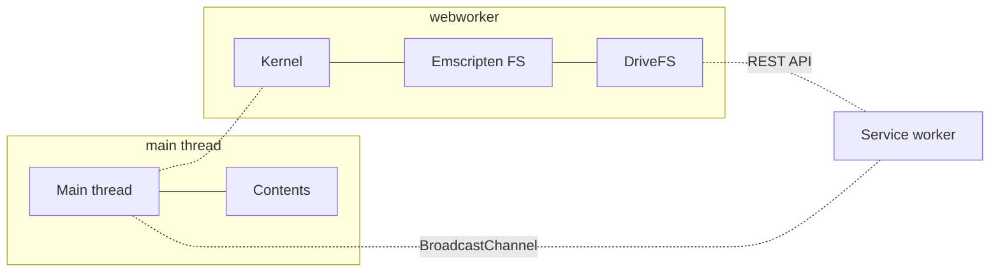
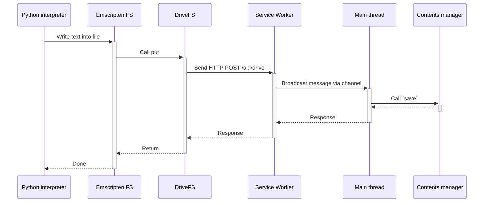

# Contents

This section describes how is the contents integrated in the website and how it is used.

## Access within the kernel

By default the contents through the filebrowser is independent of the contents
accessible within an execution kernel. Sharing the contents with the kernel is dependent
of that kernels.

### Emscripten kernel

Kernels using Emscripten (like [pyodide](https://github.com/jupyterlite/pyodide-kernel/)
or [xeus kernels](https://github.com/jupyterlite/xeus/)) relies on the
[Emscripten filesystem](https://emscripten.org/docs/api_reference/Filesystem-API.html)
to access their contents. For such case, `@jupyterlite/contents` provides a helper class
[`DriveFS`](https://jupyterlite.readthedocs.io/en/stable/reference/api/ts/classes/jupyterlite_contents.DriveFS-1.html)
to be mounted within Emscripten filesystem with a snippet like:

```ts
  const mountpoint = '/drive';
  const { FS, PATH, ERRNO_CODES } = /* provided by the empscripten module */;
  const { baseUrl } = options;
  const { DriveFS } = await import('@jupyterlite/contents');

  const driveFS = new DriveFS({
    FS,
    PATH,
    ERRNO_CODES,
    baseUrl, // Website base URL
    driveName: 'my-drive', // Any name of your choosing
    mountpoint,
  });
  FS.mkdir(mountpoint);
  FS.mount(driveFS, {}, mountpoint);
  FS.chdir(mountpoint);
```

After mounting the drive, the Jupyter Server contents (the one displayed in the
filebrowser) will be available within the kernel under the folder `/drive`.

The website base URL is required for the `DriveFS` to request its content from the main
application. Diving into the drive architecture will clarify that.



Three threads are at play when running a kernel inside JupyterLite:

- The main thread: it executes the main user interface and knows about the filebrowser
  contents.
- The kernel web worker: it executes the kernel (e.g. evaluate the code snippet from a
  notebook sent by the main thread). It mounts a `DriveFS` into the Emscripten
  filesystem.
- The service worker: it serves website assets from cache (to work offline). And it also
  can capture any other network requests.

Assuming the kernel executes the following python snippet code writing into a text file:

```py
Path("dummy.txt").write_text("Writing on Emscripten filesystem")
```

Here is a simplification sequence of interaction happening to perform the filesystem
operation:



When the code interact with the filesystem, the emscripten filesystem API is triggered.
In the sequence, we simplify the API triggered to a single `put` (in truth multiple
calls will happen when writing a file). As we plugged a custom drive implementation
`DriveFS`, the put resolution will therefore be the responsibility of that code. The
logic in place is to start a POST HTTP request on the `/api/drive` endpoint with a body
describing the filesystem operation to be perform. In this case, it looks like:

```json
{
  "method": "put",
  "path": "/dummy.txt",
  "data": { "format": "text", "data": "Writing on Emscripten filesystem" }
}
```

That request is meant to be captured by the service worker (defined in
`@jupyterlite/server` package). The service worker will forward the HTTP request to the
main thread via a message in a `BroadcastChannel` named `/api/drive.v1`.  
That message will be captured by the `BroadcastChannelWrapper` that is instantiated in
the plugin `@jupyterlite/server-extension:emscripten-filesystem`. That wrapper is aware
of the Jupyter contents manager to answer the request. For example, in the case of a
`put` operation, the `save` method of contents manager will be called.  
Then the reply is propagated back (through the broadcast channel, then the network
request,...) to the Emscripten filesystem.

The need to use a HTTP request raises to the constrain of answering a synchronous API
(aka the Emscripten filesystem) with an asynchronous API (aka the Jupyter contents
manager).
