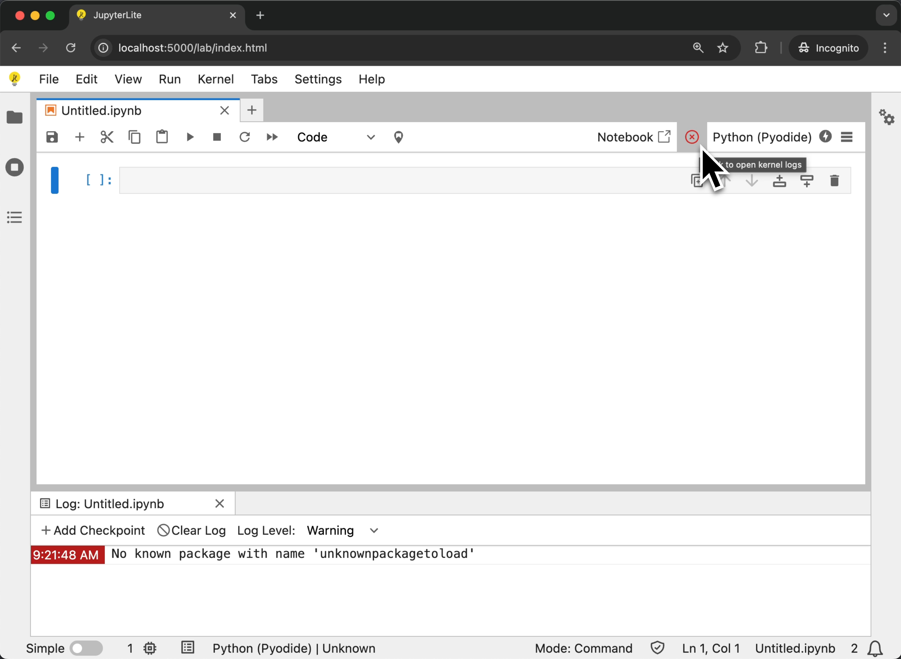

# Troubleshooting

## Not able to access files from the kernel

JupyterLite lets you access files displayed in the file browser from within the kernel.

However in some cases you might see some errors such as the following:

```
FileNotFoundError: [Errno 44] No such file or directory: 'data/iris.csv'
```


This seems to happen when code is executed before a kernel is fully ready. See
[issue #1371 ](https://github.com/jupyterlite/jupyterlite/issues/1371). If this
regularly happens, please try to wait until the kernel indicator is ready before
starting to execute code.

JupyterLite uses a [Service Worker](./howto/configure/advanced/service-worker.md) to
allow accessing files from a kernel. But in some cases the Service Worker may fail to
register, which results in an error displayed in the dev tools console:


To fix this issue, you can try the following:

- Use a different browser. Currently we support the latest Chrome and Firefox versions.
  However it is known that Service Workers are not supported in Firefox private windows.
- Clear the browser cache. This can help purge older versions of the Service Worker that
  might still be registered, for example after a JupyterLite version update.

See the [Contents](./reference/contents.md) documentation for more information.

## Clear the browser data

By default JupyterLite stores the contents of the file browser and user settings in the
browser's local storage.

If you want to clear all files and settings, you can use the `Clear Browser Data`
command via the following options:

- Open the command palette (Ctrl + Shift + C or Cmd + Shift + C) and search for
  `Clear Browser Data`.
- Click on the menu item: `Help > Clear Browser Data`.
- Right click on the file browser and select `Clear Browser Data`.

```{warning}
Clearing browser data will permanently remove data stored in your browser.
This operation cannot be undone.
```

## Package compatibility with WebAssembly kernels

JupyterLite runs Python kernels in the browser using WebAssembly, which is different
from a regular JupyterLab setup that runs on the server. This means that not all Python
packages that work in a standard Python environment will work in JupyterLite.

The two main Python kernels available in JupyterLite are:

- **Pyodide**: A Python distribution for the browser that includes a large number of
  packages compiled to WebAssembly.
- **Xeus Python**: A Python kernel leveraging emscripten-forge for packages, a conda
  package distribution tailored for WebAssembly.

### Testing package compatibility

To check if a package works with these kernels, you can test them directly in the
browser:

**For the Pyodide kernel:**

- Try the
  <a href="https://jupyterlite-pyodide-kernel.readthedocs.io/en/latest/_static/repl/?toolbar=1&kernel=python&promptCellPosition=left">Pyodide
  REPL</a>
- Install packages using: `%pip install mypackage`

**For the Xeus Python kernel:**

- Try the
  <a href="https://jupyterlite-xeus.readthedocs.io/en/latest/lite/repl/?toolbar=1&kernel=xpython&promptCellPosition=left">Xeus
  Python REPL</a>
- Install packages using: `%mamba install mypackage` or `%pip install mypackage`

**Testing the installation:**

Once you've installed a package, test that it works by trying to import it:

```python
import mypackage
# Try using some basic functionality to ensure it works correctly
```

If the import succeeds without errors, the package is likely compatible with the
WebAssembly environment.

### Common limitations

When using WebAssembly-based kernels, you may encounter limitations with packages that:

- Require native C extensions that are not compiled for WebAssembly
- Depend on system libraries not available in the browser environment
- Use threading or multiprocessing features not supported in WebAssembly
- Access the file system in ways not compatible with the browser sandbox

If a package doesn't work, consider looking for pure Python alternatives or packages
specifically compiled for WebAssembly environments. Otherwise contact the maintainers of
the respective projects:

- For Pyodide:
  [Pyodide GitHub Discussions](https://github.com/pyodide/pyodide/discussions)
- For Xeus Python:
  [Emscripten Forge GitHub](https://github.com/emscripten-forge/recipes)

## Access kernel logs

If the kernel you are using reports logs to the log console, you may be able to see
these logs by opening the log console via the following options:

- Open the command palette (Ctrl + Shift + C or Cmd + Shift + C) and search for
  `Show Log Console`.
- Click on the menu item: `View > Show Log Console`.
- Click on the toolbar item in the notebook toolbar.

The kernel status item in the notebook toolbar will also show the status of the kernel.
If the kernel is busy, it will show a spinner. If the kernel is idle, it will show a
check mark. If the kernel reports a `critical` error, it will show a red cross. Clicking
on the kernel status item will open the log console.



````{note}
If you would like to only keep the kernel status item (the one showing the spinner and the ✅), and disable the default kernel execution indicator provided by default, put the following in your `jupyter-lite.json` file:

```json
{
  "jupyter-lite-schema-version": 0,
  "jupyter-config-data": {
    "disabledExtensions": [
      "@jupyterlab/notebook-extension:execution-indicator"
    ]
  }
}
```
````

By default, the Log Console displays messages at the `warning` level and above. If you
want to see more detailed logs (such as `info` or `debug` messages), go to
`Settings > Settings Editor` and search for "Log Console".

You can also configure the default log level in your `jupyter-lite.json` file:

```json
{
  "jupyter-lite-schema-version": 0,
  "jupyter-config-data": {
    "@jupyterlab/logconsole-extension:plugin": {
      "defaultLogLevel": "info"
    }
  }
}
```

Available log levels are:

- `critical`: Only critical errors
- `error`: Errors and critical messages
- `warning`: Warnings, errors, and critical messages (default)
- `info`: Informational messages and above
- `debug`: All messages including debug information
