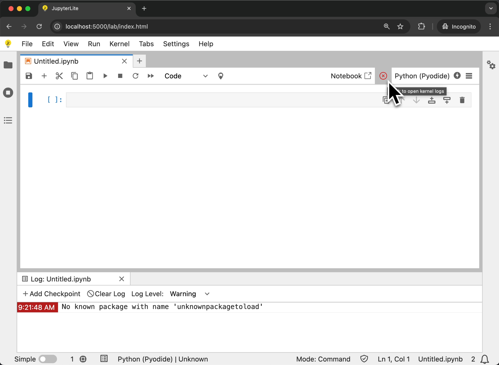

# Troubleshooting

## Not able to access files from the kernel

JupyterLite lets you access files displayed in the file browser from within the kernel.

However in some cases you might see some errors such as the following:

```
FileNotFoundError: [Errno 44] No such file or directory: 'data/iris.csv'
```


This seems to happen when code is executed before a kernel is fully ready. See
[issue #1371 ](https://github.com/jupyterlite/jupyterlite/issues/1371). If this
regularly happens, please try to wait until the kernel indicator is ready before
starting to execute code.

JupyterLite uses a [Service Worker](./howto/configure/advanced/service-worker.md) to
allow accessing files from a kernel. But in some cases the Service Worker may fail to
register, which results in an error displayed in the dev tools console:


To fix this issue, you can try the following:

- Use a different browser. Currently we support the latest Chrome and Firefox versions.
  However it is known that Service Workers are not supported in Firefox private windows.
- Clear the browser cache. This can help purge older versions of the Service Worker that
  might still be registered, for example after a JupyterLite version update.

See the [Contents](./reference/contents.md) documentation for more information.

## Clear the browser data

By default JupyterLite stores the contents of the file browser and user settings in the
browser's local storage.

If you want to clear all files and settings, you can use the `Clear Browser Data`
command via the following options:

- Open the command palette (Ctrl + Shift + C or Cmd + Shift + C) and search for
  `Clear Browser Data`.
- Click on the menu item: `Help > Clear Browser Data`.
- Right click on the file browser and select `Clear Browser Data`.

```{warning}
Clearing browser data will permanently remove data stored in your browser.
This operation cannot be undone.
```

## Access kernel logs

If the kernel you are using reports logs to the log console, you may be able to see
these logs by opening the log console via the following options:

- Open the command palette (Ctrl + Shift + C or Cmd + Shift + C) and search for
  `Show Log Console`.
- Click on the menu item: `View > Show Log Console`.
- Click on the toolbar item in the notebook toolbar.

The kernel status item in the notebook toolbar will also show the status of the kernel.
If the kernel is busy, it will show a spinner. If the kernel is idle, it will show a
check mark. If the kernel reports a `critical` error, it will show a red cross. Clicking
on the kernel status item will open the log console.


